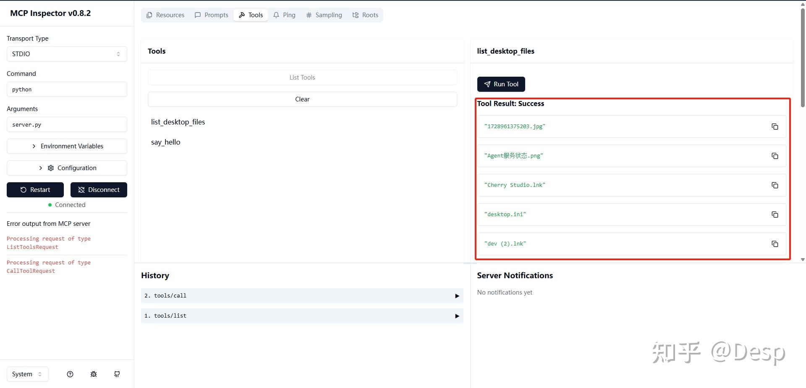
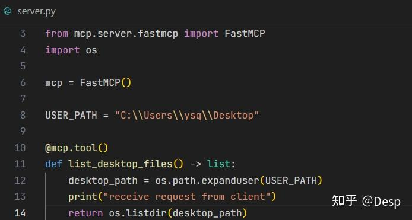
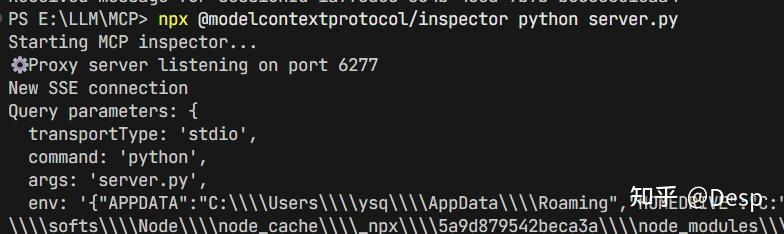
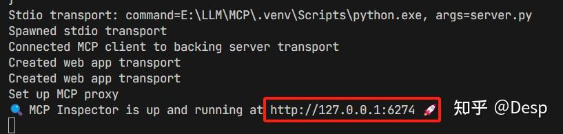
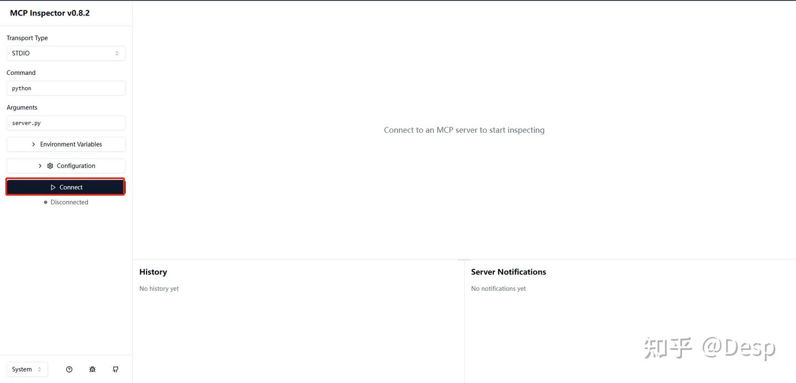
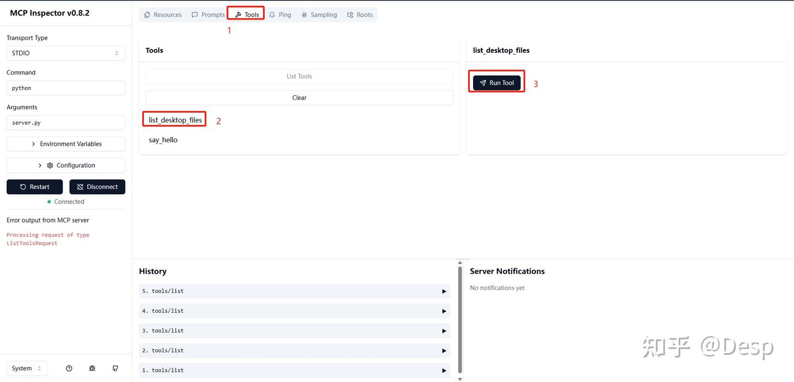
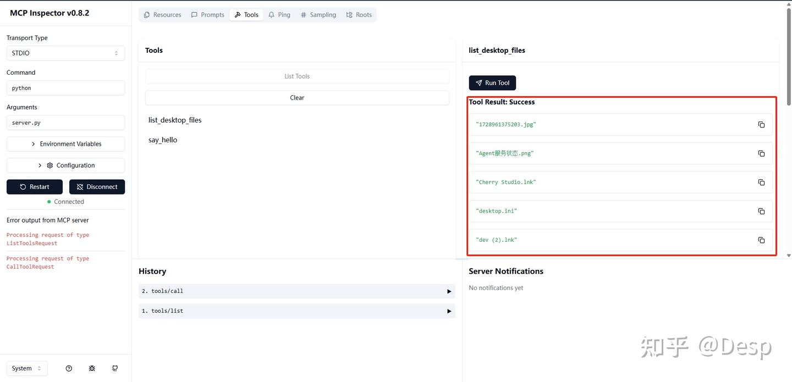

# MCP

## 官方文档

文档：https://mcp-docs.cn/docs/getting-started/intro

规范：https://mcp-docs.cn/specification/2025-11-25

社区：https://mcp-docs.cn/community/communication


MCP中Resources和Tools的区别和联系：

1. **Resources（资源）**：由MCP服务器提供，是应用程序（如Claude Desktop）可以访问的数据源。这些数据通常以只读方式提供，应用程序可以直接获取并显示给用户，或者作为上下文传递给大模型（LLM）。
2. **Tools（工具）**：由MCP服务器提供，是LLM可以调用的函数。当LLM需要执行某个操作（如计算、查询、写文件等）时，可以调用这些工具。

那么，如何关联Resources和Tools呢？

- **Resources和Tools的独立性**：在MCP中，Resources和Tools是独立的两种能力。Resources通常由应用程序直接使用，而Tools则由LLM调用。但是，它们可以共享同一个MCP服务器中的数据或逻辑。
- **依赖关系**：有时候，Tools的实现可能需要访问Resources。例如，一个Tool可能需要读取某个Resource的数据来执行操作。在这种情况下，Tool的实现内部可以调用获取Resource的逻辑。但这是服务器内部的实现细节，对客户端（包括应用程序和LLM）是透明的。
- **大模型如何使用Resources**：大模型（LLM）本身并不直接调用Resources。LLM只能调用Tools。如果LLM需要某些数据，而这些数据可以通过Resources获取，那么有两种方式：
  a. 应用程序可以将Resources的数据作为上下文的一部分提供给LLM。这样LLM在生成回复时就已经有了这些数据。
  b. 如果LLM在生成回复过程中发现需要更多数据，它可以调用一个Tool，这个Tool的内部实现可能会去获取Resource的数据，然后返回给LLM。
- **大模型如何让应用程序调用Resources**：大模型不能直接让应用程序调用Resources。但是，大模型可以通过调用Tools来间接获取数据（如果这个Tool的设计就是返回Resource的数据）。或者，应用程序可以在与LLM交互的初始阶段，主动将Resources的数据作为上下文提供给LLM。


## 核心基础模式

### 一、核心基础模式

#### 1. STDIO 模式（标准输入输出模式）

- **定义**：基于进程的标准输入（stdin）和标准输出（stdout）进行通信，是 MCP 最基础、最原生的模式。

- 交互方式：

  - 客户端（如 LLM）通过`stdin`向 MCP 服务端发送 JSON 格式的请求；
  - 服务端通过`stdout`返回 JSON 格式的响应；
  - 错误信息会输出到`stderr`（标准错误）。

- 典型场景：

  - 本地命令行工具集成（如 Python 脚本、CLI 程序）；
  - 轻量级的进程间通信（IPC），无需网络依赖。

- 优缺点：

  ✅ 优点：无需网络配置、延迟极低、实现简单；

  ❌ 缺点：仅支持单进程一对一通信、无法跨机器访问、不支持并发。

#### 2. Streamable-HTTP 模式（可流式 HTTP 模式）

- **定义**：基于 HTTP 协议的「流式通信」，是 STDIO 模式的网络版，核心是通过 HTTP 连接传输**分块的 JSON 数据流**。

- 交互方式：

  - 客户端向服务端发送 HTTP 请求（通常是 POST）；
  - 服务端通过`Transfer-Encoding: chunked`（分块编码）逐块返回响应；
  - 每个块都是独立的 JSON 对象，客户端可实时解析，无需等待完整响应。

- 典型场景：

  - 跨机器的 MCP 服务调用（如云服务、分布式系统）；
  - 需要处理大响应（如长文本生成、批量工具调用）的场景。

- 优缺点：

  ✅ 优点：支持跨网络、可流式传输（低内存占用）、适配 HTTP 生态；

  ❌ 缺点：需要处理 HTTP 连接管理、相比 STDIO 有轻微网络延迟。

#### 3. SSE 模式（Server-Sent Events 模式）

- **定义**：基于 HTTP 的 SSE（服务器推送事件）协议，是「单向流式推送」模式，服务端主动向客户端推送事件流。

- 交互方式：

  - 客户端与服务端建立持久的 HTTP 连接；
  - 服务端以`text/event-stream`格式向客户端推送事件（每个事件是 JSON 格式的 MCP 消息）；
  - 客户端可通过 HTTP POST 发送请求，服务端通过 SSE 流返回响应。

- 典型场景：

  - Web 前端实时交互（如浏览器端调用 MCP 工具）；
  - 服务端有持续数据输出的场景（如实时日志、增量计算结果）。

- 优缺点：

  ✅ 优点：适配 Web 前端、持久连接、实时推送、无需轮询；

  ❌ 缺点：仅支持服务端向客户端单向推送（客户端请求仍需 HTTP POST）、依赖浏览器 SSE 支持。

### 各模式核心区别对比

|      模式       |     通信协议      |     传输方式      | 双向通信 | 跨网络 |          适配场景          | 性能 / 延迟 |
| :-------------: | :---------------: | :---------------: | :------: | :----: | :------------------------: | :---------: |
|      STDIO      |     进程 I/O      |   非网络、单块    |    ✅     |   ❌    |    本地 CLI、单进程交互    | 最高 / 最低 |
| Streamable-HTTP |     HTTP/1.1      |  网络、流式分块   |    ✅     |   ✅    | 跨机器流式交互、大响应处理 |   中 / 中   |
|       SSE       |  HTTP/1.1 (SSE)   |  网络、服务端流   |    ❌     |   ✅    |      Web 前端实时推送      |   中 / 中   |
|    WebSocket    |     WebSocket     |   网络、双向流    |    ✅     |   ✅    |    Web 前端双向实时交互    |   中 / 低   |
|      gRPC       | HTTP/2 + Protobuf | 网络、流式 / 批量 |    ✅     |   ✅    |      企业级高并发服务      |   高 / 低   |
|   Batch-HTTP    |     HTTP/1.1      |  网络、批量单块   |    ✅     |   ✅    |        离线批量处理        |   中 / 中   |

### 实践选型建议

1. **本地开发 / 轻量工具**：优先选 **STDIO** 模式（简单、无网络依赖）；
2. **Web 前端交互**：优先选 **WebSocket** 模式（双向实时，替代 SSE）；
3. **跨机器流式交互**：优先选 **Streamable-HTTP** 模式（适配 HTTP 生态，易部署）；
4. **企业级高并发服务**：优先选 **gRPC** 模式（高性能、易扩展）；
5. **离线批量处理**：优先选 **Batch-HTTP** 模式（减少请求次数，提升效率）。


## MCP Demo


### http模式

> Agent端可以像调用http接口的形式请求

##### 代码

```python
import asyncio
from fastapi import FastAPI
from fastapi.middleware.cors import CORSMiddleware

# 创建FastAPI应用
fastapi_app = FastAPI(title="MCP Server")

# 配置CORS - 这是关键！
fastapi_app.add_middleware(
    CORSMiddleware,
    allow_origins=[
        "*",  # 生产环境不要用这个，应该指定具体域名
        "http://localhost:3000",
        "http://127.0.0.1:3000",
    ],
    allow_credentials=True,
    allow_methods=["*"],  # 允许所有HTTP方法
    allow_headers=["*"],  # 允许所有请求头
)

# 注册你的MCP工具
@fastapi_app.get("/health")
async def health_check():
    return {"status": "healthy"}

@fastapi_app.post("/chat")
async def chat_endpoint(prompt: dict):
    # 这里处理你的MCP逻辑
    return {"response": f"Echo: {prompt.get('message', '')}"}

if __name__ == "__main__":
    # 方式1：使用uvicorn直接运行
    import uvicorn
    uvicorn.run(
        fastapi_app,
        host="0.0.0.0",  # 允许所有网络访问
        port=8000
    )
```

##### 依赖

```shell
# 创建虚拟环境
python -m venv venv

# 激活
# Windows
venv\Scripts\activate
# Linux/Mac
source venv/bin/activate

# 安装依赖
pip install fastapi uvicorn[standard]
```

##### 运行

```shell
# 方式1：使用python运行
python deepseek_http_restful.py
 
# 方式2：直接使用uvicorn命令行
# deepseek_http_restful:fastapi_app -> 模块文件:应用对象 或 package.module:app
uvicorn deepseek_http_restful:fastapi_app --host 0.0.0.0 --port 8000
```

##### 测试

```shell
# 访问方式
# 1. Web浏览器访问
# 假设你的MCP应用运行在 http://localhost:8000
# 在浏览器中访问：
http://localhost:8000/docs   # 查看Swagger/OpenAPI文档
http://localhost:8000/redoc  # 查看ReDoc文档（如果有的话）
 
# 2. Postman访问

# 3. curl命令行
http://127.0.0.1:8000/health

curl -X POST http://localhost:8000/chat \
   -H "Content-Type: application/json" \
   -d '{"message": "Hello, world!"}'
```

##### 函数列表

http://127.0.0.1:8000/tools

```json

{
  "count": 2,
  "tools": [
    {
      "name": "add",
      "description": "一个简单的加法工具",
      "parameters": [
        {
          "name": "a",
          "type": "int",
          "required": true
        },
        {
          "name": "b",
          "type": "int",
          "required": true
        }
      ],
      "return_type": "int"
    },
    {
      "name": "sub",
      "description": "一个简单的减法工具",
      "parameters": [
        {
          "name": "a",
          "type": "int",
          "required": true
        },
        {
          "name": "b",
          "type": "int",
          "required": true
        }
      ],
      "return_type": "int"
    }
  ]
}
```

##### 函数调用

```shell
curl -X POST http://localhost:8000/tools/add \
   -H "Content-Type: application/json" \
   -d '{"a": 1, "b": 2}'
```

```json
{
  "tool": "add",
  "parameters": {
    "a": 1,
    "b": 2
  },
  "result": 3,
  "success": true
}
```


### Stdio模式

```python
from fastmcp import FastMCP
from starlette.requests import Request
from starlette.responses import PlainTextResponse

import os
from pathlib import Path

# 多服务模式
mcp = FastMCP("My MCP Server")  # 主服务
sub = FastMCP(name="Sub")  # 子服务


@mcp.tool
def add(a: int, b: int) -> int:
    """Add two numbers"""
    return a + b


@mcp.tool
def greet(name: str) -> str:
    return f"Hello, {name}!"


# 增加tag标签，支持筛选
@mcp.tool(tags={"public", "utility"})
def public_tool() -> str:
    return "This tool is public"


@mcp.tool(tags={"internal", "admin"})
def admin_tool() -> str:
    return "This tool is for admins only"


# 固定资源
@mcp.resource("data://config")
def get_config() -> dict:
    """Provides the application configuration."""
    return {"theme": "dark", "version": "1.0"}


# 模版资源
@mcp.resource("users://{user_id}/profile")
def get_user_profile(user_id: int) -> dict:
    """Retrieves a user's profile by ID."""
    # The {user_id} in the URI is extracted and passed to this function
    return {"id": user_id, "name": f"User {user_id}", "status": "active"}


@mcp.prompt
def analyze_data(data_points: list[float]) -> str:
    """Creates a prompt asking for analysis of numerical data."""
    formatted_data = ", ".join(str(point) for point in data_points)
    return f"Please analyze these data points: {formatted_data}"


# 自定义路由
# mcp.run(transport="http")  # Health check at http://localhost:8000/health
@mcp.custom_route("/health", methods=["GET"])
async def health_check(request: Request) -> PlainTextResponse:
    return PlainTextResponse("OK")


@sub.tool
def hello():
    return "hi"


if __name__ == "__main__":
    # 多服务器
    # Mount directly
    mcp.mount(sub, prefix="sub")

    # This runs the server, defaulting to STDIO transport
    mcp.run()

    # To use a different transport, e.g., HTTP:
    # mcp.run(transport="http", host="127.0.0.1", port=9000)
```

https://gofastmcp.com/getting-started/welcome

pip install fastmcp


https://modelcontextprotocol.io/docs/develop/build-client#server-connection-management

```text
### 安装依赖
.\.venv\Scripts\activate # 激活虚拟环境
pip install "mcp"
pip install "mcp[cli]"

### 进入测试目录
cd stdio

### 使用stdio模式交互
> 启动客户端的时候，指定服务端的文件路径

服务端：无需操作
客户端：python client/mcp_client.py server/server_stdio.py


### 服务端调试: MCP inspector
> 启动服务端，并打开调试模式
# 使用nodejs启动
npx -y @modelcontextprotocol/inspector python .\server\server_stdio.py
# 使用mcp命令行启动，需要安装mcp：pip install "mcp"
mcp dev .\server\server_stdio.py
```


### StreamableHTTP

```python
from fastmcp import FastMCP
from starlette.requests import Request
from starlette.responses import PlainTextResponse

import os
from pathlib import Path

# 多服务模式
mcp = FastMCP("My MCP Server")  # 主服务
sub = FastMCP(name="Sub")  # 子服务


@mcp.tool
def add(a: int, b: int) -> int:
    """Add two numbers"""
    return a + b


@mcp.tool
def greet(name: str) -> str:
    return f"Hello, {name}!"


# 增加tag标签，支持筛选
@mcp.tool(tags={"public", "utility"})
def public_tool() -> str:
    return "This tool is public"


@mcp.tool(tags={"internal", "admin"})
def admin_tool() -> str:
    return "This tool is for admins only"


# 固定资源
@mcp.resource("data://config")
def get_config() -> dict:
    """Provides the application configuration."""
    return {"theme": "dark", "version": "1.0"}


# 模版资源
@mcp.resource("users://{user_id}/profile")
def get_user_profile(user_id: int) -> dict:
    """Retrieves a user's profile by ID."""
    # The {user_id} in the URI is extracted and passed to this function
    return {"id": user_id, "name": f"User {user_id}", "status": "active"}


@mcp.prompt
def analyze_data(data_points: list[float]) -> str:
    """Creates a prompt asking for analysis of numerical data."""
    formatted_data = ", ".join(str(point) for point in data_points)
    return f"Please analyze these data points: {formatted_data}"


# 自定义路由
# mcp.run(transport="http")  # Health check at http://localhost:8000/health
@mcp.custom_route("/health", methods=["GET"])
async def health_check(request: Request) -> PlainTextResponse:
    return PlainTextResponse("OK")


@sub.tool
def hello():
    return "hi"


if __name__ == "__main__":
    # 多服务器
    # Mount directly
    mcp.mount(sub, prefix="sub")

    # This runs the server, defaulting to STDIO transport
    # mcp.run()

    # To use a different transport, e.g., HTTP:
    mcp.run(transport="http", host="127.0.0.1", port=9000)
```


https://gofastmcp.com/getting-started/welcome

pip install fastmcp


# MCP调试

https://github.com/modelcontextprotocol/inspector

https://gitcode.com/gh_mirrors/inspector1/inspector


## 官方文档：调试器

https://mcp-docs.cn/docs/tools/inspector

https://zhuanlan.zhihu.com/p/1894853118367364719


## MCP Inspector

MCP Inspector 是一款用于测试和调试 MCP 服务器的开发工具。


### 架构概述

MCP Inspector 由两个协同工作的主要组件构成：

- **MCP Inspector 客户端（MCPI）**：一个基于 React 的 Web 用户界面，提供用于测试和调试 MCP 服务器的交互式操作界面
- **MCP 代理（MCPP）**：一个 Node.js 服务器，充当协议桥接器，通过多种传输方式（stdio、SSE、streamable-http）将 Web 用户界面连接到 MCP 服务器

请注意，此代理并非用于拦截流量的网络代理。相反，它同时充当 MCP 客户端（连接到您的 MCP 服务器）和 HTTP 服务器（提供 Web 用户界面服务），从而支持基于浏览器与使用不同传输协议的 MCP 服务器进行交互。

### 运行 Inspector

#### 要求

- Node.js：^22.7.5

#### 快速开始（UI 模式）

要立即启动并运行 UI，请执行以下命令：

```bash
npx @modelcontextprotocol/inspector
或者
npx @modelcontextprotocol/inspector <command> <arg1> <arg2>
```

服务器将启动，UI 可通过 `http://localhost:6274` 访问。


本地访问：http://127.0.0.1:6274

代理访问(访问wsl内部运行的服务)：http://127.0.0.1:6277

```shell
# npx @modelcontextprotocol/inspector
Starting MCP inspector...
⚙️ Proxy server listening on 127.0.0.1:6277
🔑 Session token: 2847bec3412b4dd930794464c838c2c836cd09c430c2f069c4926e51181ab8c6
Use this token to authenticate requests or set DANGEROUSLY_OMIT_AUTH=true to disable auth

🔗 Open inspector with token pre-filled:
   http://localhost:6274/?MCP_PROXY_AUTH_TOKEN=2847bec3412b4dd930794464c838c2c836cd09c430c2f069c4926e51181ab8c6

🔍 MCP Inspector is up and running at http://127.0.0.1:6274 🚀
```


指定监听端口、指定不使用token认证

- DANGEROUSLY_OMIT_AUTH：不需要认证的token
- host：监听IP
- port：监听端口，例如：--port  3000
- allowed-origins：允许跨域

```shell
# DANGEROUSLY_OMIT_AUTH=true npx @modelcontextprotocol/inspector --host 0.0.0.0 --allowed-origins "*" --verbose --log-level debug
Starting MCP inspector...
⚙️ Proxy server listening on localhost:6277
⚠️  WARNING: Authentication is disabled. This is not recommended.
Received GET message for sessionId 231fd285-2406-4354-96a8-77521625040d

🚀 MCP Inspector is up and running at:
   http://localhost:6274

🌐 Opening browser...
Received GET message for sessionId 231fd285-2406-4354-96a8-77521625040d
New StreamableHttp connection request
Query parameters: {"url":"http://127.0.0.1:9000/mcp","transportType":"streamable-http"}
Created StreamableHttp client transport
Client <-> Proxy  sessionId: 5ef37a12-806d-4275-a60a-4b89a5e423ff
Proxy  <-> Server sessionId: fcc6335ddb9a49e1b8180659f0aea75a
Received POST message for sessionId 5ef37a12-806d-4275-a60a-4b89a5e423ff
Received GET message for sessionId 5ef37a12-806d-4275-a60a-4b89a5e423ff
Received POST message for sessionId 5ef37a12-806d-4275-a60a-4b89a5e423ff
```





##### MCP 本地Server测试

> 本地MCP Server



> npx执行inspector：npx @modelcontextprotocol/inspector python server.py



> MCP客户端和服务端建立连接



> 点击地址进入UI界面



> 点击建立连接


> 选择Tools功能，点击List Tools，选择list_desktop_files，无需参数，直接Run Tool



> 测试结果




使用配置文件

```shell
npx @modelcontextprotocol/inspector --config path/to/config.json --server everything
```

配置内容即为mcp的配置

```json
{
  "mcpServers": {
    "everything": {
      "command": "npx",
      "args": ["@modelcontextprotocol/server-everything"],
      "env": {
        "hello": "Hello MCP!"
      }
    },
    "my-server": {
      "command": "node",
      "args": ["build/index.js", "arg1", "arg2"],
      "env": {
        "key": "value",
        "key2": "value2"
      }
    }
  }
}
```


#### Docker 容器

您也可以使用以下命令在 Docker 容器中启动它：

```bash
docker run --rm \
  -p 127.0.0.1:6274:6274 \
  -p 127.0.0.1:6277:6277 \
  -e HOST=0.0.0.0 \
  -e MCP_AUTO_OPEN_ENABLED=false \
  -e ALLOWED_ORIGINS="*" \
  ghcr.io/modelcontextprotocol/inspector:latest
```

#### 从 MCP 服务器仓库中

##### 运行TypeScript本地服务

若要检查 MCP 服务器的实现，无需克隆此仓库。您可以直接使用 `npx`。例如，如果您的服务器构建在 `build/index.js`：

```bash
npx @modelcontextprotocol/inspector node build/index.js
```

您可以向 MCP 服务器传递参数和环境变量。参数会直接传递给服务器，而环境变量可以使用 `-e` 标志进行设置：

```bash
# Pass arguments only
npx @modelcontextprotocol/inspector node build/index.js arg1 arg2

# Pass environment variables only
npx @modelcontextprotocol/inspector -e key=value -e key2=$VALUE2 node build/index.js

# Pass both environment variables and arguments
npx @modelcontextprotocol/inspector -e key=value -e key2=$VALUE2 node build/index.js arg1 arg2

# Use -- to separate inspector flags from server arguments
npx @modelcontextprotocol/inspector -e key=$VALUE -- node build/index.js -e server-flag
```

inspector 会同时运行 MCP Inspector (MCPI) 客户端界面（默认端口 6274）和 MCP Proxy (MCPP) 服务器（默认端口 6277）。在浏览器中打开 MCPI 客户端界面即可使用 inspector。（这些端口分别源自 MCPI 和 MCPP 的 T9 拨号键盘映射，作为助记符）。如有需要，你可以自定义端口：

```bash
CLIENT_PORT=8080 SERVER_PORT=9000 npx @modelcontextprotocol/inspector node build/index.js
```

有关 inspector 使用方法的更多详情，请参见 [MCP 文档网站的 Inspector 部分](https://modelcontextprotocol.io/docs/tools/inspector)。如需调试帮助，请参见 [调试指南](https://modelcontextprotocol.io/docs/tools/debugging)。

##### 运行本地Python服务

```shell
# 使用uv运行本地服务
npx @modelcontextprotocol/inspector \
  uv \
  --directory path/to/server \
  run \
  package-name \
  args...
  
# 使用python运行
npx @modelcontextprotocol/inspector python path/to/server.py

# 监听0.0.0.0 不需要token
HOST=0.0.0.0 DANGEROUSLY_OMIT_AUTH=true npx @modelcontextprotocol/inspector python ./server.py
```


#### 服务器文件导出

MCP Inspector 提供便捷按钮，用于导出服务器启动配置，以便在 Cursor、Claude Code 或 Inspector 的 CLI 等客户端中使用。该文件通常名为 `mcp.json`。

- **服务器条目** - 将单个服务器配置条目复制到剪贴板。可将其添加到 `mcp.json` 文件中 `mcpServers` 对象内，并使用您偏好的服务器名称。

  **STDIO 传输示例：**

  ```json
  {
    "command": "node",
    "args": ["build/index.js", "--debug"],
    "env": {
      "API_KEY": "your-api-key",
      "DEBUG": "true"
    }
  }
  ```

  **SSE 传输示例：**

  ```json
  {
    "type": "sse",
    "url": "http://localhost:3000/events",
    "note": "For SSE connections, add this URL directly in Client"
  }
  ```

  **Streamable HTTP 传输示例：**

  ```json
  {
    "type": "streamable-http",
    "url": "http://localhost:3000/mcp",
    "note": "For Streamable HTTP connections, add this URL directly in your MCP Client"
  }
  ```

- **服务器文件** - 将完整的 MCP 配置文件结构复制到剪贴板，其中包含您当前的服务器配置，并将其命名为 `default-server`。可直接将其保存为 `mcp.json`。

  **STDIO 传输示例：**

  ```json
  {
    "mcpServers": {
      "default-server": {
        "command": "node",
        "args": ["build/index.js", "--debug"],
        "env": {
          "API_KEY": "your-api-key",
          "DEBUG": "true"
        }
      }
    }
  }
  ```

  **SSE 传输示例：**

  ```json
  {
    "mcpServers": {
      "default-server": {
        "type": "sse",
        "url": "http://localhost:3000/events",
        "note": "For SSE connections, add this URL directly in Client"
      }
    }
  }
  ```

  **Streamable HTTP 传输示例：**

  ```json
  {
    "mcpServers": {
      "default-server": {
        "type": "streamable-http",
        "url": "http://localhost:3000/mcp",
        "note": "For Streamable HTTP connections, add this URL directly in your MCP Client"
      }
    }
  }
  ```

配置服务器设置后，这些按钮将显示在 Inspector UI 中，便于保存和重用您的配置。

对于 SSE 和 Streamable HTTP 传输连接，Inspector 的两个按钮提供类似功能。“服务器条目”按钮复制可添加到现有配置文件的配置，而“服务器文件”按钮创建包含直接供客户端使用的 URL 的完整配置文件。

您可以将服务器条目粘贴到现有 `mcp.json` 文件中，并使用您选择的服务器名称，或者使用完整的服务器文件内容创建新的配置文件。

#### 身份验证

inspector 支持对 SSE 连接使用承载令牌（bearer token）身份验证。在连接到 MCP 服务器时，在 UI 中输入您的令牌，该令牌将在 Authorization 头中发送。您可以使用侧边栏中的输入字段覆盖头名称。

#### 安全注意事项

MCP Inspector 包含一个代理服务器，该服务器可以运行并与本地 MCP 进程通信。此代理服务器不应暴露在不受信任的网络中，因为它有权限生成本地进程，并且可以连接到任何指定的 MCP 服务器。

##### 身份验证

MCP Inspector 代理服务器默认需要身份验证。启动服务器时，会生成一个随机会话令牌并打印到控制台：

```
🔑 Session token: 3a1c267fad21f7150b7d624c160b7f09b0b8c4f623c7107bbf13378f051538d4

🔗 Open inspector with token pre-filled:
   http://localhost:6274/?MCP_PROXY_AUTH_TOKEN=3a1c267fad21f7150b7d624c160b7f09b0b8c4f623c7107bbf13378f051538d4
```

此令牌必须作为 Bearer 令牌包含在所有服务器请求的 Authorization 标头中。inspector 会自动打开您的浏览器，并在 URL 中预填充该令牌。

**自动打开浏览器** - 启用身份验证后，inspector 现在会自动打开您的浏览器，并在 URL 中预填充令牌。

**替代方案：手动配置** - 如果您已打开 inspector：

1. 点击侧边栏中的“Configuration”按钮
2. 找到“Proxy Session Token”并输入代理控制台中显示的令牌
3. 点击“Save”应用配置

该令牌将保存在您浏览器的本地存储中，以便将来使用。

如果您需要禁用身份验证（不推荐），可以设置 `DANGEROUSLY_OMIT_AUTH` 环境变量：

```bash
DANGEROUSLY_OMIT_AUTH=true npm start
```

------

**🚨 警告 🚨**

使用 `DANGEROUSLY_OMIT_AUTH` 禁用身份验证极其危险！禁用身份验证不仅会使您的设备在暴露于公共互联网时面临攻击风险，还会**通过您的网页浏览器**遭受威胁。这意味着，访问恶意网站或查看恶意广告都可能让攻击者远程入侵您的计算机。除非您真正了解其中风险，否则切勿禁用此功能。

有关此漏洞风险的更多信息，请阅读 Oligo 的博客：[Critical RCE Vulnerability in Anthropic MCP Inspector - CVE-2025-49596](https://www.oligo.security/blog/critical-rce-vulnerability-in-anthropic-mcp-inspector-cve-2025-49596)

------

您还可以在启动服务器时通过 `MCP_PROXY_AUTH_TOKEN` 环境变量设置令牌：

```bash
MCP_PROXY_AUTH_TOKEN=$(openssl rand -hex 32) npm start
```

##### 仅本地绑定

默认情况下，MCP Inspector 代理服务器和客户端均仅绑定到 `localhost`，以阻止网络访问。这确保它们无法从网络中的其他设备访问。如果出于开发目的需要绑定到所有接口，可以通过 `HOST` 环境变量覆盖此设置：

```bash
HOST=0.0.0.0 npm start
```

**警告：** 仅在受信任的网络环境中绑定到所有接口，因为这会使代理服务器执行本地进程的能力以及两个服务都暴露于网络访问。

##### DNS 重绑定保护

为防止 DNS 重绑定攻击，MCP Inspector 会验证传入请求的 `Origin` 标头。默认情况下，仅允许来自客户端源的请求（如果设置了 `CLIENT_PORT`，则会予以尊重，默认为端口 6274）。您可以通过设置 `ALLOWED_ORIGINS` 环境变量（逗号分隔的列表）来配置其他允许的源：

```bash
ALLOWED_ORIGINS=http://localhost:6274,http://localhost:8000 npm start
```

#### 配置

MCP Inspector 支持以下配置设置。若要修改这些设置，请点击 MCP Inspector 用户界面中的 `Configuration`（配置）按钮：

| 设置项                                  | 描述                                                         | 默认值 |
| --------------------------------------- | ------------------------------------------------------------ | ------ |
| `MCP_SERVER_REQUEST_TIMEOUT`            | 客户端超时时间（毫秒）- 如果在此时间内未收到响应，Inspector 将取消请求。注意：服务器可能有其自身的超时设置 | 300000 |
| `MCP_REQUEST_TIMEOUT_RESET_ON_PROGRESS` | 收到进度通知时重置超时时间                                   | true   |
| `MCP_REQUEST_MAX_TOTAL_TIMEOUT`         | 发送至 MCP 服务器的请求的最大总超时时间（毫秒）（配合进度通知使用） | 60000  |
| `MCP_PROXY_FULL_ADDRESS`                | 如果您在非默认地址上运行 MCP Inspector Proxy，请设置此项。例如：[http://10.1.1.22:5577](http://10.1.1.22:5577/) | ""     |
| `MCP_AUTO_OPEN_ENABLED`                 | 启用 Inspector 启动时自动打开浏览器（在启用身份验证时有效）。仅作为环境变量，无法在浏览器中配置。 | true   |

**关于超时的注意事项**：上述超时设置控制 Inspector（作为 MCP 客户端）何时取消请求。这些设置独立于任何服务器端超时。例如，如果服务器工具的超时时间为 10 分钟，但 Inspector 的超时时间设置为 30 秒，则 Inspector 会在 30 秒后取消请求。相反，如果 Inspector 的超时时间为 10 分钟，但服务器在 30 秒后超时，您将收到服务器的超时错误。对于需要用户交互（如信息启发）或长时间运行的操作的工具，请确保适当设置 Inspector 的超时时间。

这些设置可通过用户界面实时调整，并将在会话间持久保存。

Inspector 还支持通过配置文件存储不同 MCP 服务器的设置。这在使用多个服务器或复杂配置时非常有用：

```bash
npx @modelcontextprotocol/inspector --config path/to/config.json --server everything
```

示例服务器配置文件：

```json
{
  "mcpServers": {
    "everything": {
      "command": "npx",
      "args": ["@modelcontextprotocol/server-everything"],
      "env": {
        "hello": "Hello MCP!"
      }
    },
    "my-server": {
      "command": "node",
      "args": ["build/index.js", "arg1", "arg2"],
      "env": {
        "key": "value",
        "key2": "value2"
      }
    }
  }
}
```

##### 配置文件中的传输类型

inspector 会自动从您的配置文件中检测传输类型。您可以指定不同的传输类型：

**STDIO（默认）：**

```json
{
  "mcpServers": {
    "my-stdio-server": {
      "type": "stdio",
      "command": "npx",
      "args": ["@modelcontextprotocol/server-everything"]
    }
  }
}
```

**SSE（服务器发送事件）：**

```json
{
  "mcpServers": {
    "my-sse-server": {
      "type": "sse",
      "url": "http://localhost:3000/sse"
    }
  }
}
```

**可流式 HTTP：**

```json
{
  "mcpServers": {
    "my-http-server": {
      "type": "streamable-http",
      "url": "http://localhost:3000/mcp"
    }
  }
}
```

##### 默认服务器选择

如果您的配置满足以下条件，则无需指定服务器名称即可启动 inspector：

1. **单个服务器** - 将自动选择：

```bash
# Automatically uses "my-server" if it's the only one
npx @modelcontextprotocol/inspector --config mcp.json
```

1. **名为“default-server”的服务器** - 已自动选择：

```json
{
  "mcpServers": {
    "default-server": {
      "command": "npx",
      "args": ["@modelcontextprotocol/server-everything"]
    },
    "other-server": {
      "command": "node",
      "args": ["other.js"]
    }
  }
}
```

> **提示：** 您可以使用 Inspector UI 中的 **Server Entry** 和 **Servers File** 按钮轻松生成此配置格式，如上文“服务器文件导出”部分所述。

您还可以通过查询参数设置初始的 `transport` 类型、`serverUrl`、`serverCommand` 和 `serverArgs`，例如：

```
http://localhost:6274/?transport=sse&serverUrl=http://localhost:8787/sse
http://localhost:6274/?transport=streamable-http&serverUrl=http://localhost:8787/mcp
http://localhost:6274/?transport=stdio&serverCommand=npx&serverArgs=arg1%20arg2
```

您还可以通过查询参数设置初始配置，例如：

```
http://localhost:6274/?MCP_SERVER_REQUEST_TIMEOUT=60000&MCP_REQUEST_TIMEOUT_RESET_ON_PROGRESS=false&MCP_PROXY_FULL_ADDRESS=http://10.1.1.22:5577
```

请注意，如果同时设置了查询参数和相应的 localStorage 项，查询参数将优先生效。

#### 从本仓库

如果您正在 inspector 本身进行开发：

开发模式：

```bash
npm run dev

# To co-develop with the typescript-sdk package (assuming it's cloned in ../typescript-sdk; set MCP_SDK otherwise):
npm run dev:sdk "cd sdk && npm run examples:simple-server:w"
# then open http://localhost:3000/mcp as SHTTP in the inspector.
# To go back to the deployed SDK version:
#   npm run unlink:sdk && npm i
```

> **Windows 用户注意事项：** 在 Windows 系统上，请改用以下命令：
>
> ```bash
> npm run dev:windows
> ```

生产模式：

```bash
npm run build
npm start
```

#### CLI 模式

CLI 模式支持通过命令行以编程方式与 MCP 服务器交互，非常适合脚本编写、自动化操作以及与编码助手集成。这为 MCP 服务器开发打造了高效的反馈循环。

```bash
npx @modelcontextprotocol/inspector --cli node build/index.js
```

CLI 模式支持跨工具、资源和提示的大多数操作。以下是几个示例：

```bash
# Basic usage
npx @modelcontextprotocol/inspector --cli node build/index.js

# With config file
npx @modelcontextprotocol/inspector --cli --config path/to/config.json --server myserver

# List available tools
npx @modelcontextprotocol/inspector --cli node build/index.js --method tools/list

# Call a specific tool
npx @modelcontextprotocol/inspector --cli node build/index.js --method tools/call --tool-name mytool --tool-arg key=value --tool-arg another=value2

# Call a tool with JSON arguments
npx @modelcontextprotocol/inspector --cli node build/index.js --method tools/call --tool-name mytool --tool-arg 'options={"format": "json", "max_tokens": 100}'

# List available resources
npx @modelcontextprotocol/inspector --cli node build/index.js --method resources/list

# List available prompts
npx @modelcontextprotocol/inspector --cli node build/index.js --method prompts/list

# Connect to a remote MCP server (default is SSE transport)
npx @modelcontextprotocol/inspector --cli https://my-mcp-server.example.com

# Connect to a remote MCP server (with Streamable HTTP transport)
npx @modelcontextprotocol/inspector --cli https://my-mcp-server.example.com --transport http --method tools/list

# Connect to a remote MCP server (with custom headers)
npx @modelcontextprotocol/inspector --cli https://my-mcp-server.example.com --transport http --method tools/list --header "X-API-Key: your-api-key"

# Call a tool on a remote server
npx @modelcontextprotocol/inspector --cli https://my-mcp-server.example.com --method tools/call --tool-name remotetool --tool-arg param=value

# List resources from a remote server
npx @modelcontextprotocol/inspector --cli https://my-mcp-server.example.com --method resources/list
```

#### UI 模式与 CLI 模式：何时使用哪种模式

| 使用场景       | UI 模式                                  | CLI 模式                                                     |
| -------------- | ---------------------------------------- | ------------------------------------------------------------ |
| **服务器开发** | 用于开发期间交互式测试和调试的可视化界面 | 用于快速测试和持续集成的可编写脚本命令；与 Cursor 等 AI 编码助手创建反馈循环，实现快速开发 |
| **资源探索**   | 具有层级导航和 JSON 可视化的交互式浏览器 | 用于自动化和脚本编写的程序化列出与读取功能                   |
| **工具测试**   | 基于表单的参数输入，带有实时响应可视化   | 带有 JSON 输出的命令行工具执行，适用于脚本编写               |
| **提示词工程** | 具有流式响应和可视化比较的交互式采样     | 带有机器可读输出的提示词批量处理                             |
| **调试**       | 请求历史记录、可视化错误和实时通知       | 用于日志分析和与其他工具集成的直接 JSON 输出                 |
| **自动化**     | 不适用                                   | 非常适合 CI/CD 管道、批量处理以及与编码助手集成              |
| **学习 MCP**   | 丰富的可视化界面帮助新用户了解服务器功能 | 简化的命令，用于专注学习特定端点                             |

### 工具输入验证指南

在 Inspector 中实现或修改工具输入参数处理时：

- **省略空值的可选字段** - 处理表单输入时，省略可选参数的空字符串或 null 值，除非该字段在架构中具有与当前值匹配的显式默认值
- **保留显式默认值** - 如果字段架构包含显式默认值（例如 `default: null`），且当前值与该默认值匹配，则将其包含在请求中。这是工具期望的有意义的值
- **始终包含必填字段** - 即使为空也保留必填字段值，允许 MCP 服务器进行验证并返回适当的错误消息
- **将深度验证推迟到服务器** - 在 Inspector 客户端中实现基本的字段存在性检查，但依赖 MCP 服务器根据其架构进行参数验证

这些指南可保持清晰的参数传递，并在 Inspector 客户端和 MCP 服务器之间实现适当的关注点分离。
