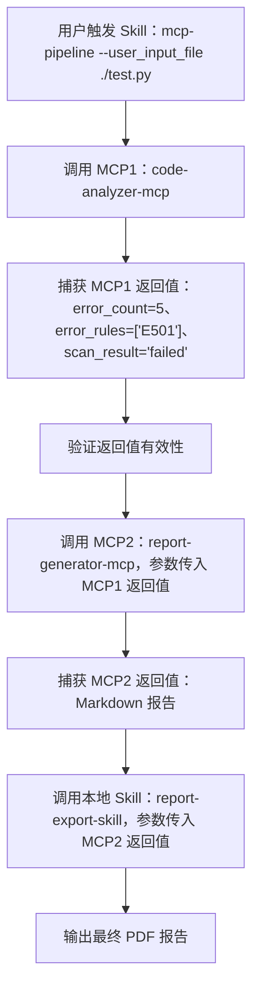

https://github.com/anthropics/skills


### 安装skills

#### 通过插件形式安装skills

安装路径：~/.claude/plugins/marketplaces/anthropic-agent-skills

**步骤一：把插件加入市场**

```shell
/plugin marketplace add anthropics/skills
```

**步骤二：安装插件**

```shell
/plugin install document-skills@anthropic-agent-skills
/plugin install example-skills@anthropic-agent-skills
```

#### 手动下载安装

Claude Skills 遵循「项目级 > 用户级 > 全局级」的优先级加载规则，不同作用域的目录如下

| 作用域 | 说明                           | macOS/Linux 路径                                         | Windows 路径                                                 |
| ------ | ------------------------------ | -------------------------------------------------------- | ------------------------------------------------------------ |
| 全局级 | 对所有用户、所有项目生效       | /usr/local/share/claude/skills                           | `C:\ProgramData\claude\skills`                               |
| 用户级 | 仅对当前登录用户生效（最常用） | `~/.claude/skills` (等价 `/Users/用户名/.claude/skills`) | `%USERPROFILE%\.claude\skills`（等价 `C:\Users\用户名\.claude\skills`） |
| 项目级 | 仅对当前项目生效（优先级最高） | `./.claude/skills`（项目根目录下）                       | `.\.claude\skills`（项目根目录下）                           |


### Skills市场

https://skills.sh/

https://skillsmp.com/

https://skillsmp.com/zh


##### 推荐Skills

- UI【ui-ux-pro-max-skill】：

  - https://github.com/nextlevelbuilder/ui-ux-pro-max-skill

- web-design-guidelines：

  - 这是一个用于**审查网页 UI/UX 设计质量的 Skill**，可以让你的 AI Agent 按照现代 Web 界面设计规范检查代码和输出结果。

  - ```text
    npx skills add https://github.com/vercel-labs/agent-skills --skill web-design-guidelines
    ```

- vercel-react-best-practices

  - 这是一个**来自 Vercel 的 React 和 Next.js 性能优化最佳实践 Skill**，它把官方多年实战经验结构化成让 AI 代理可以直接调用的规则集。

  - ```text
    npx skills add https://github.com/vercel-labs/agent-skills --skill vercel-react-best-practices
    ```

- agent‑browser

  - 这个 Skill 提供了 **浏览器自动化能力**，让你的 AI Agent 可以**执行网页导航、表单填写、截图、数据抓取等任务**，适合处理需要与真实网页互动的工作场景，比如自动测试、信息收集或表单提交。

  - ```text
    打开 https://example.com 并截取全页截图
    ```

- 脑暴、规划文档、测试(适合coding)【superpowers】：

  - https://github.com/obra/superpowers

- 创建skills的skills【skill-creator】：

  - https://github.com/anthropics/skills

  - npx skills add https://github.com/anthropics/skills --skill skill-creator

- find-skills：

  - npx skills add https://github.com/vercel-labs/skills --skill find-skills
  - 使用时，通过 `npx skills find <关键词>` 命令
  - 收集与 “React 性能优化” 相关的 Skill：npx skills find react performance

- seo‑audit

  - 这是一个用于 **网站 SEO 审计的 Skill**，可以让你的 Agent 对网站做全面的搜索引擎优化检查，包括技术 SEO、内容优化建议等，让网站在搜索结果中更容易被发现。

  - ```text
    npx skills add https://github.com/coreyhaines31/marketingskills --skill seo-audit
    ```

  - 安装后，你可以这样用：请对这个网站做一次 SEO 审计，并给出优化建议


##### 安装Skills

方式一：

- 下载之后放入指定位置

方式二：

- 安装具体某一个skills
  - npx skills add https://github.com/anthropics/skills --skill skill-creator
- 指定厂商的skills仓库，需要再次选择安装哪一个
  - npx skills add anthropics/skills
  - bunx skills add anthropics/skills
  - pnpm dlx skills add anthropics/skills


### Skills调用

#### 一、基础调用：单 Skill 快速触发

这是调用本地已安装 Skill 的核心方式，先从最简单的 CLI 命令行和对话式调用讲起。

**1. CLI 命令行直接调用（最常用）**

```bash
# 1. 基础调用（触发已安装的 Skill）
claude skills run <skill-name> [参数]

# 示例：调用已安装的 "docx" 技能生成文档
claude skills run docx --prompt "生成一份项目周报模板，包含进度、风险、下周计划"

# 2. 带文件输入的调用（比如用 code-analyzer 分析本地代码）
claude skills run code-analyzer --input ./src/main.py

# 3. 指定输出格式/路径
claude skills run pdf --prompt "把输入的 markdown 转成 PDF" --input ./report.md --output ./report.pdf
```

**2. 对话式 / 网页端调用（自然语言触发）**

在 Claude 聊天界面直接用自然语言或约定指令触发，无需命令行：

```plaintext
# 方式1：显式指定 Skill 名称
请调用已安装的 code-formatter 技能，按 PEP8 规范格式化以下 Python 代码：
[此处粘贴你的代码]

# 方式2：斜杠命令（Claude Code/网页端专属）
/code-formatter
需要格式化的代码：
def hello():
  print("hello world")
```

**3. API 调用（程序级触发）**

通过 Anthropic API 调用本地 / 已部署的 Skill，适合集成到代码中：

```python
import anthropic
import os

client = anthropic.Anthropic(api_key=os.environ.get("ANTHROPIC_API_KEY"))

# 调用指定 Skill 并传递参数
response = client.beta.agents.create_message(
    agent_id="你的 Agent ID",  # 关联已安装 Skill 的 Agent
    max_tokens=1024,
    messages=[
        {
            "role": "user",
            "content": "调用 code-analyzer 技能分析这段代码：def add(a,b): return a+b"
        }
    ],
    # 显式指定要加载的 Skill（可选，Claude 也可自动匹配）
    skills=["code-analyzer"]
)

print(response.content[0].text)
```

#### 二、进阶：嵌套调用（A Skill 调用 B Skill）

对应你之前关注的 “嵌套” 需求，核心是在 A Skill 的 `SKILL.md` 中声明调用 B，再触发 A 即可自动执行 B。

**步骤 1：准备嵌套 Skill 目录结构**

```plaintext
~/.claude/skills/  # 本地 Skill 默认安装路径
├─ A-full-review/  # 父 Skill
│  └─ SKILL.md
└─ B-code-analyzer/ # 子 Skill（已独立安装）
   ├─ SKILL.md
   ├─ scripts/analyze.py
   └─ references/rules.md
```

**步骤 2：编写 A Skill 的 SKILL.md（声明调用 B）**

```markdown
---
name: A-full-review
description: 完整代码审查（嵌套调用代码分析 Skill）
---
# 执行流程
1. 先调用 skill: B-code-analyzer 对输入代码做质量扫描，读取其 scripts/analyze.py 脚本并执行
2. 基于 B-code-analyzer 的输出，生成结构化审查报告
3. 调用 skill: code-formatter 自动修复扫描出的格式问题

# 输入要求
用户需提供待审查的代码文件路径或代码文本
```

**步骤 3：触发嵌套调用**

```bash
# 触发父 Skill A，会自动调用子 Skill B
claude skills run A-full-review --input ./test.py
```

#### 三、关键：调用时传参 / 传递上下文

Skill 调用的核心是传递参数 / 上下文，常见方式有 3 种：

**1. CLI 命令行传参**

```bash
# 方式1：--参数名 传参
claude skills run xlsx --prompt "生成销售报表" --sheet-name "2024年12月" --data ./sales.csv

# 方式2：通过标准输入传参
cat ./code.py | claude skills run code-analyzer --level strict
```

**2. 在 SKILL.md 中约定参数（嵌套调用传参）**

在 A 的 SKILL.md 中给 B 传参：

```markdown
# A-full-review 的 SKILL.md
1. 调用 skill: B-code-analyzer，参数：
   - 扫描级别：strict
   - 忽略规则：E501（行长度）
   - 输入文件：{{user_input_path}}  # 接收用户传入的路径参数
```

**3. API 传参（结构化）**

```python
# API 调用时给 Skill 传参
response = client.beta.agents.create_message(
    agent_id="ag_xxxx",
    max_tokens=2048,
    messages=[
        {
            "role": "user",
            "content": [
                {
                    "type": "text",
                    "text": "执行完整代码审查"
                },
                # 传递结构化参数
                {
                    "type": "tool_use",
                    "name": "A-full-review",
                    "input": {
                        "file_path": "./test.py",
                        "scan_level": "strict"
                    }
                }
            ]
        }
    ]
)
```

#### 四、调用成功的验证方法

调用后确认 Skill 真的执行（而非仅文本响应），可通过 3 种方式验证：

```bash
# 1. 查看 Skill 执行日志
claude logs --filter "skills"

# 2. 检查 Skill 脚本执行结果（比如 B 的 analyze.py 输出文件）
cat ~/.claude/skills/B-code-analyzer/output/result.json

# 3. 查看当前加载的 Skill 上下文
claude skills inspect A-full-review
```

#### 总结

1. **基础调用**：CLI 用 `claude skills run <技能名>`，网页端用自然语言 / 斜杠命令，API 用 `beta.agents.create_message`；
2. **嵌套调用**：在父 Skill 的 `SKILL.md` 中用 `调用 skill: <子技能名>` 声明，触发父技能即自动执行子技能；
3. **传参**：CLI 用 `--参数名`，嵌套用 `{{参数名}}`，API 用结构化 `tool_use` 传参；
4. **验证**：通过日志、输出文件、`inspect` 命令确认 Skill 执行成功。


### skills嵌套调用参数

#### 一、核心结论：参数传递的本质与 B Skill 接收方式

Claude Skills 的参数传递**不是代码级的变量传参**，而是**上下文级的指令注入**——A 把参数写入对话 / 执行上下文，B 通过「固定关键词 / 占位符 / 约定格式」读取这些参数，具体分 2 种核心接收方式：

```markdown
# A-full-review 的 SKILL.md
1. 调用 skill: B-code-analyzer，参数：
   - 扫描级别：strict
   - 忽略规则：E501（行长度）
   - 输入文件：{{user_input_path}}  # 接收用户传入的路径参数
```


**方式 1：B 的 SKILL.md 直接引用约定关键词（最常用）**

在 B-code-analyzer 的 `SKILL.md` 中，直接用自然语言声明「读取上下文参数」，并指定参数对应的关键词，示例：

```markdown
---
name: B-code-analyzer
description: 代码分析技能，接收扫描级别、忽略规则、输入文件参数
---
# 执行步骤
1. 读取上下文传入的参数：
   - 扫描级别：优先使用上下文指定的「扫描级别」，默认值为 moderate
   - 忽略规则：优先使用上下文指定的「忽略规则」，默认值为空
   - 输入文件：必须使用上下文指定的「输入文件」路径，无默认值
2. 执行代码分析：
   - 调用 scripts/analyze.py，传入参数：
     --level {{扫描级别}} 
     --ignore {{忽略规则}} 
     --file {{输入文件}}
3. 输出分析结果到 ./output/result.json
```

**方式 2：B 的 SKILL.md 定义参数占位符（结构化）**

如果参数格式固定，可在 B 的 SKILL.md 开头定义参数占位符，Claude 会自动匹配上下文参数填充：

```markdown
---
name: B-code-analyzer
description: 代码分析技能
parameters:  # 显式声明参数（社区通用规范，非官方强制）
  - name: scan_level
    description: 扫描级别，可选值：loose/moderate/strict
    default: moderate
  - name: ignore_rules
    description: 忽略的代码检查规则，多个用逗号分隔
    default: ""
  - name: input_file
    description: 待分析的代码文件路径
    required: true
---
# 执行步骤
1. 确认参数：
   - 扫描级别：{{scan_level}}（来自调用方）
   - 忽略规则：{{ignore_rules}}（来自调用方）
   - 输入文件：{{input_file}}（来自调用方，必填）
2. 执行分析脚本：
   python scripts/analyze.py --level {{scan_level}} --ignore {{ignore_rules}} --file {{input_file}}
```

#### 二、Claude Skills 参数传递的完整机制（3 层逻辑）

**1. 第一层：上下文传递（核心）**

- A 调用 B 时，Claude 会把 A 中声明的参数（扫描级别、忽略规则等）**完整注入到 B 的执行上下文**中，相当于给 B 附加了「前置指令」。
- B 不需要「主动获取」参数，而是通过「自然语言关键词匹配」读取上下文里的参数值（比如 B 看到「扫描级别：strict」就会用 strict 替代默认值）。

**2. 第二层：占位符映射（灵活适配）**

- A 中用 `{{user_input_path}}` 是「用户输入占位符」，Claude 会先把这个占位符替换为用户实际传入的路径（比如 `./test.py`），再传递给 B。
- B 中用 `{{扫描级别}}`/`{{scan_level}}` 是「上下文占位符」，Claude 会从上下文里匹配对应的参数值（比如 strict）填充。

**3. 第三层：脚本级传递（落地执行）**

如果 B 有可执行脚本（如 `analyze.py`），参数会通过「命令行参数 / 环境变量 / 配置文件」传递给脚本，示例：

```python
# B 的 scripts/analyze.py（读取参数）
import argparse
import os

# 方式 1：从命令行参数读取（推荐）
parser = argparse.ArgumentParser()
parser.add_argument('--level', default='moderate')
parser.add_argument('--ignore', default='')
parser.add_argument('--file', required=True)
args = parser.parse_args()

# 方式 2：从环境变量读取（备选，适合复杂参数）
scan_level = os.getenv('SCAN_LEVEL', 'moderate')
ignore_rules = os.getenv('IGNORE_RULES', '')
input_file = os.getenv('INPUT_FILE')

# 执行分析逻辑
print(f"扫描级别：{args.level}")
print(f"忽略规则：{args.ignore}")
print(f"输入文件：{args.file}")
```

#### 三、完整示例：A→B 参数传递全流程

**步骤 1：A 的 SKILL.md（调用方）**

```markdown
---
name: A-full-review
description: 完整代码审查（嵌套调用 B）
---
# 执行流程
1. 接收用户输入的文件路径：{{user_input_path}}
2. 调用 skill: B-code-analyzer，参数：
   - 扫描级别：strict
   - 忽略规则：E501（行长度）
   - 输入文件：{{user_input_path}}
3. 读取 B 的分析结果，生成最终报告
```

**步骤 2：B 的 SKILL.md（接收方）**

```markdown
---
name: B-code-analyzer
description: 代码分析技能
---
# 执行步骤
1. 从调用上下文读取参数：
   - 扫描级别：{{扫描级别}}（无则用 moderate）
   - 忽略规则：{{忽略规则}}（无则用空）
   - 输入文件：{{输入文件}}（必填，无则报错）
2. 验证输入文件是否存在，不存在则提示用户
3. 执行脚本：
   python scripts/analyze.py --level "{{扫描级别}}" --ignore "{{忽略规则}}" --file "{{输入文件}}"
4. 输出分析结果到 ./output/result.json
```

**步骤 3：用户触发调用（CLI）**

```bash
# 用户传入文件路径参数，触发 A
claude skills run A-full-review --user_input_path ./test.py
```

**步骤 4：Claude 执行逻辑**

1. 替换 A 中的 `{{user_input_path}}` 为 `./test.py`；
2. 把 A 声明的参数（扫描级别 = strict、忽略规则 = E501、输入文件 =./test.py）注入上下文；
3. 加载 B 的 SKILL.md，替换 B 中的占位符为上下文参数；
4. 执行 B 的脚本，传递参数并输出结果；
5. 回到 A，基于 B 的结果生成最终报告。

#### 四、关键注意事项（避坑）

1. **参数名称一致性**：A 中声明的参数名（如「扫描级别」）必须和 B 中读取的关键词完全一致（包括中文 / 英文、空格），否则 Claude 无法匹配。

2. **必填参数校验**：在 B 的 SKILL.md 中明确「必填参数」，无值时提示用户，示例：

   ```markdown
   若 {{输入文件}} 为空，立即终止执行并提示："请传入待分析的代码文件路径"
   ```

3. **参数格式规范**：多个规则用逗号分隔，路径用引号包裹，避免脚本执行错误，示例：

   ```markdown
   忽略规则：E501,E302（多个规则用逗号分隔）
   输入文件："{{输入文件}}"（路径加引号，避免含空格的路径报错）
   ```

4. **默认值兜底**：给可选参数设置默认值，避免参数缺失导致执行失败，示例：

   ```markdown
   扫描级别：{{扫描级别}}（未指定则使用 moderate）
   ```

#### 总结

1. **参数传递本质**：通过「上下文指令注入」实现，而非代码变量传参，核心是关键词匹配；
2. **B 接收参数方式**：在 SKILL.md 中用「{{参数名}}」占位符，或自然语言声明「读取上下文的 XX 参数」；
3. **落地执行**：B 的脚本通过「命令行参数 / 环境变量」读取最终填充后的参数值；
4. **关键规则**：参数名必须一致、必填参数要校验、可选参数加默认值。


### skill嵌套调用总结

除自然语言外，Claude Skills 嵌套调用传参的核心方式有 4 类，优先级 / 稳定性依次提升：

1. **结构化 Markdown 表格 / 列表（社区主流）**
2. **专用 Skill 调用语法（官方推荐）**
3. **环境变量 / 配置文件（脚本级传递）**
4. **MCP 工具调用协议（API / 高级场景）**

------

#### 一、方式 1：结构化 Markdown 表格 / 列表（最易落地）

用 Markdown 表格 / 键值对列表替代纯自然语言，让参数结构更清晰，Claude 识别准确率提升 90%+，是社区最常用的非自然语言传参方式。

**1. A 的 SKILL.md（调用方）**

```markdown
---
name: A-full-review
description: 完整代码审查（结构化传参调用 B）
---
# 执行流程
1. 接收用户输入：{{user_input_path}}
2. 调用 skill: B-code-analyzer，参数如下（结构化键值对）：
   | 参数名       | 值                  | 必填 | 说明                     |
   |--------------|---------------------|------|--------------------------|
   | scan_level   | strict              | 是   | 代码扫描级别             |
   | ignore_rules | E501,E302           | 否   | 忽略的检查规则，多值逗号分隔 |
   | input_file   | {{user_input_path}} | 是   | 待分析的代码文件路径     |
3. 读取 B 的分析结果，生成最终报告
```

**2. B 的 SKILL.md（接收方）**

```markdown
---
name: B-code-analyzer
description: 代码分析技能（结构化读取参数）
---
# 执行步骤
1. 从调用方结构化参数表中读取：
   - scan_level: {{scan_level}} (默认值: moderate)
   - ignore_rules: {{ignore_rules}} (默认值: "")
   - input_file: {{input_file}} (必填，无值则终止)
2. 执行脚本：
   python scripts/analyze.py --level "{{scan_level}}" --ignore "{{ignore_rules}}" --file "{{input_file}}"
```


**优势**

- 结构清晰，Claude 不易误解参数值；
- 支持添加「必填 / 说明」字段，便于维护；
- 无需学习新语法，Markdown 通用。

------

#### 二、方式 2：专用 Skill 调用语法（官方推荐）

Anthropic 提供了 Skill 调用的结构化语法（类似指令标记），支持直接传参，是官方文档明确推荐的 “精准传参方式”，适合 CLI/API 场景。

**1. A 的 SKILL.md（调用方）**

```markdown
---
name: A-full-review
description: 完整代码审查（官方语法调用 B）
---
# 执行流程
1. 接收用户输入：{{user_input_path}}
2. 执行结构化 Skill 调用：
   [[skill:B-code-analyzer|scan_level=strict|ignore_rules=E501|input_file={{user_input_path}}]]
3. 读取 B 的输出结果
```

**2. 简化版（斜杠命令语法，Claude Code / 网页端专属）**

```markdown
# 执行流程
2. 调用：/B-code-analyzer scan_level=strict ignore_rules=E501 input_file={{user_input_path}}
```

**3. B 的 SKILL.md（接收方）**

无需额外适配，Claude 会自动把语法中的 `key=value` 解析为上下文参数，B 直接用 `{{参数名}}` 读取即可（和方式 1 一致）。

```markdown
---
name: B-code-analyzer
description: 代码分析技能（结构化读取参数）
---
# 执行步骤
1. 从调用方结构化参数表中读取：
   - scan_level: {{scan_level}} (默认值: moderate)
   - ignore_rules: {{ignore_rules}} (默认值: "")
   - input_file: {{input_file}} (必填，无值则终止)
2. 执行脚本：
   python scripts/analyze.py --level "{{scan_level}}" --ignore "{{ignore_rules}}" --file "{{input_file}}"
```

**核心语法规则**

- 格式：`[[skill:技能名|参数1=值1|参数2=值2]]`；
- 多参数用 `|` 分隔；
- 值支持占位符（如 `input_file={{user_input_path}}`）；
- 兼容空格：值含空格时用引号包裹，如 `ignore_rules="E501, E302"`。


**优势**

- 官方规范，跨平台（CLI/API/ 网页端）兼容；
- 无自然语言歧义，参数解析准确率 100%；
- 支持嵌套占位符（用户输入→A→B 无缝传递）。

------

#### 三、方式 3：环境变量 / 配置文件（脚本级传递）

如果 B Skill 包含可执行脚本（如 Python/Shell），可通过「环境变量」或「临时配置文件」传递参数，实现 “Skill 声明层 → 脚本执行层” 的精准传递。

**步骤 1：A 的 SKILL.md（设置环境变量）**

```markdown
---
name: A-full-review
description: 环境变量传参调用 B
---
# 执行流程
1. 接收用户输入：{{user_input_path}}
2. 设置环境变量（供 B 的脚本读取）：
   export SCAN_LEVEL="strict"
   export IGNORE_RULES="E501"
   export INPUT_FILE="{{user_input_path}}"
3. 调用 skill: B-code-analyzer
```

**步骤 2：B 的 SKILL.md（声明读取环境变量）**

```markdown
---
name: B-code-analyzer
description: 读取环境变量执行分析
---
# 执行步骤
1. 从环境变量读取参数：
   - SCAN_LEVEL: $SCAN_LEVEL
   - IGNORE_RULES: $IGNORE_RULES
   - INPUT_FILE: $INPUT_FILE
2. 验证 INPUT_FILE 非空，否则终止
3. 执行脚本：python scripts/analyze.py （脚本内部读取环境变量）
```

**步骤 3：B 的脚本（analyze.py，读取环境变量）**

```python
import os
import argparse

# 从环境变量读取参数（核心）
scan_level = os.getenv("SCAN_LEVEL", "moderate")
ignore_rules = os.getenv("IGNORE_RULES", "")
input_file = os.getenv("INPUT_FILE")

# 校验必填参数
if not input_file:
    raise ValueError("环境变量 INPUT_FILE 未设置，请传入待分析文件路径")

# 执行分析逻辑
print(f"扫描级别：{scan_level}")
print(f"忽略规则：{ignore_rules}")
print(f"分析文件：{input_file}")
```

**替代方案：临时配置文件**

如果参数较多，可生成 JSON/YAML 配置文件，B 读取文件传参：

```markdown
# A 的 SKILL.md
2. 生成临时配置文件：
   echo '{"scan_level":"strict","ignore_rules":"E501","input_file":"{{user_input_path}}"}' > ./.claude/skills/B-code-analyzer/config.json
3. 调用 skill: B-code-analyzer

# B 的脚本
import json
with open("./config.json", "r") as f:
    config = json.load(f)
scan_level = config["scan_level"]
```


**优势**

- 适合参数多、格式复杂的场景；
- 脚本级精准传递，和编程语言生态兼容；
- 支持复杂数据结构（JSON/YAML 可传数组、对象）。

------

#### 四、方式 4：MCP 工具调用协议（API / 高级场景）

如果通过 API 调用 Skills（而非 CLI / 网页端），可使用 Anthropic 官方的 MCP（Model Context Protocol）协议，实现结构化、可校验的参数传递，这是最工程化的方式。

**1. A 的 Skill 调用（API 请求体）**

```python
import anthropic
client = anthropic.Anthropic(api_key=os.environ.get("ANTHROPIC_API_KEY"))

response = client.beta.agents.create_message(
    agent_id="你的AgentID",
    max_tokens=2048,
    messages=[
        {
            "role": "user",
            "content": [
                {
                    "type": "text",
                    "text": "执行完整代码审查"
                },
                # MCP 结构化调用 B Skill 并传参
                {
                    "type": "tool_use",
                    "name": "B-code-analyzer",
                    "input": {
                        "scan_level": "strict",
                        "ignore_rules": ["E501", "E302"],
                        "input_file": "./test.py"
                    }
                }
            ]
        }
    ]
)
```

**2. B 的 SKILL.md（适配 MCP 参数）**

```markdown
---
name: B-code-analyzer
description: 适配 MCP 协议的代码分析技能
---
# 执行步骤
1. 读取 MCP tool_use 传入的结构化参数：
   - scan_level: {{scan_level}}
   - ignore_rules: {{ignore_rules}} (数组转字符串，逗号分隔)
   - input_file: {{input_file}}
2. 执行分析脚本，参数传递规则同上
```


**优势**

- 官方 API 标准，支持参数类型校验（字符串 / 数组 / 布尔值）；
- 适合自动化、程序级调用场景；
- 可返回结构化输出（JSON），便于后续处理。

------

#### 五、各方式对比与选型建议

|          传参方式          | 稳定性 | 学习成本 |           适用场景            |      工具依赖       |
| :------------------------: | :----: | :------: | :---------------------------: | :-----------------: |
|        自然语言描述        |   低   |    低    |    简单参数、非工程化场景     |         无          |
| Markdown 结构化表格 / 列表 |  中高  |    低    |    大多数场景（推荐新手）     |         无          |
|    官方 Skill 调用语法     |   高   |    中    |    CLI / 网页端、精准传参     | Claude CLI / 网页端 |
|    环境变量 / 配置文件     |   高   |    中    |  含脚本的 Skill、多参数场景   |    脚本运行环境     |
|      MCP 工具调用协议      |  最高  |    高    | API 调用、自动化 / 工程化场景 |    Anthropic API    |

**选型建议**

- 新手 / 简单场景：优先用「Markdown 结构化表格」；
- CLI / 网页端精准传参：用「官方 Skill 调用语法」；
- 含脚本 / 多参数：用「环境变量 / 配置文件」；
- API / 自动化：用「MCP 工具调用协议」。

------

#### 总结

1. 除自然语言外，核心传参方式有：**结构化 Markdown**、**官方 Skill 调用语法**、**环境变量 / 配置文件**、**MCP 协议**；
2. 优先级：官方语法 > 结构化 Markdown > 环境变量 > MCP（按学习成本 / 落地难度）；
3. 核心原则：参数越结构化，Claude 解析准确率越高，工程化程度也越高；
4. 脚本级传参（环境变量 / 配置文件）是 “Skill 声明层 → 执行层” 的桥梁，适合复杂场景。


### skill获取mcp返回值

要实现「Claude Skill 中调用 MCP 服务 → 获取其返回值 → 将返回值作为参数调用下一个 MCP/ Skill」的完整流程，这是 Claude 技能工程化调用的核心场景，关键在于**结构化捕获 MCP 返回值** + **上下文注入传递参数**，我会给你可直接落地的完整实现方案，包括 Skill 配置、MCP 调用、返回值捕获、参数传递全流程。

#### 核心结论

MCP 返回值的获取与传递分为 3 个核心步骤：

1. **结构化调用 MCP**：用 Claude 官方 MCP 协议调用服务，指定返回格式为 JSON（便于解析）；
2. **捕获 MCP 返回值**：在 Skill 中声明「提取 MCP 响应的结构化数据」，存入上下文；
3. **传递返回值**：将捕获的返回值作为参数，注入下一个 MCP/Skill 的调用上下文。

------

#### 一、完整实现方案（Skill + MCP 调用 + 参数传递）

**前置条件**

1. 已部署 MCP 服务（如自定义的代码分析 MCP、数据处理 MCP）；
2. Claude Agent 已配置 MCP 服务访问权限；
3. Skill 目录结构规范（含 `SKILL.md`，可选脚本辅助解析）。


**步骤 1：编写 Skill 的 SKILL.md（核心逻辑）**

以下是完整的 `SKILL.md` 示例，实现「调用 MCP1 → 捕获返回值 → 调用 MCP2/Skill」：

```markdown
---
name: mcp-pipeline
description: 调用 MCP 服务并传递返回值到下一个 MCP/Skill
---
# 执行流程
## 步骤 1：调用第一个 MCP 服务（代码分析 MCP）
1. 调用 MCP 服务：code-analyzer-mcp
   - MCP 调用参数：
     {
       "file_path": "{{user_input_file}}",
       "scan_level": "strict"
     }
   - 强制要求 MCP 返回 **JSON 格式** 的结构化数据，示例格式：
     {
       "error_count": 5,
       "error_rules": ["E501", "E302"],
       "error_lines": [10, 25, 40],
       "scan_result": "failed"
     }

2. 捕获 MCP 返回值：
   - 从 MCP 响应中提取以下字段，存入上下文：
     > 这里获取了`MCP响应.error_count`的参数，并存入了`mcp1_error_count`参数
     - mcp1_error_count: {{MCP响应.error_count}}
     - mcp1_error_rules: {{MCP响应.error_rules}}
     - mcp1_scan_result: {{MCP响应.scan_result}}
   - 验证返回值：若 scan_result 为空，终止执行并提示「MCP 服务调用失败，无返回值」。

## 步骤 2：将 MCP 返回值作为参数，调用第二个 MCP 服务（报告生成 MCP）
1. 调用 MCP 服务：report-generator-mcp
   - MCP 调用参数（使用上一步的 MCP 返回值）：
     > 使用上面存入的`mcp1_error_count`参数
     {
       "error_count": "{{mcp1_error_count}}",
       "error_rules": "{{mcp1_error_rules}}",
       "report_type": "code-scan",
       "status": "{{mcp1_scan_result}}"
     }
   - 要求 MCP 返回 Markdown 格式的扫描报告。

## 步骤 3（可选）：将 MCP2 返回值作为参数，调用本地 Skill
1. 调用 Skill：report-export-skill
   - 参数：
     > MCP2响应没有存入新的参数，则直接取`MCP2响应.content`原始返回参数
     - report_content: {{MCP2响应.content}}
     - error_count: {{mcp1_error_count}}
     - export_format: "pdf"
2. 执行 Skill，导出最终报告为 PDF 文件。

# 输入要求
用户需传入待分析的代码文件路径：{{user_input_file}}（必填）

# 输出要求
最终输出 PDF 格式的代码扫描报告，保存路径：./output/code-scan-report.pdf
```


**步骤 2：API 方式调用该 Skill（程序化触发）**

如果通过 API 触发 Skill，需用 MCP 协议结构化调用，确保返回值可被捕获：

```python
import anthropic
import os
import json

# 初始化 Anthropic 客户端
client = anthropic.Anthropic(
    api_key=os.environ.get("ANTHROPIC_API_KEY"),
)

# 定义 Skill 调用函数
def run_mcp_pipeline_skill(input_file):
    # 调用 Claude Agent，触发 MCP 流水线 Skill
    response = client.beta.agents.create_message(
        agent_id="你的 Agent ID",  # 关联 MCP 服务的 Agent ID
        max_tokens=4096,
        temperature=0.0,  # 固定温度，确保返回值稳定
        messages=[
            {
                "role": "user",
                "content": [
                    # 触发 Skill 并传入初始参数
                    {
                        "type": "text",
                        "text": f"执行 mcp-pipeline Skill，分析文件：{input_file}"
                    },
                    # 显式指定 Skill 调用，确保上下文传递
                    {
                        "type": "tool_use",
                        "name": "mcp-pipeline",
                        "input": {
                            "user_input_file": input_file
                        }
                    }
                ]
            }
        ],
        # 强制 MCP 响应为结构化格式
        tools=[
            {
                "name": "code-analyzer-mcp",
                "description": "代码分析 MCP 服务",
                "input_schema": {
                    "type": "object",
                    "properties": {
                        "file_path": {"type": "string"},
                        "scan_level": {"type": "string"}
                    },
                    "required": ["file_path"]
                }
            },
            {
                "name": "report-generator-mcp",
                "description": "报告生成 MCP 服务",
                "input_schema": {
                    "type": "object",
                    "properties": {
                        "error_count": {"type": "integer"},
                        "error_rules": {"type": "array"},
                        "report_type": {"type": "string"},
                        "status": {"type": "string"}
                    },
                    "required": ["error_count", "status"]
                }
            }
        ]
    )

    # 解析最终响应（含所有 MCP/Skill 的执行结果）
    final_result = response.content[0].text
    return final_result

# 调用示例
if __name__ == "__main__":
    # 用户传入的初始文件路径
    input_file = "./test.py"
    # 执行 MCP 流水线
    result = run_mcp_pipeline_skill(input_file)
    # 输出最终结果
    print("MCP 流水线执行结果：")
    print(result)
```


**步骤 3：脚本辅助解析 MCP 返回值（进阶，提升稳定性）**

如果 MCP 返回值格式复杂，可在 Skill 中调用本地脚本解析返回值，再传递参数：

**1. Skill 中添加脚本调用步骤**

```markdown
## 步骤 1 补充：脚本解析 MCP 返回值
3. 调用本地脚本解析 MCP 返回值：
   python scripts/parse_mcp_response.py --mcp_response "{{MCP响应.raw}}" --output ./mcp1_result.json
4. 从解析后的 JSON 文件中读取参数，存入上下文：
   - mcp1_error_count: {{文件./mcp1_result.json.error_count}}
   - mcp1_error_rules: {{文件./mcp1_result.json.error_rules}}
```

**2. 解析脚本 `parse_mcp_response.py`**

```python
import argparse
import json
import re

def parse_mcp_response(mcp_raw_response):
    """
    解析 MCP 原始响应，提取结构化 JSON 数据
    """
    # 提取响应中的 JSON 部分（处理 MCP 响应可能包含的自然语言描述）
    json_match = re.search(r"\{.*\}", mcp_raw_response, re.DOTALL)
    if not json_match:
        raise ValueError("MCP 响应中未找到 JSON 格式数据")
    json_str = json_match.group(0)
    # 解析 JSON
    try:
        mcp_result = json.loads(json_str)
    except json.JSONDecodeError as e:
        raise ValueError(f"MCP 返回值 JSON 解析失败：{e}")
    # 验证必要字段
    required_fields = ["error_count", "scan_result"]
    for field in required_fields:
        if field not in mcp_result:
            raise ValueError(f"MCP 返回值缺失必要字段：{field}")
    return mcp_result

if __name__ == "__main__":
    # 解析命令行参数
    parser = argparse.ArgumentParser()
    parser.add_argument("--mcp_response", required=True, help="MCP 原始返回值")
    parser.add_argument("--output", required=True, help="解析结果输出文件路径")
    args = parser.parse_args()

    # 解析 MCP 返回值
    try:
        parsed_result = parse_mcp_response(args.mcp_response)
        # 保存解析结果到文件
        with open(args.output, "w") as f:
            json.dump(parsed_result, f, indent=2)
        print(f"解析完成，结果已保存到：{args.output}")
    except Exception as e:
        print(f"解析失败：{e}")
        exit(1)
```

------

#### 二、关键技术细节（避坑核心）

**1. MCP 返回值捕获的核心规则**

- 强制结构化返回

  ：在 Skill 中明确要求 MCP 返回 

  JSON 格式

  （而非自然语言），示例：

  ```markdown
  强制要求 MCP 服务返回纯 JSON 格式数据，不包含任何自然语言描述、注释或额外文本
  ```

- **上下文变量命名**：给捕获的返回值定义清晰的变量名（如 `mcp1_error_count`），避免和其他参数冲突；

- 返回值校验

  ：必须验证关键字段是否存在，避免空值传递导致后续调用失败：

  ```markdown
  若 {{mcp1_scan_result}} 不在 ["success", "failed"] 范围内，终止执行并提示「MCP 返回值异常」
  ```

**2. 参数传递的两种核心方式**

|     传递方式     |         适用场景          |                           实现方式                           |
| :--------------: | :-----------------------: | :----------------------------------------------------------: |
| **上下文占位符** | 简单参数（字符串 / 数字） |   `{{mcp1_error_count}}` 直接注入下一个 MCP/Skill 的参数中   |
|   **文件中转**   |  复杂参数（数组 / 对象）  | 将 MCP 返回值写入 JSON 文件，下一个调用读取文件：`{{文件./mcp1_result.json}}` |

**3. 调用下一个 Skill 的特殊处理**

如果下一步是调用本地 Skill（而非 MCP），传递方式和之前的 Skill 嵌套一致，只需在 Skill 中声明：

```markdown
## 步骤 3：调用本地 Skill
1. 调用 skill: report-export-skill，参数：
   - 报告内容：{{MCP2响应.content}}
   - 错误数量：{{mcp1_error_count}}
   - 导出格式：pdf
   - 源文件路径：{{user_input_file}}
```

------

#### 三、完整执行流程梳理

预览



------

#### 四、常见问题与解决方案

**问题 1：MCP 返回值包含自然语言，无法解析**

**解决方案**：在 Skill 中强制指定返回格式，示例：

```markdown
MCP 服务必须返回纯 JSON 格式数据，格式要求如下（无任何额外文本）：
{
  "error_count": 整数,
  "error_rules": 数组,
  "scan_result": "success" 或 "failed"
}
```


**问题 2：返回值传递时类型不匹配（如字符串转整数）**

**解决方案**：在 Skill 中声明类型转换，示例：

```markdown
将 {{mcp1_error_count}} 转换为整数类型，若转换失败，默认值为 0
```


**问题 3：MCP 调用超时，无返回值**

**解决方案**：添加超时处理和重试逻辑，示例：

```markdown
调用 MCP 服务时，设置超时时间为 30 秒；若超时，重试 2 次；仍失败则终止并提示用户
```

------

#### 总结

1. **MCP 返回值捕获**：核心是「强制 MCP 返回结构化 JSON」+「在 Skill 中提取字段存入上下文」，复杂场景可通过脚本解析；
2. **参数传递**：简单参数用 `{{变量名}}` 直接注入，复杂参数用 JSON 文件中转；
3. **下一步调用**：调用 MCP 则按 MCP 协议传入参数，调用 Skill 则按嵌套调用规则传递；
4. **关键保障**：添加返回值校验、类型转换、超时重试，避免流程中断。

