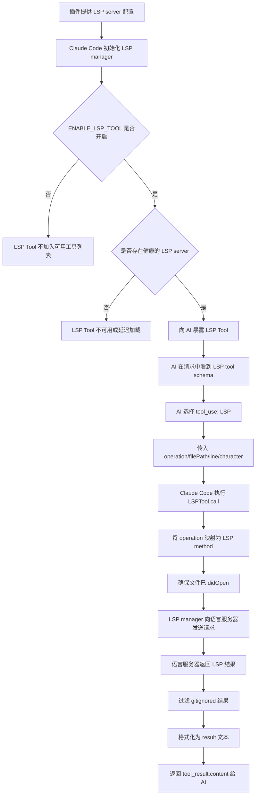

# Claude Code LSP 知识文档

## 目录

### 前置方案调研

- [多语言 LSP 网关 / 代理方案调研](#多语言-lsp-网关--代理方案调研)
- [VS Code Web 内嵌与能力裁剪方案调研](#vs-code-web-内嵌与能力裁剪方案调研)

### 一、基础概念篇

- [LSP 是什么](#lsp-是什么)
- [Claude Code 中的 LSP](#claude-code-中的-lsp)
- [整体原理](#整体原理)
- [执行流程](#执行流程)

### 二、配置与插件篇

- [启用方式](#启用方式)
- [LSP Tool 的暴露方式](#lsp-tool-的暴露方式)
- [LSP server 配置来源](#lsp-server-配置来源)
- [官方 LSP 插件与语言服务器安装命令](#官方-lsp-插件与语言服务器安装命令)
  - [Java JDT.LS 安装细节](#java-jdtls-安装细节)
- [自定义 LSP 插件](#自定义-lsp-插件)

### 三、SDK 集成篇

- [Agent SDK 中使用 LSP](#agent-sdk-中使用-lsp)

### 四、能力参考篇

- [对 AI 暴露的 LSP 能力](#对-ai-暴露的-lsp-能力)
- [Tool 输入参数](#tool-输入参数)
- [Tool 输出参数](#tool-输出参数)
- [各能力输入输出示例](#各能力输入输出示例)

### 五、进阶主题篇

- [LSP 与大模型交互示例](#lsp-与大模型交互示例)
- [代码补全能力与自定义 LSP Client 实现](#代码补全能力与自定义-lsp-client-实现)

### 六、前端编辑篇

- [Monaco 编辑器与 LSP 集成](#monaco-编辑器与-lsp-集成)

### 七、运行时与源码篇

- [运行时细节](#运行时细节)
- [错误和特殊输出](#错误和特殊输出)
- [关键源码位置](#关键源码位置)

## 前置方案调研：多语言 LSP 网关 / 代理方案调研

### 结论

Node.js、Go、Python 生态中都有成熟的开源 LSP 网关 / 代理方案，不需要从零纯手写。差异主要在生态完善度、并发性能、生产稳定性和接入成本。

对于当前“后端独立 LSP 服务 + 前端 Vue/React + `monaco-editor` + `monaco-lsp-bridge` 做代码补全”的需求，推荐方案是：

- 线上部署、多用户并发：Go + `github.com/lspserver/proxy`，作为独立生产级 LSP WebSocket 网关。
- 本地开发、单人调试：Rust `lsp-ws-proxy` 或 Node.js `ws-lsp-bridge`。
- TypeFox 技术栈学习或 Demo：参考 `@typefox/monaco-editor-ws-proxy` / `monaco-languageclient` 示例，但不建议直接用其示例后端上线。
- OpenSumi 完整 IDE 项目内部集成：再考虑 `@opensumi/language-server`。它偏 OpenSumi IDE 双进程架构，不适合作为裸 Monaco + `monaco-lsp-bridge` 的标准 WebSocket LSP Proxy。

### 概念区分

需要先区分两个概念：

- LSP 网关 / Proxy：接收前端 WebSocket，自动拉起 `gopls`、`pyright`、`jdtls`、`typescript-language-server` 等 LSP server，负责消息转发、进程管理、多语言路由、多用户 / 多工作区隔离。这是 Web IDE 场景真正需要建设的核心后端服务。
- 单语言 LSP server：只负责某一门语言代码分析，例如 `gopls`、`pyright`、`typescript-language-server`，本身不是网关。

### 工具区分：`lspserver/proxy`、`lsp-ws-proxy`、`@typefox/monaco-editor-ws-proxy`

#### `github.com/lspserver/proxy`

`github.com/lspserver/proxy` 是纯 Go / Golang 实现，编译后是单二进制文件，无 Node.js 运行时依赖。

定位：生产级后端 LSP 网关代理。

核心作用：

- 对外启动 WebSocket 服务，接收浏览器 Monaco 前端连接。
- 根据语言配置自动 spawn 对应的 stdio 语言服务，例如 `typescript-language-server`、`gopls`、`pyright`、Vue LSP 等。
- 双向转发 WebSocket 与 LSP stdio 标准 JSON-RPC 报文。
- 支持多语言、多端口、连接池、进程生命周期管理、空闲 LSP 进程自动回收。

优势：

- Go goroutine 并发模型适合多用户在线编辑器。
- 内存占用低。
- 跨平台单文件二进制，Windows / Linux / macOS 可直接运行。
- 没有 Node.js 事件循环阻塞问题，更适合云端多用户场景。

与 `monaco-lsp-bridge` 的兼容性：完全兼容。它输出标准 LSP over WebSocket，握手、文档同步、补全、诊断、跳转都可以与 `monaco-lsp-bridge` 互通。

#### `lsp-server-proxy` / `lsp proxy` / `lsp-ws-proxy`

这些名字经常被混用，通常泛指“把 stdio LSP 转成 WebSocket 的代理服务”，不是一个唯一项目名。

常见实现分三类：

1. Rust 版 `lsp-ws-proxy`
   - 安装方式通常是 `cargo install lsp-ws-proxy`。
   - 编译后是轻量单文件二进制。
   - 主要做单语言、单端口 LSP 转发。
   - 适合本地开发、单语言调试。
   - 功能极简，通常不负责完整多语言管理、连接池、空闲回收和生产级多租户隔离。

2. Node.js / TypeScript 版 `ws-lsp-bridge`、`ws-lsp-server`
   - 基于 `ws` + `vscode-jsonrpc` + `child_process`。
   - 优势是前端同栈，调试简单，适合快速实现内部工具。
   - 劣势是高并发时更容易受 Node.js 单线程事件循环、内存占用和进程回收问题影响。

3. Go 版生产网关
   - 典型代表是 `github.com/lspserver/proxy`。
   - 更偏生产部署、多语言、多用户并发。

协议层面，这几类只要输出标准 LSP over WebSocket，都能对接 `monaco-lsp-bridge`。

#### `@typefox/monaco-editor-ws-proxy`

`@typefox/monaco-editor-ws-proxy` 属于 TypeFox / `monaco-languageclient` 生态，通常更适合理解为 TypeFox Monaco LSP 示例体系中的通信与演示配套，而不是生产级独立后端网关。

它的定位包括：

- 依赖 `vscode-ws-jsonrpc`，封装浏览器 WebSocket 与 LSP JSON-RPC 序列化 / 反序列化逻辑。
- 配套 `monaco-languageclient`，用于 Monaco 与 LSP 的连接示例。
- 示例中可能包含极简 Node.js 后端 demo，但主要用于演示，不适合直接作为生产网关。

与 `monaco-lsp-bridge` 的区别：

- TypeFox 全家桶通常是 `monaco-languageclient` + `vscode-ws-jsonrpc` + 示例后端。
- `monaco-lsp-bridge` 是第三方轻量封装，不依赖 TypeFox 套件。
- 两者通信协议可以互通：只要后端是标准 LSP over WebSocket，前端都可以连接。
- 两者 API 不通用，不建议在同一个前端链路中混用。

短板：TypeFox 示例后端通常缺少生产所需的多语言管理、进程池、空闲回收、限流、鉴权、租户隔离等能力。

#### 与 `@opensumi/language-server` 的区别

`@opensumi/language-server` 更适合 OpenSumi 自身 IDE 架构，偏 OpenSumi 私有 RPC / 双进程集成模型，不是给裸 Monaco + `monaco-lsp-bridge` 准备的通用标准 WebSocket LSP Proxy。

因此需要区分：

- `github.com/lspserver/proxy`、Rust `lsp-ws-proxy`、Node `ws-lsp-bridge`、TypeFox 示例：面向标准 LSP over WebSocket，可服务裸 Monaco。
- `@opensumi/language-server`：面向 OpenSumi 完整 IDE 集成，不建议用于当前 `monaco-lsp-bridge` 方案。

#### 选型速查表

| 工具 | 开发语言 | 类型 | 适用场景 | 是否适配 `monaco-lsp-bridge` |
| --- | --- | --- | --- | --- |
| `github.com/lspserver/proxy` | Go | 生产级后端 LSP 网关 | 云端多用户在线编辑器、高并发 | 是，推荐线上 |
| `lsp-ws-proxy` | Rust | 轻量单语言转发 | 本地开发、单语言调试 | 是，适合本地测试 |
| `ws-lsp-bridge` | Node.js / TypeScript | JS 同栈简易转发 | 前端快速调试、小流量内部工具 | 是，适合简单项目 |
| `@typefox/monaco-editor-ws-proxy` | Node.js | TypeFox 官方演示 / 通信配套 | TypeFox 套件学习、Demo | 协议互通，但不推荐混用 |
| `@opensumi/language-server` | TypeScript | OpenSumi IDE 内置语言服务集成 | 完整 OpenSumi IDE 项目 | 不建议用于裸 Monaco + `monaco-lsp-bridge` |

### Node.js 生态

Node.js 生态轮子最多，和前端栈衔接最顺，适合快速搭建内部工具或中小规模 Web IDE。

#### `@opensumi/language-server`

`@opensumi/language-server` 是 OpenSumi 配套的 LSP 代理 / 网关能力，面向 Web IDE 场景，通常不需要手动开发 LSP 代理。

能力包括：

- WebSocket 服务。
- 多 LSP 进程管理。
- 工作区文件同步。
- 多用户隔离。
- LSP JSON-RPC 编解码。
- 请求节流。
- 进程保活、超时销毁。

适合：基于 OpenSumi 快速搭建完整多语言编辑器后端，减少自研进程调度、协议转发和生命周期管理成本。

#### 轻量 LSP 桥

可选项目：

- `ws-lsp-bridge`：极简 WebSocket LSP 桥，一条命令启动，自动 spawn 各类语言服务器，单端口通过路由区分语言。
- `@ridit/relay`：面向 Monaco 的单端口多路复用 LSP 网关，开箱支持 TypeScript、Python、Go、Java 等，前端可通过 `monaco-languageclient` 对接。

适合：不想引入完整 IDE 框架，只需要 Monaco + LSP 能力的业务内嵌编辑器。

#### 自研极简 Node 方案

如果不使用完整框架，也可以基于以下库实现最小转发：

- `ws`
- `vscode-jsonrpc`
- Node.js `child_process`

基础转发代码量不大，但进程管理、异常回收、多工作区隔离、限流、鉴权、日志、资源释放都需要自行补齐。

### Go 生态

Go 生态的现成项目数量少于 Node.js，但性能和并发模型更适合长期线上服务。

#### `lspserver/proxy`

仓库：`github.com/lspserver/proxy`

定位：工业级 LSP 代理，面向云端在线编辑器生产场景。

能力包括：

- YAML 配置文件驱动。
- 配置各语言对应的 LSP 二进制路径。
- WebSocket 服务。
- 多并发协程管理 LSP 子进程。
- 自动清理僵尸进程。
- Docker 打包。
- 多工作区隔离。
- 日志分级。

适合：对外产品、多用户并发、长期稳定线上运行、资源占用敏感的场景。

#### 轻量 Go 自建依赖

如果不使用完整网关，可以用以下基础库实现稳定代理：

- `gorilla/websocket`：处理前端 WebSocket 长连接。
- Go 标准库 `os/exec`：spawn `gopls`、`jdtls`、`pyright` 等语言服务器。
- `github.com/sourcegraph/jsonrpc2`：封装 LSP JSON-RPC 协议。

Go 方案的特点是并发和内存表现优于 Node.js，适合作为生产 LSP 网关，但需要团队具备 Go 服务端开发能力。

### Python 生态

Python 生态适合 Demo、Notebook、内部小工具或本地验证，不建议作为线上多用户 LSP 网关。

#### `jupyter-lsp`

`jupyter-lsp` 是 Jupyter 官方多语言 WebSocket LSP 代理，初衷是服务 Notebook，也可以剥离或单独部署为 LSP 网关。

能力包括：

- 多语言 LSP server 调度。
- WebSocket 接入。
- 与 Jupyter 生态集成成熟。

适合：Notebook 场景、本地验证、内部低并发工具。

#### Python 基础库

- `pygls`：LSP 协议封装库，可用于实现 LSP server 或转发代理，支持 WebSocket、TCP、STDIO 等传输方式。
- `websockets`：Python WebSocket 常用库。

主要短板：Python 在多用户并发和大量 LSP 子进程调度场景下容易受 GIL、CPU 阻塞和资源调度影响，可能出现卡顿、消息延迟或稳定性问题。

### 三种生态对比

| 语言 | 现成完整网关项目 | 底层基础库 | 并发性能 | 上手成本 | 生产推荐度 |
| --- | --- | --- | --- | --- | --- |
| Node.js | `@opensumi/language-server`、`ws-lsp-bridge`、`@ridit/relay` | `ws`、`vscode-jsonrpc`、`child_process` | 一般，多进程内存较高 | 低，前端栈无缝 | 中小型内部工具推荐 |
| Go | `lspserver/proxy` | `gorilla/websocket`、`jsonrpc2`、`os/exec` | 强，协程轻量 | 中等，需要 Go 能力 | 对外在线编辑器首选 |
| Python | `jupyter-lsp` | `pygls`、`websockets` | 较弱，不适合高并发 | 低 | 仅 Demo / 内部低并发 |

### 什么时候需要纯手写

大多数场景不需要从零纯手写 LSP 网关。只有以下情况才考虑完全自研：

1. 定制化极强：需要深度自定义鉴权、文件权限沙箱、LSP 请求限流、计费、分布式多机调度、租户隔离，现有开源框架无法扩展。
2. 极致精简：不希望引入任何第三方框架依赖，只保留最小 WebSocket 与 STDIO 转发逻辑。

如果只是实现网页内嵌编辑器的补全、Hover、Diagnostics、Definition、References，优先复用现成网关或基础库。

### 前端接入方案

#### 轻量封装包

- `monaco-lsp-bridge`：轻量封装 WebSocket、JSON-RPC 与 Monaco 绑定，适合 React / Vue 内嵌编辑器场景。
- `@ridit/relay` 配套前端：后端同包多路复用 WebSocket 网关，前端连接简单，适合单端口多语言路由。
- `monaco-languageclient`：TypeFox 出品，生态完善，提供 `EditorApp`、`LanguageClientWrapper` 等高层 API，内置 LSP 与 Monaco 适配能力。
- `@codingame/monaco-vscode-api`：模拟 VS Code 前端 API，适合需要接近完整 IDE 体验的 Monaco 场景。

#### React / Vue 组件封装

- `@typefox/monaco-editor-react`：React 组件封装，可配合 LSP WebSocket 使用。
- `vue-monaco-lsp`：社区 Vue 封装，适合组件式接入 Monaco + LSP。

#### 可运行 Demo 仓库

- `https://github.com/TypeFox/monaco-languageclient`：官方示例较完整，包含多语言前后端联调示例、WebSocket 网关、Vite 配置。
- `https://github.com/wylieconlon/jsonrpc-ws-proxy`：Node 网关 + Python LSP 示例，可参考配置方式。
- OpenSumi Web-Lite：阿里开源轻量 Web IDE 示例，包含文件树、编辑器、语言能力等，可按需剥离。
- `https://github.com/NipunaMarcus/hellols`：极简前后端联调模板，适合快速验证 LSP 链路。

### 当前项目推荐方案

推荐采用：后端独立 LSP 服务 + 前端 Vue/React + `monaco-editor` + `monaco-lsp-bridge` 做代码补全、Hover、诊断和跳转。

最终选型：

- 线上部署、多用户并发：选择 `github.com/lspserver/proxy`，即 Golang 版本的生产级 LSP WebSocket 网关。
- 本地开发、单人调试：可选择 Rust `lsp-ws-proxy` 或 Node.js `ws-lsp-bridge`。
- 不建议使用 TypeFox 示例后端作为生产服务，它更适合学习 `monaco-languageclient` 体系。
- 不建议在该路线中使用 `@opensumi/language-server`，它更适合 OpenSumi 完整 IDE 内部集成，不是裸 Monaco 的标准 WS LSP Proxy。

建议落地路线：

1. 前端使用 React / Vue + `monaco-editor` + `monaco-lsp-bridge`。
2. 后端先用 `github.com/lspserver/proxy` 搭独立 LSP WebSocket 网关。
3. 服务端预装语言服务器：`typescript-language-server`、`pyright-langserver`、`gopls`，需要 Java 时再加 `jdtls`。
4. 先跑通 TypeScript 的 completion、hover、diagnostics、definition。
5. 再扩展 Python 和 Go。
6. 生产环境补齐鉴权、workspace 隔离、文件权限控制、连接限流、LSP 进程空闲回收和日志监控。

## 前置方案调研：VS Code Web 内嵌与能力裁剪方案调研

### 背景

当前已有 demo 是基于 Monaco / LSP 的一种前端编辑实现方案。另一个待确认方向是：不再自行基于 Monaco 组装文件树、编辑器、补全、跳转等能力，而是直接使用 VS Code Web / code-server / openvscode-server 这类完整 Web IDE。

该方向的主要目标是复用 VS Code Web 已经完整实现的 IDE 能力：

- 文件树
- 文件编辑
- 代码补全
- Hover
- 跳转定义
- 查找引用
- Diagnostics
- 多文件模型
- 语言扩展与 LSP 能力

同时希望关闭不需要或不希望暴露的能力，例如：

- 终端
- 调试
- 部分命令入口
- 部分 Activity Bar / Panel
- 非白名单扩展

核心问题是：VS Code Web 是否能像可模块化 IDE 框架一样，通过配置关闭部分 IDE 能力，只保留文件树、编辑、补全和跳转。

### 方案定位

如果目标是直接复用完整 IDE 能力，VS Code Web 方向是可行的。它相比 Monaco 自研方案的优势是：

| 能力          | Monaco 自研     | VS Code Web        |
| ----------- | ------------- | ------------------ |
| 文件树         | 需要自己实现        | 已内置                |
| 编辑器         | Monaco 本体     | Monaco + Workbench |
| 补全          | 需要接 LSP 或语言服务 | 已内置                |
| 跳转定义        | 需要接 LSP       | 已内置                |
| Diagnostics | 需要接 LSP       | 已内置                |
| 多文件模型       | 需要自己维护        | 已内置                |
| 快捷键 / 命令体系  | 需要自己实现        | 已内置                |
| UI 裁剪       | 高度可控          | 控制力较弱              |
| 终端 / 调试关闭   | 默认没有          | 需要额外关闭或裁剪          |

因此，该方案适合“快速获得完整 IDE 能力”，但不天然适合“强模块化裁剪”。

### 可选实现形态

| 形态                            | 可行性 | 说明                                  |
| ----------------------------- | --: | ----------------------------------- |
| 官方 vscode.dev / github.dev    |   低 | 官方站点不适合作为业务系统内嵌，受 CSP、登录态、跨域和产品边界限制 |
| code-server                   |   高 | 自托管 VS Code Web，适合内嵌、反代和权限控制        |
| openvscode-server             |   高 | 更接近官方 VS Code Web Workbench，适合自托管评估 |
| 基于 Code OSS / VS Code Web 自编译 |  最高 | 控制力最强，但维护成本最高                       |

建议优先评估：

```text
code-server / openvscode-server
```

如果后续需要强裁剪，再评估是否 fork Code OSS / VS Code Web 源码。

### 网页内嵌方式

完整 VS Code Web Workbench 本质是一个完整 Web 应用，不是普通 React/Vue 组件库。它自己管理：

- 路由
- 全局样式
- 快捷键
- Web Worker
- WebSocket
- IndexedDB / localStorage
- 扩展宿主
- Workbench 生命周期
- 文件系统访问
- 认证跳转

因此，工程上常见的内嵌方式主要有两类：

```text
1. iframe 内嵌完整 IDE 页面
2. 不使用 iframe，将 IDE 作为独立页面或子路径打开
```

不推荐把 VS Code Web Workbench 当作微前端组件直接挂载到业务页面中。理论上可以尝试，但会遇到 loader、worker、CSS、快捷键、Service Worker、扩展宿主等大量冲突，工程风险较高。

### iframe 内嵌的认证问题

iframe 不是唯一选择，但如果要在业务页面中局部嵌入完整 IDE，实际工程上通常还是 iframe。

跨域 iframe 最容易出现认证问题，例如：

```text
业务系统：https://app.example.com
IDE 服务：https://ide.example.com
```

此时 IDE Cookie 对业务系统来说属于第三方上下文，现代浏览器会限制第三方 Cookie，尤其是 Safari 和逐步收紧第三方 Cookie 的 Chrome。

常见问题包括：

| 问题                     | 表现                 | 处理方式                                              |
| ---------------------- | ------------------ | ------------------------------------------------- |
| 第三方 Cookie 被拦截         | iframe 内 IDE 无登录态  | 尽量同域反代；跨站时 Cookie 需 `SameSite=None; Secure`       |
| SameSite 配置错误          | iframe 请求不带 Cookie | 使用 HTTPS，并设置 `SameSite=None; Secure`              |
| CSP 禁止嵌入               | iframe 加载失败        | 配置 `Content-Security-Policy: frame-ancestors ...` |
| X-Frame-Options 禁止嵌入   | 浏览器拒绝展示            | 避免 `DENY` / `SAMEORIGIN`，或同源部署                    |
| SSO/OAuth 禁止 iframe 登录 | 登录页拒绝在 iframe 中展示  | 不在 iframe 内走完整登录，外层先登录后传递一次性 ticket               |

跨域 iframe + IDE 内部自己做 SSO/OAuth 登录，是风险最高的方式，不建议作为正式方案。

### 推荐内嵌路径一：同域反向代理 + iframe

推荐将业务系统和 IDE 放在同一个域名或同站点路径下：

```text
https://app.example.com/          -> 业务系统
https://app.example.com/ide/      -> VS Code Web / code-server / openvscode-server
```

业务页面中使用：

```html
<iframe src="/ide/?workspace=xxx"></iframe>
```

由网关统一处理认证：

```text
用户请求 /ide/*
  ↓
Gateway 校验主站 Cookie / Token
  ↓
通过后再转发给 IDE 服务
```

优点：

- 避免第三方 Cookie 问题
- CSP 可配置为 `frame-ancestors 'self'`
- 登录态可以由统一网关处理
- WebSocket 可以统一反向代理
- 业务系统和 IDE 仍然保持 iframe 隔离

注意点：

- IDE 服务需要支持 base path
- 反向代理需要正确处理 WebSocket Upgrade
- Cookie Path 建议限制到 `/ide`
- 静态资源路径需要验证
- iframe 与外层通信建议使用 `postMessage`

### 推荐内嵌路径二：同域独立 IDE 路由

如果不强制要求在业务页面中局部展示 IDE，可以把 IDE 做成业务系统下的独立页面：

```text
https://app.example.com/ide/?workspace=xxx
```

用户点击“打开 IDE”后直接进入该页面，不再套 iframe。

优点：

- 没有 iframe 第三方 Cookie 问题
- 没有 `frame-ancestors` 问题
- IDE 快捷键、布局、全屏体验最好
- 认证链路最简单

缺点：

- 不能在业务页面中局部嵌入
- 与业务系统 UI 融合较弱
- 需要通过 URL、后端 API 或跳转上下文传递 workspace 信息

这是认证最稳定的方式。

### 终端能力关闭

VS Code Web 通常可以通过配置、命令隐藏、快捷键移除、禁用内置 contribution 等方式弱化终端入口。例如部分发行版支持：

```json
{
  "terminal.integrated.enabled": false
}
```

还可以配合：

- 隐藏 Terminal 菜单
- 移除 \`Ctrl+\`\` 快捷键
- 隐藏底部 Panel 入口
- 禁用相关命令入口
- 禁用终端相关内置扩展或 contribution

但需要注意：这些大多属于 UI 或配置层关闭，不一定等于安全关闭。

如果终端能力必须彻底不可用，不能只隐藏按钮，还需要：

```text
1. 前端隐藏终端入口
2. 禁用终端相关配置
3. 后端禁止创建 pty / shell
4. 反向代理层限制相关 WebSocket / API
5. 必要时源码层移除 terminal contribution
```

正式产品不建议只依赖 UI 隐藏。

### 调试能力关闭

调试能力比终端更复杂，涉及：

- Run and Debug Activity Bar
- Debug 面板
- `launch.json`
- Debug Adapter
- 断点
- 调试命令
- 语言扩展贡献的 debugger

可以采取的措施：

- 隐藏 Run and Debug 视图
- 移除调试相关快捷键
- 禁用 debug 相关内置扩展
- 禁用语言扩展里的 debugger contribution
- 后端禁止启动 debug adapter
- 必要时源码层移除 debug contribution

VS Code Web 默认没有一个稳定、完整的官方配置项可以声明“关闭全部 Debug 能力”。如果只是产品体验上不展示，可以配置隐藏；如果是安全上绝对不允许，需要后端拦截或源码裁剪。

### 能力裁剪的实现层级

| 层级    | 方式                                | 适用场景     | 安全性 |
| ----- | --------------------------------- | -------- | --: |
| UI 隐藏 | 隐藏菜单、视图、快捷键、Activity Bar          | POC、内部演示 |   低 |
| 配置限制  | settings、keybindings、禁用部分功能       | 内部系统     |  中低 |
| 扩展白名单 | 只允许安装/启用指定扩展                      | 正式系统     |   中 |
| 后端拦截  | 禁止 pty、shell、debug adapter、敏感 API | 正式系统     |   高 |
| 源码裁剪  | 移除 terminal/debug contribution    | 强控制产品    |  最高 |

推荐不要把“关闭能力”仅理解成前端配置。对于终端和调试这类会触发后端进程或系统能力的功能，至少需要后端权限控制。

### 推荐落地策略

#### POC 阶段

```text
code-server / openvscode-server
  + 同域反代
  + iframe 或独立 /ide 路由
  + settings/keybindings 隐藏终端和调试入口
  + 禁用不需要的扩展
```

目标是验证：

- 文件树是否满足需求
- 文件编辑是否满足需求
- 补全/跳转是否完整
- LSP/语言扩展是否可用
- iframe 或独立路由认证是否稳定

#### 正式产品阶段

```text
code-server / openvscode-server
  + Gateway 统一认证
  + 扩展白名单
  + 终端/调试 UI 隐藏
  + 后端禁止 pty / shell / debug adapter
  + workspace 级权限隔离
```

这是一条较平衡的路径：保留 VS Code Web 的完整 IDE 能力，同时避免终端和调试带来的安全风险。

#### 强安全 / 强白标阶段

```text
fork Code OSS / VS Code Web
  + 移除 terminal contribution
  + 移除 debug contribution
  + 自定义 product.json
  + 自定义内置扩展列表
  + 自定义认证和 workspace 权限
```

适合对外产品、多租户平台、强安全环境。缺点是维护成本最高，后续跟随 VS Code upstream 升级会有持续成本。

### Theia 与 OpenSumi 方案补充

除 VS Code Web 外，Theia 和 OpenSumi 也是可选方案。它们不是单纯编辑器，而是用于构建类 VS Code 的 Web IDE / Cloud IDE 框架。

二者底层通常都使用 Monaco 作为代码编辑器，但在 Monaco 之上提供了完整 IDE 框架能力：

- 文件树
- 多标签编辑器
- 命令体系
- 菜单和快捷键
- LSP 语言服务
- 补全、跳转、Hover、Diagnostics
- Git、终端、调试等可选 IDE 能力
- 前后端通信和插件/扩展机制

可以理解为：

```text
Monaco：编辑器内核
Theia / OpenSumi：基于 Monaco 的完整 Web IDE 框架
VS Code Web：完整 VS Code Web 产品形态
```

#### Theia 是什么

Theia 即 Eclipse Theia，是 Eclipse 基金会下的开源 Web IDE 框架。它更偏国际化、基金会背书和通用 IDE 平台定位。

特点：

- Eclipse 基金会项目
- 国际开源生态相对成熟
- 架构稳定，历史较长
- 支持前后端分离
- 支持 Theia extension，也兼容部分 VS Code extension
- 适合构建企业 IDE、嵌入式 IDE、云开发平台

#### OpenSumi 是什么

OpenSumi 是阿里系开源的云端 IDE 框架，同样用于构建类 VS Code 的 Web IDE。它更偏业务系统集成、模块化裁剪和国内云 IDE 场景。

特点：

- 阿里系开源项目
- 面向云 IDE 和业务研发平台场景
- 模块化和布局定制能力较强
- 更贴近国内中后台 / 研发平台集成习惯
- 支持 OpenSumi contribution，也兼容部分 VS Code extension
- 中文资料和国内实践相对更容易获取

#### Theia 与 OpenSumi 对比

| 维度           | Theia                     | OpenSumi            |
| ------------ | ------------------------- | ------------------- |
| 背景           | Eclipse 基金会               | 阿里系开源               |
| 定位           | 通用 Web IDE / Cloud IDE 框架 | 可高度定制的云端 IDE 框架     |
| 底层编辑器        | Monaco                    | Monaco              |
| UI 风格        | 类 VS Code                 | 类 VS Code           |
| 架构           | 前后端分离                     | 前后端分离               |
| 模块裁剪         | 支持，理解成本偏高                 | 支持，业务集成更直观          |
| UI / 布局定制    | 支持                        | 支持，通常更友好            |
| VS Code 扩展兼容 | 支持部分扩展                    | 支持部分扩展              |
| 国内资料         | 相对少                       | 相对多                 |
| 适合场景         | 国际化、通用 IDE 平台、企业 IDE      | 国内云 IDE、业务系统内嵌、白标定制 |

#### 与 VS Code Web 的差异

| 维度          | VS Code Web / code-server | Theia / OpenSumi          |
| ----------- | ------------------------- | ------------------------- |
| 定位          | 完整 IDE 产品形态               | 可组装 IDE 框架                |
| 上手速度        | 快                         | 中等                        |
| IDE 能力完整度   | 很高                        | 高                         |
| VS Code 兼容性 | 更好                        | 兼容部分扩展                    |
| 模块裁剪        | 较难                        | 更适合                       |
| 白标定制        | 较难                        | 更适合                       |
| 业务系统融合      | iframe / 路由集成为主           | 更适合深度集成                   |
| 关闭终端/调试     | 需要隐藏、拦截或源码裁剪              | 可不引入对应模块或不暴露 contribution |

VS Code Web 更像“拿来即用的完整 IDE”，Theia / OpenSumi 更像“用来组装自己的 Web IDE 的框架”。

#### 能力裁剪对比

对于当前关注的“只保留文件树、文件编辑、代码补全、跳转，关闭终端和调试”场景：

| 能力裁剪             | Theia | OpenSumi | VS Code Web |
| ---------------- | ----: | -------: | ----------: |
| 不引入 Terminal 模块  |    支持 |       支持 |          较难 |
| 不引入 Debug 模块     |    支持 |       支持 |          较难 |
| 自定义 Activity Bar |    支持 |   支持，较友好 |          较难 |
| 自定义菜单命令          |    支持 |   支持，较友好 |          较难 |
| 自定义布局            |    支持 |   支持，较友好 |          较难 |
| 扩展白名单            |    支持 |       支持 |    支持但需额外治理 |
| 后端权限隔离           | 需要自己做 |    需要自己做 |       需要自己做 |
| 白标定制             |    支持 |   支持，较友好 |          较难 |

因此，如果要做强业务定制和模块裁剪，Theia / OpenSumi 通常比 VS Code Web 更适合。

#### OpenSumi Lite 与完整版

OpenSumi 可以分成两种典型形态：

```text
OpenSumi Lite / CodeBlitz：纯前端、轻量化 Web IDE，主要运行在浏览器内。
OpenSumi 完整版：前端 + 后端 Node 服务，提供完整 IDE 运行时能力。
```

二者不是简单的“功能多和少”的关系，而是面向不同产品场景：Lite 更适合代码浏览、代码评审、轻编辑和业务页面内嵌；完整版更适合完整云 IDE、复杂项目在线开发和完整 LSP 场景。

##### 核心差异

| 维度           | OpenSumi Lite / CodeBlitz               | OpenSumi 完整版    |
| ------------ | --------------------------------------- | --------------- |
| 运行形态         | 纯前端为主                                   | 前端 + 后端         |
| 是否需要 Node 后端 | 不需要标准 IDE Node 后端                       | 需要              |
| 是否需要容器       | 通常不需要                                   | 云 IDE 场景通常需要    |
| 文件系统         | HTTP 接口 / IndexedDB / 内存 / 自定义 Provider | 后端真实文件系统        |
| LSP 能力       | 受限，常用 Worker 语言服务或 LSIF                 | 完整 LSP Server   |
| 跨文件分析        | 受限，依赖 LSIF 或后端服务                        | 完整支持            |
| 终端           | 不适合                                     | 支持              |
| 调试           | 不适合或能力有限                                | 支持              |
| Git          | 受限                                      | 支持更完整           |
| 插件           | Worker 插件 / 纯前端插件能力                     | 更完整插件体系         |
| 启动速度         | 快                                       | 相对重             |
| 部署复杂度        | 低                                       | 中高              |
| 定制成本         | 低到中                                     | 中               |
| IDE 完整度      | 中                                       | 高               |
| 适合场景         | 代码浏览、评审、轻编辑、嵌入业务页面                      | 完整编码、云开发、企业 IDE |

一句话概括：

```text
Lite：把 IDE 前端能力轻量化，文件和语言能力更多依赖浏览器、HTTP 接口、Worker 或离线索引。
完整版：提供完整 IDE 运行时，后端负责文件系统、LSP Server、插件宿主、终端、调试等能力。
```

##### Lite 的使用重点

Lite 的重点是“轻接入”。它适合把 IDE 作为业务系统的一部分嵌入进去，由业务系统提供文件、权限和认证能力。

接入时主要关注三块：

1. **文件服务**：只读场景至少实现目录读取和文件读取；编辑场景还需要实现文件写入、创建、删除。
2. **语言能力**：基础提示可用 Worker 语言服务；代码浏览和评审类场景可用 LSIF 支持跨文件 Hover 和跳转；如果要完整项目级补全，则需要额外后端语言服务或改用完整版。
3. **业务集成**：认证、权限、仓库信息、分支信息、文件接口都可以复用业务系统已有能力。

Lite 不是完整版的简单降级版。对于代码浏览、代码评审、轻量编辑这类不需要终端、调试和完整容器的场景，Lite 反而更合适。

##### 完整版的使用重点

完整版的重点是“完整开发环境”。它适合让用户真的在浏览器里进行项目开发。

接入时主要关注：

1. **workspace 管理**：每个用户或会话对应的工作区、文件系统和权限隔离。
2. **语言服务**：通过真实 LSP Server 提供更完整的跨文件补全、跳转、引用、诊断能力。
3. **插件能力**：可以获得更完整的插件宿主和扩展生态。
4. **能力裁剪**：如果不需要终端、调试，可以通过模块、扩展白名单、后端权限控制等方式不引入或禁用。

完整版能力更完整，但部署、资源、隔离和安全治理成本也更高。

##### 适合场景结论

| 产品目标               | 更适合的形态    | 原因                                  |
| ------------------ | --------- | ----------------------------------- |
| 只读代码浏览             | Lite      | 文件接口即可支撑，部署轻                        |
| Code Review / 代码评审 | Lite      | 可结合 LSIF 支持跳转和 Hover，不需要完整开发环境      |
| 业务页面内嵌轻编辑          | Lite      | 认证和权限更容易接业务系统                       |
| 在线修改少量文件           | Lite 或完整版 | 取决于是否需要完整跨文件分析                      |
| 大型项目在线开发           | 完整版       | 需要完整 LSP、文件系统和插件能力                  |
| AI 编程 / 云端研发环境     | 完整版       | 需要真实 workspace、语言服务、运行环境            |
| 多语言复杂项目            | 完整版       | Lite 的 Worker 语言服务和 LSIF 难以覆盖完整开发体验 |

当前场景更建议按下面顺序验证：

```text
1. OpenSumi Lite + 自定义文件服务
2. Lite + Worker 语言服务 / LSIF 跳转
3. 如果跨文件补全和跳转不足，再评估 OpenSumi 完整版
4. 如果选择完整版，再禁用终端、调试和非必要模块
```

#### 选型建议

| 目标                    | 推荐方案                            |
| --------------------- | ------------------------------- |
| 快速获得最接近 VS Code 的完整体验 | code-server / openvscode-server |
| 代码浏览、评审、轻编辑、业务页面内嵌    | OpenSumi Lite / CodeBlitz       |
| 完整云 IDE、复杂项目编辑、完整 LSP | OpenSumi 完整版 / Theia            |
| 做可控、可裁剪、可白标的 Web IDE  | OpenSumi / Theia                |
| 国内业务系统集成、研发平台内嵌       | 优先评估 OpenSumi                   |
| 国际化生态、基金会背书、通用 IDE 平台 | 优先评估 Theia                      |
| 只需要轻量编辑器，完全自定义 UI     | Monaco 自研                       |

对当前需求：

```text
1. 页面中集成 IDE 能力
2. 文件树
3. 文件编辑
4. 代码补全
5. 代码跳转
6. 不要终端
7. 不要调试
8. 希望认证和业务系统融合
9. 希望比 Monaco 自研更省事
```

优先级建议是：

```text
第一选择：OpenSumi
第二选择：Theia
第三选择：VS Code Web / code-server
第四选择：Monaco 自研
```

原因是：

- VS Code Web 能力最完整，但裁剪和内嵌认证更麻烦。
- Monaco 自研最可控，但需要自己补齐大量 IDE 能力。
- Theia / OpenSumi 介于二者之间，更适合“想要完整 IDE 能力，但又要裁剪和业务集成”的场景。
- 如果团队在国内环境，OpenSumi 的资料、背景和业务集成思路可能更匹配。

### 与 Monaco 方案的取舍

| 维度        | Monaco 自研方案 | VS Code Web 方案  | Theia / OpenSumi 方案 |
| --------- | ----------- | --------------- | ------------------- |
| IDE 能力完整度 | 需要逐步补齐      | 开箱即用            | 高，框架已提供大量能力         |
| 开发速度      | 前期慢         | 前期快             | 中等                  |
| UI 自定义    | 高           | 中低              | 高                   |
| 能力裁剪      | 高           | 中               | 高                   |
| 认证集成      | 简单          | iframe / 反代需设计  | 更适合业务系统融合           |
| LSP 接入    | 需要自行实现      | 已有成熟链路          | 框架提供成熟集成            |
| 终端/调试控制   | 默认无此能力      | 需要关闭或拦截         | 可不引入或不暴露对应模块        |
| 长期维护      | 自研代码维护      | 跟随 VS Code 生态维护 | 跟随框架生态维护            |

如果目标是快速获得完整 VS Code 体验，VS Code Web 更合适。

如果目标是高度定制、只暴露少量能力、与业务页面深度融合，Theia / OpenSumi 更可控。

如果只需要轻量编辑器，并且愿意自研文件树、LSP、补全、跳转等能力，Monaco 自研最灵活。

### 结论

VS Code Web 方案可行，但需要明确边界：

```text
1. 它适合复用完整 IDE 能力。
2. 它不天然提供强模块化裁剪能力。
3. 网页局部内嵌通常还是 iframe。
4. iframe 认证建议优先采用同域反向代理，避免跨域第三方 Cookie 问题。
5. 终端、调试不建议只靠 UI 隐藏，正式产品至少需要后端拦截。
6. 如果需要强裁剪和强安全，最终可能需要源码级裁剪。
```

推荐优先验证路径：

```text
第一优先：同域反代 + iframe + code-server/openvscode-server
第二优先：同域独立 /ide 路由，不使用 iframe
第三优先：配置隐藏 + 后端拦截终端/调试能力
必要时：fork VS Code Web 做源码裁剪
```

## 一、基础概念篇

### LSP 是什么

LSP 是 Language Server Protocol 的缩写，即语言服务器协议。它定义了编辑器、IDE、代码工具与语言服务器之间的通信方式。

语言服务器负责理解某种编程语言或项目结构，并对外提供代码智能能力，例如：

- 跳转到定义
- 查找引用
- 获取符号类型和文档
- 获取文件符号大纲
- 获取工作区符号
- 查找接口实现
- 分析函数调用层级

LSP 的价值在于把语言智能能力从编辑器中抽离出来。只要工具实现了 LSP 客户端能力，就可以复用不同语言服务器提供的代码理解能力。

### Claude Code 中的 LSP

Claude Code 中的 LSP 能力以内部 Tool 的形式暴露给 AI。

对 AI 来说，它看到的是一个名为 `LSP` 的工具。AI 调用这个工具时，通过 `operation` 字段选择具体能力，例如：

- `goToDefinition`
- `findReferences`
- `hover`
- `documentSymbol`
- `workspaceSymbol`
- `goToImplementation`
- `prepareCallHierarchy`
- `incomingCalls`
- `outgoingCalls`

AI 不直接连接语言服务器，也不直接发送 LSP 协议请求。Claude Code 在本地接收 AI 的 tool 调用，然后把 `operation/filePath/line/character` 转换成真实的 LSP method 和 params，再通过内部 LSP manager 与语言服务器通信。

### 整体原理

Claude Code 的 LSP 能力由四层组成：

| 层级                | 作用                                 |
| ----------------- | ---------------------------------- |
| AI Tool 层         | 向 AI 暴露 `LSP` 工具和 operation schema |
| Tool 执行层          | 校验输入、打开文件、转换 operation、格式化结果       |
| LSP manager 层     | 管理语言服务器生命周期、文件打开状态、请求转发            |
| Language Server 层 | 真正理解代码并返回定义、引用、符号、调用层级等结果          |

AI 调用的是 Tool 层抽象，真实代码智能能力来自底层语言服务器。

### 执行流程



## 二、配置与插件篇

### 启用方式

LSP 能力需要 Claude Code `2.0.74+`。当前源码相关 changelog 显示 bundled CLI 已高于该版本，但精确运行时版本需要通过 `claude --version` 或构建产物确认。

启动时需要设置环境变量：

```bash
ENABLE_LSP_TOOL=1 claude
```

开发或本地运行源码时，在对应启动命令前加同样的环境变量。

此外，还需要满足：

1. 插件提供对应文件类型的 LSP server 配置。
2. 插件处于启用状态。
3. 工作区通过 trust 检查。
4. LSP manager 初始化成功。
5. 至少一个语言服务器连接成功且状态健康。

### LSP Tool 的暴露方式

`LSPTool` 是标准内部 Tool，具备以下特征：

- 工具名：`LSP`
- 对 AI 暴露的能力入口：`operation`
- 输入参数：`filePath`、`line`、`character`
- 输出结果：格式化后的 `result` 文本
- 只读工具：不会直接修改文件
- 并发安全：可以并发执行
- 延迟加载：初始化未完成时可走 `defer_loading`

工具是否可用受运行时状态控制：

1. `ENABLE_LSP_TOOL` 环境变量需要开启。
2. LSP manager 需要初始化成功。
3. 至少有一个语言服务器连接成功且状态健康。
4. 当前文件类型需要有插件提供对应的 LSP server。

### LSP server 配置来源

Claude Code 当前通过插件提供 LSP server 配置。插件加载后，Claude Code 会读取插件中的 LSP server 配置，并交给 LSP manager 管理。

配置可以来自：

1. 插件根目录的 `.lsp.json`。
2. 插件 `.claude-plugin/plugin.json` 中的 `lspServers` 字段。
3. marketplace / catalog 对插件的 `lspServers` 声明。

使用官方已支持的 LSP 插件时，通常不需要自己写 `.lsp.json`；安装官方插件和对应 language server binary 即可。官方不支持的语言、需要特殊启动参数、需要调整 diagnostics 行为时，才需要自定义 LSP 插件配置。

自定义 `.lsp.json` 示例：

```json
{
  "go": {
    "command": "gopls",
    "args": ["serve"],
    "extensionToLanguage": {
      ".go": "go"
    },
    "diagnostics": false
  }
}
```

字段含义：

| 字段                    | 说明                                                       |
| --------------------- | -------------------------------------------------------- |
| `go`                  | LSP server 配置名称，在插件内唯一即可                                 |
| `command`             | Claude Code runtime 要启动的 language server 命令，必须在 `PATH` 中 |
| `args`                | 启动 language server 时传入的参数                                |
| `extensionToLanguage` | 文件扩展名到 LSP language id 的映射                               |
| `diagnostics`         | 是否把 diagnostics 自动注入 Claude 上下文，默认 `true`                |

### 官方 LSP 插件与语言服务器安装命令

官方插件仓库地址：<https://github.com/anthropics/claude-plugins-official/tree/main/plugins>

安装 Claude Code 插件的通用方式：

```text
/plugin install {plugin-name}@claude-plugins-official
```

也可以通过 Claude Code 内的 `/plugin > Discover` 浏览并安装。

下表列出官方 `plugins` 目录中已提供的 LSP 插件、支持的语言/文件扩展名，以及对应语言服务器的安装命令。

| Claude 插件           | 语言 / LSP 服务                                        | 支持扩展名                                                         | 插件安装命令                                                      | LSP 服务安装命令                                                                                                                                                                                           |
| ------------------- | -------------------------------------------------- | ------------------------------------------------------------- | ----------------------------------------------------------- | ---------------------------------------------------------------------------------------------------------------------------------------------------------------------------------------------------- |
| `clangd-lsp`        | C / C++，clangd                                     | `.c`, `.h`, `.cpp`, `.cc`, `.cxx`, `.hpp`, `.hxx`, `.C`, `.H` | `/plugin install clangd-lsp@claude-plugins-official`        | macOS: `brew install llvm`；Ubuntu/Debian: `sudo apt install clangd`；Fedora: `sudo dnf install clang-tools-extra`；Arch: `sudo pacman -S clang`；Windows: `winget install LLVM.LLVM`                    |
| `csharp-lsp`        | C#，csharp-ls                                       | `.cs`                                                         | `/plugin install csharp-lsp@claude-plugins-official`        | 推荐: `dotnet tool install --global csharp-ls`；macOS: `brew install csharp-ls`                                                                                                                         |
| `gopls-lsp`         | Go，gopls                                           | `.go`                                                         | `/plugin install gopls-lsp@claude-plugins-official`         | `go install golang.org/x/tools/gopls@latest`                                                                                                                                                         |
| `jdtls-lsp`         | Java，Eclipse JDT.LS                                | `.java`                                                       | `/plugin install jdtls-lsp@claude-plugins-official`         | macOS: `brew install jdtls`；Arch AUR: `yay -S jdtls`；其他 Linux: 手动安装 Eclipse JDT.LS 并创建 `jdtls` wrapper                                                                                               |
| `kotlin-lsp`        | Kotlin，Kotlin LSP                                  | `.kt`, `.kts`                                                 | `/plugin install kotlin-lsp@claude-plugins-official`        | `brew install JetBrains/utils/kotlin-lsp`                                                                                                                                                            |
| `lua-lsp`           | Lua，Lua Language Server                            | `.lua`                                                        | `/plugin install lua-lsp@claude-plugins-official`           | macOS: `brew install lua-language-server`；Ubuntu/Debian: `sudo snap install lua-language-server --classic`；Arch: `sudo pacman -S lua-language-server`；Fedora: `sudo dnf install lua-language-server` |
| `php-lsp`           | PHP，Intelephense                                   | `.php`                                                        | `/plugin install php-lsp@claude-plugins-official`           | npm: `npm install -g intelephense`；yarn: `yarn global add intelephense`                                                                                                                              |
| `pyright-lsp`       | Python，Pyright / python-lsp-server                 | `.py`, `.pyi`                                                 | `/plugin install pyright-lsp@claude-plugins-official`       | **推荐**：`pip install python-lsp-server[all]`；备选：`pip install pyright`（仅类型检查，无补全）                                                                                                                      |
| `ruby-lsp`          | Ruby，Ruby LSP                                      | `.rb`, `.rake`, `.gemspec`, `.ru`, `.erb`                     | `/plugin install ruby-lsp@claude-plugins-official`          | gem: `gem install ruby-lsp`；Bundler: 在 `Gemfile` 加 `gem 'ruby-lsp', group: :development` 后执行 `bundle install`                                                                                        |
| `rust-analyzer-lsp` | Rust，rust-analyzer                                 | `.rs`                                                         | `/plugin install rust-analyzer-lsp@claude-plugins-official` | 推荐: `rustup component add rust-analyzer`；macOS: `brew install rust-analyzer`；Ubuntu/Debian: `sudo apt install rust-analyzer`；Arch: `sudo pacman -S rust-analyzer`                                    |
| `swift-lsp`         | Swift，SourceKit-LSP                                | `.swift`                                                      | `/plugin install swift-lsp@claude-plugins-official`         | macOS: 安装 Xcode，或 `brew install swift`；Linux: 从 <https://www.swift.org/download/> 安装 Swift，确保 `sourcekit-lsp` 在 PATH 中                                                                               |
| `typescript-lsp`    | TypeScript / JavaScript，typescript-language-server | `.ts`, `.tsx`, `.js`, `.jsx`, `.mts`, `.cts`, `.mjs`, `.cjs`  | `/plugin install typescript-lsp@claude-plugins-official`    | npm: `npm install -g typescript-language-server typescript`；yarn: `yarn global add typescript-language-server typescript`                                                                            |

### Java JDT.LS 安装细节

`jdtls-lsp` 使用的是 Eclipse JDT.LS。JDT.LS 要求本机安装 **Java 17 或更高版本的 JDK**，不是只安装 JRE。

#### Java 版本要求

先确认当前 Java 版本：

```bash
java -version
```

常见版本对应关系：

| 常见说法    | `java -version` 可能显示 | 是否满足 JDT.LS 要求 |
| ------- | -------------------- | -------------: |
| Java 8  | `1.8.0_xxx`          |              否 |
| Java 11 | `11.x.x`             |              否 |
| Java 17 | `17.x.x`             |              是 |
| Java 21 | `21.x.x`             |              是 |

`Java 8` 和 `Java 1.8` 是同一个版本。`JDK 17+` 表示 JDK 17、JDK 21 等，不包括 Java 8 / Java 1.8。

如果本机只有 Java 8 或 Java 11，通常无法启动当前官方 `jdtls-lsp` 依赖的 JDT.LS 服务。解决方案是额外安装一个 JDK 17+，专门用于运行 JDT.LS。

这不要求业务项目升级到 Java 17。Java 8 项目仍然可以保持 Java 8 编译目标，例如 Maven 中继续使用：

```xml
<source>1.8</source>
<target>1.8</target>
```

或 Gradle 中继续使用：

```gradle
sourceCompatibility = JavaVersion.VERSION_1_8
targetCompatibility = JavaVersion.VERSION_1_8
```

推荐做法是：

```text
JDK 8：用于老项目编译和运行
JDK 17+：用于启动 JDT.LS language server
```

#### 推荐的 JDK 17+ 发行版

JDK 17+ 不一定收费。为了减少授权不确定性，建议优先使用常见 OpenJDK 发行版，而不是默认选择 Oracle JDK。

| JDK 发行版                    | 出品方 / 维护方                             | 说明                                | 适合场景               |
| -------------------------- | ------------------------------------- | --------------------------------- | ------------------ |
| Eclipse Temurin            | Eclipse Adoptium / Eclipse Foundation | 社区常用 OpenJDK 发行版，前身是 AdoptOpenJDK | 本地开发、CI、企业环境       |
| Amazon Corretto            | Amazon / AWS                          | AWS 维护的 OpenJDK 发行版，免费长期支持        | AWS、服务器、企业环境       |
| Microsoft Build of OpenJDK | Microsoft                             | Microsoft 维护的 OpenJDK 发行版         | Windows、Azure、微软生态 |
| Azul Zulu Community        | Azul Systems                          | Azul 维护的 OpenJDK 发行版，有免费社区版和商业支持版 | 企业环境、本地开发          |
| Homebrew `openjdk@17`      | Homebrew 分发的 OpenJDK 包                | macOS 上安装方便                       | macOS 本地开发         |
| Oracle JDK                 | Oracle                                | Oracle 官方 JDK，授权政策需要单独确认          | 已确认 Oracle 授权的环境   |

推荐优先级：

1. Eclipse Temurin 17 / 21
2. Amazon Corretto 17 / 21
3. Microsoft OpenJDK 17 / 21
4. Homebrew `openjdk@17`

#### 安装 JDK 17+

macOS 推荐使用 Eclipse Temurin：

```bash
brew install --cask temurin@17
```

或者使用 Amazon Corretto：

```bash
brew install --cask corretto17
```

也可以使用 Homebrew OpenJDK：

```bash
brew install openjdk@17
```

安装后确认：

```bash
java -version
```

如果系统同时存在 JDK 8 和 JDK 17+，需要确保启动 `jdtls` 时使用的是 JDK 17+。可以通过 `JAVA_HOME` 指定：

```bash
export JAVA_HOME=$(/usr/libexec/java_home -v 17)
export PATH="$JAVA_HOME/bin:$PATH"
```

Linux 可以选择 Eclipse Temurin、Amazon Corretto 或系统包管理器中的 OpenJDK 17。例如 Ubuntu / Debian：

```bash
sudo apt update
sudo apt install openjdk-17-jdk
```

安装后确认：

```bash
java -version
```

#### 安装 JDT.LS

macOS 可以用 Homebrew 安装 JDT.LS：

```bash
brew install jdtls
```

安装后确认命令可用：

```bash
command -v jdtls
```

Arch Linux 可以通过 AUR 安装：

```bash
yay -S jdtls
```

其他 Linux 发行版通常需要手动安装 Eclipse JDT.LS：

1. 从 Eclipse JDT.LS snapshots 下载发行包：<https://download.eclipse.org/jdtls/snapshots/>
2. 解压到固定目录，例如：

```bash
mkdir -p ~/.local/share/jdtls
```

1. 将下载的 JDT.LS 内容解压到该目录。
2. 在 `PATH` 中创建名为 `jdtls` 的 wrapper 脚本。

wrapper 脚本示例：

```bash
#!/usr/bin/env bash
export JAVA_HOME="${JAVA_HOME:-/path/to/jdk-17}"
export PATH="$JAVA_HOME/bin:$PATH"
JDTLS_HOME="$HOME/.local/share/jdtls"
LAUNCHER_JAR=$(ls "$JDTLS_HOME"/plugins/org.eclipse.equinox.launcher_*.jar | head -n 1)
java \
  -Declipse.application=org.eclipse.jdt.ls.core.id1 \
  -Dosgi.bundles.defaultStartLevel=4 \
  -Declipse.product=org.eclipse.jdt.ls.core.product \
  -Dlog.protocol=true \
  -Dlog.level=ALL \
  -Xmx1G \
  --add-modules=ALL-SYSTEM \
  --add-opens java.base/java.util=ALL-UNNAMED \
  --add-opens java.base/java.lang=ALL-UNNAMED \
  -jar "$LAUNCHER_JAR" \
  -configuration "$JDTLS_HOME/config_linux" \
  -data "${1:-$PWD/.jdtls-workspace}"
```

保存为 `~/.local/bin/jdtls`，并赋予执行权限：

```bash
chmod +x ~/.local/bin/jdtls
```

确保 `~/.local/bin` 在 `PATH` 中：

```bash
export PATH="$HOME/.local/bin:$PATH"
```

最后确认：

```bash
command -v jdtls
```

#### 部署 Claude Java LSP 插件

JDK 17+ 和 `jdtls` 准备好后，安装 Claude 官方插件：

```text
/plugin install jdtls-lsp@claude-plugins-official
```

如果是在已运行的 Claude Code 会话中安装插件，执行：

```text
/reload-plugins
```

启动 Claude Code 时开启 LSP Tool：

```bash
ENABLE_LSP_TOOL=1 claude
```

使用 Agent SDK 时，如果显式限制了工具，需要允许 `LSP`：

```python
allowed_tools=["Read", "Grep", "Glob", "LSP"]
```

部署完成后，打开 Java 项目文件，Claude Code runtime 会根据 `jdtls-lsp` 插件配置启动本机 `jdtls` 进程。用户一般不需要手动运行 `jdtls`。

### 使用官方 LSP 插件的基本步骤

1. 安装对应语言服务器，并确保可执行命令在 `PATH` 中。
2. 在 Claude Code 中安装对应 LSP 插件。
3. 启动 Claude Code 时开启 LSP Tool：

```bash
ENABLE_LSP_TOOL=1 claude
```

1. 打开对应语言的项目文件，等待 LSP manager 初始化并连接语言服务器。

## 三、SDK 集成篇

### Agent SDK 中使用 LSP

Claude Agent SDK 建立在 Claude Code runtime 之上。SDK 本身不提供独立的 LSP API，例如没有 `client.lsp.goToDefinition()` 这类直接调用接口。LSP 能力仍然通过 Claude Code 的内部 Tool 和插件系统生效。

在 Agent SDK 场景中，链路是：

```text
Python / TypeScript 应用
  ↓
Claude Agent SDK
  ↓
Claude Code runtime / bundled Claude Code binary
  ↓
加载 Claude Code 配置和 plugins
  ↓
读取 LSP server 配置
  ↓
启动 language server 进程
  ↓
向 AI 暴露 LSP Tool
```

### SDK 中的 Tool 名称

官方 Tools reference 中明确的工具名是 `LSP`。如果在 SDK 中显式设置 `allowed_tools` / `allowedTools`，需要把 `LSP` 加进去。

Python 示例：

```python
from claude_agent_sdk import ClaudeAgentOptions

options = ClaudeAgentOptions(
    cwd="/path/to/project",
    allowed_tools=["Read", "Grep", "Glob", "LSP"],
)
```

TypeScript 示例：

```ts
const options = {
  cwd: "/path/to/project",
  allowedTools: ["Read", "Grep", "Glob", "LSP"],
}
```

如果没有显式限制工具，SDK 会按 Claude Code runtime 的默认工具可用性和权限配置处理。如果显式限制了工具但漏掉 `LSP`，AI 就不能调用 LSP Tool。

### SDK 加载官方 LSP 插件

使用官方已支持的 LSP 插件时，通常不需要自己写 **`marketplace.json`** 或者 **`.lsp.json`** 。需要做的是：

1. 安装对应 language server binary，并确保命令在 `PATH` 中。
2. 安装官方 LSP 插件，例如 `/plugin install gopls-lsp@claude-plugins-official`。
3. SDK 会话加载对应 Claude Code 配置或显式加载插件。
4. 如果设置了 `allowed_tools` / `allowedTools`，加入 `LSP`。

SDK 默认会加载用户、项目、本地等 Claude Code 配置来源；如果显式设置 `setting_sources=[]` / `settingSources: []`，则不会自动加载项目和用户配置中的插件、skills、hooks 等内容。

Python 示例：

```python
import asyncio
from claude_agent_sdk import query, ClaudeAgentOptions

async def main():
    async for message in query(
        prompt="Find where validateUser is defined and list its references.",
        options=ClaudeAgentOptions(
            cwd="/path/to/project",
            allowed_tools=["Read", "Grep", "Glob", "LSP"],
        ),
    ):
        print(message)

asyncio.run(main())
```

TypeScript 示例：

```ts
import { query } from "@anthropic-ai/claude-agent-sdk"

for await (const message of query({
  prompt: "Find the implementation of UserService and explain its call hierarchy.",
  options: {
    cwd: "/path/to/project",
    allowedTools: ["Read", "Grep", "Glob", "LSP"],
  },
})) {
  console.log(message)
}
```

### SDK 显式加载本地 LSP 插件

如果不是使用已安装的官方插件，也可以在 SDK options 中显式加载本地插件。

TypeScript 示例：

```ts
import { query } from "@anthropic-ai/claude-agent-sdk"

for await (const message of query({
  prompt: "Analyze this project with code intelligence.",
  options: {
    plugins: [
      { type: "local", path: "./my-lsp-plugin" },
    ],
    allowedTools: ["Read", "Grep", "Glob", "LSP"],
  },
})) {
  console.log(message)
}
```

Python 示例：

```python
import asyncio
from claude_agent_sdk import query, ClaudeAgentOptions

async def main():
    async for message in query(
        prompt="Analyze this project with code intelligence.",
        options=ClaudeAgentOptions(
            plugins=[
                {"type": "local", "path": "./my-lsp-plugin"},
            ],
            allowed_tools=["Read", "Grep", "Glob", "LSP"],
        ),
    ):
        print(message)

asyncio.run(main())
```

### SDK 与 LSP server 启动

SDK 不要求用户手动运行 language server，例如不需要手动执行：

```bash
gopls serve
```

正确做法是让插件声明启动方式，Claude Code runtime 根据插件配置启动对应进程。官方插件已经提供这类配置；自定义插件需要自己提供。

### 自定义 LSP 插件

官方插件也会编写 LSP 启动信息。通过官方插件市场安装时，这些配置会自动写入本地 marketplace 配置。

Claude Code 内部不为每一种语言硬编码 LSP 启动方式，而是通过插件配置确定如何启动 language server。

> \~/.claude/plugins/marketplaces/claude-plugins-official/.claude-plugin/marketplace.json

```json
{
	"$schema": "https://anthropic.com/claude-code/marketplace.schema.json",
	"name": "claude-plugins-official",
	"description": "Directory of popular Claude Code extensions including development tools, productivity plugins, and MCP integrations",
	"owner": {
		"name": "Anthropic",
		"email": "support@anthropic.com"
	},
	"plugins": [
		{
			"name": "gopls-lsp",
			"description": "Go language server for code intelligence and refactoring",
			"version": "1.0.0",
			"author": {
				"name": "Anthropic",
				"email": "support@anthropic.com"
			},
			"source": "./plugins/gopls-lsp",
			"category": "development",
			"strict": false,
			"lspServers": {
				"gopls": {
					"command": "gopls",
					"extensionToLanguage": {
						".go": "go"
					}
				}
			}
		}
	]
}
```

如果不是通过插件市场安装，而是手动安装或开发自定义插件，需要自己在插件的 `.lsp.json`、`plugin.json` 或 `marketplace.json` 中添加相关内容。

### 两种 LSP 配置方式对比

| 方式   | 配置文件               | 位置    | 适用场景             |
| ---- | ------------------ | ----- | ---------------- |
| 本地配置 | `.lsp.json`        | 项目根目录 | 项目专属配置、快速测试、团队共享 |
| 插件方式 | `marketplace.json` | 插件包内  | 通用配置打包分发、插件市场    |

### 插件方式：通过 marketplace.json 声明 LSP server

官方插件可以在 `marketplace.json` 中通过 `lspServers` 字段定义 LSP server：

```json
{
	"name": "your-lsp-plugin",
	"version": "1.0.0",
	"description": "插件描述",
	"author": {
		"name": "你的名字",
		"email": "邮箱"
	},
	"lspServers": {
		"服务器ID": {
			"command": "启动命令",
			"args": [
				"参数1",
				"参数2"
			],
			"extensionToLanguage": {
				".文件后缀": "语言ID"
			},
			"env": {
				"环境变量键": "值"
			},
			"initializationOptions": {},
			"settings": {}
		}
	}
}
```

### 配置字段说明

| 字段                      | 必需 | 说明                                  |
| ----------------------- | -: | ----------------------------------- |
| `command`               |  是 | LSP 服务器的可执行文件路径，例如 `gopls`、`clangd` |
| `args`                  |  否 | 命令行参数数组，例如 `["--stdio"]`            |
| `extensionToLanguage`   |  是 | 文件后缀到 LSP 语言 ID 的映射                 |
| `env`                   |  否 | 启动服务器时的环境变量                         |
| `cwd`                   |  否 | 工作目录，支持 `${workspaceFolder}` 占位符    |
| `initializationOptions` |  否 | LSP `initialize` 请求的选项              |
| `settings`              |  否 | LSP 服务器的特定设置                        |
| `transport`             |  否 | 通信方式，默认 `stdio`                     |

### 插件方式示例

```json
{
	"$schema": "https://anthropic.com/claude-code/marketplace.schema.json",
	"name": "pyright-lsp",
	"description": "Python LSP support using Pyright type checker",
	"version": "1.0.0",
	"author": {
		"name": "Your Name",
		"email": "your@email.com"
	},
	"category": "development",
	"strict": false,
	"lspServers": {
		"pyright": {
			"command": "pyright-langserver",
			"args": [
				"--stdio"
			],
			"extensionToLanguage": {
				".py": "python",
				".pyi": "python"
			},
			"settings": {
				"python": {
					"analysis": {
						"autoSearchPaths": true,
						"useLibraryCodeForTypes": true,
						"typeCheckingMode": "basic"
					}
				}
			}
		}
	}
}
```

C/C++ 示例：

```json
{
	"name": "clangd-lsp",
	"description": "C/C++ LSP support using clangd",
	"version": "1.0.0",
	"author": {
		"name": "Your Name"
	},
	"lspServers": {
		"clangd": {
			"command": "clangd",
			"args": [
				"--background-index",
				"--clang-tidy",
				"--completion-style=detailed"
			],
			"extensionToLanguage": {
				".c": "c",
				".h": "c",
				".cpp": "cpp",
				".hpp": "cpp",
				".cc": "cpp"
			}
		}
	}
}
```

### 本地配置方式：.lsp.json

这是最常用也最灵活的方式，直接在项目根目录创建 `.lsp.json` 文件即可。

位置：`你的项目根目录/.lsp.json`，可以和代码一起提交到 git。

完整格式示例：

```json
{
	"lspServers": [
		{
			"name": "Pyright",
			"languageId": "python",
			"command": "pyright-langserver",
			"args": [
				"--stdio"
			],
			"settings": {
				"python": {
					"analysis": {
						"typeCheckingMode": "basic",
						"useLibraryCodeForTypes": true
					}
				}
			}
		}
	]
}
```

本地 `.lsp.json` 配置字段示例：

```json
{
	"lspServers": [
		{
			"name": "服务器显示名称",
			"languageId": "语言ID (python/go/cpp/javascript)",
			"command": "启动命令",
			"args": [
				"参数数组"
			],
			"env": {
				"环境变量": "值"
			},
			"settings": {
				"LSP服务器特定设置": "值"
			}
		}
	]
}
```

### 优先级规则

`.lsp.json` 优先级更高。如果两种方式都配置了相同语言，项目根目录的 `.lsp.json` 会覆盖插件中的配置。

这样设计的好处是可以在不修改插件的情况下，根据项目需求自定义 LSP 行为。

### 常用配置示例

Pyright 示例：

```json
  {
    "lspServers": [
      {
        "name": "Pyright",
        "languageId": "python",
        "command": "pyright-langserver",
        "args": ["--stdio"]
      }
    ]
  }
```

安装：**推荐** `pip install python-lsp-server[all]`；备选 `pip install pyright`（仅类型检查，无补全）

Clangd 示例：

```json
  {
    "lspServers": [
      {
        "name": "Clangd",
        "languageId": "cpp",
        "command": "clangd",
        "args": ["--background-index", "--clang-tidy"]
      }
    ]
  }
```

TypeScript Language Server 示例：

```json
{
  "lspServers": [
    {
      "name": "TypeScript",
      "languageId": "typescript",
      "command": "typescript-language-server",
      "args": ["--stdio"]
    }
  ]
}
```

安装：`npm install -g typescript typescript-language-server`

## 四、能力参考篇

### 对 AI 暴露的 LSP 能力

`LSP` Tool 对 AI 暴露的是一个工具入口。AI 通过 `operation` 选择具体能力。

| AI 可调用能力 / operation   | 对 AI 的能力说明                  | 适合什么时候调用                        | 底层 LSP method                                                       |
| ---------------------- | --------------------------- | ------------------------------- | ------------------------------------------------------------------- |
| `goToDefinition`       | 查找当前位置符号的定义位置               | 需要理解某个变量、函数、类、类型、接口从哪里定义时       | `textDocument/definition`                                           |
| `findReferences`       | 查找当前位置符号的所有引用               | 需要分析某个函数、变量、类型在哪里被使用，或判断修改影响范围时 | `textDocument/references`                                           |
| `hover`                | 获取当前位置符号的类型、签名、文档等 hover 信息 | 需要快速理解符号类型、函数签名、参数、返回值或注释文档时    | `textDocument/hover`                                                |
| `documentSymbol`       | 获取当前文件内的符号大纲                | 需要快速了解一个文件里有哪些类、函数、方法、变量、接口时    | `textDocument/documentSymbol`                                       |
| `workspaceSymbol`      | 获取整个 workspace 的符号列表        | 需要在项目范围内查找符号、了解全局代码结构时          | `workspace/symbol`                                                  |
| `goToImplementation`   | 查找接口、抽象方法或声明的具体实现           | 需要从接口/抽象定义跳到实际实现，或分析多态调用实现时     | `textDocument/implementation`                                       |
| `prepareCallHierarchy` | 获取当前位置函数/方法的调用层级入口项         | 需要先确认当前位置是否能做调用层级分析时            | `textDocument/prepareCallHierarchy`                                 |
| `incomingCalls`        | 查找哪些函数/方法调用了当前位置函数/方法       | 需要分析上游调用方、入口路径、影响范围时            | `textDocument/prepareCallHierarchy` + `callHierarchy/incomingCalls` |
| `outgoingCalls`        | 查找当前位置函数/方法内部调用了哪些函数/方法     | 需要分析下游依赖、执行链路、函数内部调用关系时         | `textDocument/prepareCallHierarchy` + `callHierarchy/outgoingCalls` |

### Tool 输入参数

所有 operation 使用同一套输入结构。

| 参数          | 类型                      | 必填 | 说明                    |
| ----------- | ----------------------- | -- | --------------------- |
| `operation` | enum                    | 是  | 要执行的 LSP 能力           |
| `filePath`  | string                  | 是  | 目标文件路径，支持绝对路径或相对路径    |
| `line`      | number / int / positive | 是  | 行号，1-based，和编辑器显示一致   |
| `character` | number / int / positive | 是  | 字符偏移，1-based，和编辑器显示一致 |

示例：

```json
{
  "operation": "goToDefinition",
  "filePath": "src/services/api/claude.ts",
  "line": 1713,
  "character": 10
}
```

内部执行时，Claude Code 会把 `line` 和 `character` 转换为 LSP 协议使用的 0-based position。

### Tool 输出参数

结构化输出包含以下字段：

| 参数            | 类型                         | 必填 | 说明           |
| ------------- | -------------------------- | -- | ------------ |
| `operation`   | enum                       | 是  | 实际执行的 LSP 能力 |
| `result`      | string                     | 是  | 格式化后的结果文本    |
| `filePath`    | string                     | 是  | 操作目标文件       |
| `resultCount` | number / int / nonnegative | 否  | 结果数量         |
| `fileCount`   | number / int / nonnegative | 否  | 包含结果的文件数量    |

示例：

```json
{
  "operation": "goToDefinition",
  "result": "Defined in src/services/api/claude.ts:1207:16",
  "filePath": "src/services/api/claude.ts",
  "resultCount": 1,
  "fileCount": 1
}
```

返回给 AI 的 `tool_result.content` 只包含 `result` 字符串。

### 各能力输入输出示例

### goToDefinition

输入：

```json
{
  "operation": "goToDefinition",
  "filePath": "src/services/api/claude.ts",
  "line": 1713,
  "character": 10
}
```

输出：

```json
{
  "operation": "goToDefinition",
  "result": "Defined in src/services/api/claude.ts:1207:16",
  "filePath": "src/services/api/claude.ts",
  "resultCount": 1,
  "fileCount": 1
}
```

多个定义时：

```json
{
  "operation": "goToDefinition",
  "result": "Found 2 definitions:\n  src/foo.ts:10:5\n  src/bar.ts:22:3",
  "filePath": "src/services/api/claude.ts",
  "resultCount": 2,
  "fileCount": 2
}
```

### findReferences

输入：

```json
{
  "operation": "findReferences",
  "filePath": "src/tools/LSPTool/LSPTool.ts",
  "line": 447,
  "character": 15
}
```

输出：

```json
{
  "operation": "findReferences",
  "result": "Found 4 references across 2 files:\n\nsrc/tools/LSPTool/LSPTool.ts:\n  Line 447:10\n  Line 494:10\n\nsrc/tools/LSPTool/schemas.ts:\n  Line 32:15\n  Line 146:15",
  "filePath": "src/tools/LSPTool/LSPTool.ts",
  "resultCount": 4,
  "fileCount": 2
}
```

### hover

输入：

```json
{
  "operation": "hover",
  "filePath": "src/tools/LSPTool/LSPTool.ts",
  "line": 427,
  "character": 10
}
```

输出：

```json
{
  "operation": "hover",
  "result": "Hover info at 427:10:\n\nfunction getMethodAndParams(input: Input, absolutePath: string): { method: string; params: unknown }",
  "filePath": "src/tools/LSPTool/LSPTool.ts",
  "resultCount": 1,
  "fileCount": 1
}
```

### documentSymbol

输入：

```json
{
  "operation": "documentSymbol",
  "filePath": "src/tools/LSPTool/LSPTool.ts",
  "line": 1,
  "character": 1
}
```

输出：

```json
{
  "operation": "documentSymbol",
  "result": "Document symbols:\nLSPTool (Constant) - Line 127\ngetMethodAndParams (Function) - Line 427",
  "filePath": "src/tools/LSPTool/LSPTool.ts",
  "resultCount": 2,
  "fileCount": 1
}
```

该能力实际只需要文件维度的信息。当前 Tool schema 仍统一要求 `line` 和 `character`。

### workspaceSymbol

输入：

```json
{
  "operation": "workspaceSymbol",
  "filePath": "src/tools/LSPTool/LSPTool.ts",
  "line": 1,
  "character": 1
}
```

输出：

```json
{
  "operation": "workspaceSymbol",
  "result": "Found 5 symbols in workspace:\n\nsrc/tools/LSPTool/LSPTool.ts:\n  LSPTool (Constant) - Line 127\n  getMethodAndParams (Function) - Line 427\n\nsrc/tools/LSPTool/formatters.ts:\n  formatHoverResult (Function) - Line 253\n  formatWorkspaceSymbolResult (Function) - Line 371\n  formatOutgoingCallsResult (Function) - Line 538",
  "filePath": "src/tools/LSPTool/LSPTool.ts",
  "resultCount": 5,
  "fileCount": 2
}
```

当前实现固定传 `query: ''`，没有开放自定义 query 参数。

### goToImplementation

输入：

```json
{
  "operation": "goToImplementation",
  "filePath": "src/Tool.ts",
  "line": 434,
  "character": 12
}
```

输出：

```json
{
  "operation": "goToImplementation",
  "result": "Defined in src/tools/LSPTool/LSPTool.ts:127:14",
  "filePath": "src/Tool.ts",
  "resultCount": 1,
  "fileCount": 1
}
```

### prepareCallHierarchy

输入：

```json
{
  "operation": "prepareCallHierarchy",
  "filePath": "src/tools/LSPTool/LSPTool.ts",
  "line": 427,
  "character": 10
}
```

输出：

```json
{
  "operation": "prepareCallHierarchy",
  "result": "Call hierarchy item: getMethodAndParams (Function) - src/tools/LSPTool/LSPTool.ts:427",
  "filePath": "src/tools/LSPTool/LSPTool.ts",
  "resultCount": 1,
  "fileCount": 1
}
```

### incomingCalls

输入：

```json
{
  "operation": "incomingCalls",
  "filePath": "src/tools/LSPTool/LSPTool.ts",
  "line": 427,
  "character": 10
}
```

输出：

```json
{
  "operation": "incomingCalls",
  "result": "Found 2 incoming calls:\n\nsrc/tools/LSPTool/LSPTool.ts:\n  call (Method) - Line 230 [calls at: 255:32]\n\nsrc/tests/LSPTool.test.ts:\n  testGoToDefinition (Function) - Line 88 [calls at: 91:15]",
  "filePath": "src/tools/LSPTool/LSPTool.ts",
  "resultCount": 2,
  "fileCount": 2
}
```

该能力会先请求 `textDocument/prepareCallHierarchy`，再请求 `callHierarchy/incomingCalls`。

### outgoingCalls

输入：

```json
{
  "operation": "outgoingCalls",
  "filePath": "src/tools/LSPTool/LSPTool.ts",
  "line": 230,
  "character": 10
}
```

输出：

```json
{
  "operation": "outgoingCalls",
  "result": "Found 3 outgoing calls:\n\nsrc/services/lsp/manager.ts:\n  getLspServerManager (Function) - Line 97 [called from: 236:21]\n  sendRequest (Method) - Line 120 [called from: 281:30]\n\nsrc/tools/LSPTool/formatters.ts:\n  formatResult (Function) - Line 600 [called from: 377:53]",
  "filePath": "src/tools/LSPTool/LSPTool.ts",
  "resultCount": 3,
  "fileCount": 2
}
```

该能力会先请求 `textDocument/prepareCallHierarchy`，再请求 `callHierarchy/outgoingCalls`。

## 五、进阶主题篇

### LSP 与大模型交互示例

> 默认LSP调用过程终端界面看不到，可以从日志中看到：\~.claude\projects\D-go-src-segmentio-kafka-go{session-id}.jsonl

可以在设置中开启更详细的日志输出：不过只能看到调用LSP的tool名称，也看不到具体细节，需要看日志

```json
// 在 ~/.claude/settings.json 中添加
{
  "lsp": {
     "debug": true,
     "logLevel": "verbose"
  }
}
```

用户：询问代码问题

```json
{
	"parentUuid": "cc51bd5f-5d35-4926-8174-9d90a522f7ff",
	"isSidechain": false,
	"promptId": "64894c97-0ec6-4a2a-a785-da03818e5653",
	"type": "user",
	"message": {
		"role": "user",
		"content": "请告诉我main.go中的main函数内部调用的Produce函数是哪里定义的？"
	},
	"uuid": "fddf59dd-d170-4940-bf18-94268235bb99",
	"timestamp": "2026-06-16T14:30:58.984Z",
	"permissionMode": "default",
	"promptSource": "typed",
	"userType": "external",
	"entrypoint": "cli",
	"cwd": "D:\\go\\src\\segmentio-kafka-go",
	"sessionId": "7f197fa8-1f9c-467b-9192-ee50021fa4da",
	"version": "2.1.168",
	"gitBranch": "HEAD"
}
```

大模型：调用工具 Glob全局查找（根据文件名和路径模式批量查找文件 - 递归搜索目录树）

```json
{
	"parentUuid": "47c7dcb3-4ebb-485b-bf1e-bb0a7f65f757",
	"isSidechain": false,
	"message": {
		"type": "message",
		"id": "021781620256627dd8ef7af441b125f2150dd3f48013f2adc727d",
		"role": "assistant",
		"content": [
			{
				"type": "tool_use",
				"id": "call_9p1mwnhu1ocb52lbt7ujv2u5",
				"name": "Glob",
				"input": {
					"pattern": "**/main.go",
					"path": "D:/go/src/segmentio-kafka-go"
				}
			}
		],
		"model": "auto",
		"stop_reason": "tool_use",
		"stop_sequence": null,
		"usage": {
			"input_tokens": 4340,
			"cache_creation_input_tokens": 0,
			"cache_read_input_tokens": 30520,
			"output_tokens": 91,
			"server_tool_use": {
				"web_search_requests": 0,
				"web_fetch_requests": 0
			},
			"service_tier": "standard",
			"cache_creation": {
				"ephemeral_1h_input_tokens": 0,
				"ephemeral_5m_input_tokens": 0
			},
			"inference_geo": "",
			"iterations": [],
			"speed": "standard"
		},
		"stop_details": null
	},
	"type": "assistant",
	"uuid": "d003c35e-4040-46ca-a2e0-18b0711e1064",
	"timestamp": "2026-06-16T14:31:01.995Z",
	"userType": "external",
	"entrypoint": "cli",
	"cwd": "D:\\go\\src\\segmentio-kafka-go",
	"sessionId": "7f197fa8-1f9c-467b-9192-ee50021fa4da",
	"version": "2.1.168",
	"gitBranch": "HEAD"
}
```

Agent：返回结果 找到文件

```json
{
	"parentUuid": "d003c35e-4040-46ca-a2e0-18b0711e1064",
	"isSidechain": false,
	"promptId": "64894c97-0ec6-4a2a-a785-da03818e5653",
	"type": "user",
	"message": {
		"role": "user",
		"content": [
			{
				"tool_use_id": "call_9p1mwnhu1ocb52lbt7ujv2u5",
				"type": "tool_result",
				"content": "main.go"
			}
		]
	},
	"uuid": "f7bc9174-5db1-4411-955e-86e8d26306d0",
	"timestamp": "2026-06-16T14:31:02.071Z",
	"toolUseResult": {
		"filenames": [
			"main.go"
		],
		"durationMs": 72,
		"numFiles": 1,
		"truncated": false
	},
	"sourceToolAssistantUUID": "d003c35e-4040-46ca-a2e0-18b0711e1064",
	"userType": "external",
	"entrypoint": "cli",
	"cwd": "D:\\develop\\go\\src\\kafka\\segmentio-kafka-go",
	"sessionId": "7f197fa8-1f9c-467b-9192-ee50021fa4da",
	"version": "2.1.168",
	"gitBranch": "HEAD"
}
```

大模型：调用工具 Read 读取文件

```json
{
	"parentUuid": "ed9dcfb7-c526-4470-97e8-5c2cab583f29",
	"isSidechain": false,
	"message": {
		"type": "message",
		"id": "021781620259709dd8ef7af441b125f2150dd3f48013f2ab0e7c7",
		"role": "assistant",
		"content": [
			{
				"type": "tool_use",
				"id": "call_7vppentm4wbh50oz3f3cqwqy",
				"name": "Read",
				"input": {
					"file_path": "D:/go/src/segmentio-kafka-go/main.go"
				}
			}
		],
		"model": "auto",
		"stop_reason": "tool_use",
		"stop_sequence": null,
		"usage": {
			"input_tokens": 4500,
			"cache_creation_input_tokens": 0,
			"cache_read_input_tokens": 30520,
			"output_tokens": 49,
			"server_tool_use": {
				"web_search_requests": 0,
				"web_fetch_requests": 0
			},
			"service_tier": "standard",
			"cache_creation": {
				"ephemeral_1h_input_tokens": 0,
				"ephemeral_5m_input_tokens": 0
			},
			"inference_geo": "",
			"iterations": [],
			"speed": "standard"
		},
		"stop_details": null
	},
	"type": "assistant",
	"uuid": "4cb39a09-04d4-4fea-a53c-c66e9f7d499a",
	"timestamp": "2026-06-16T14:31:06.389Z",
	"userType": "external",
	"entrypoint": "cli",
	"cwd": "D:\\go\\src\\segmentio-kafka-go",
	"sessionId": "7f197fa8-1f9c-467b-9192-ee50021fa4da",
	"version": "2.1.168",
	"gitBranch": "HEAD"
}
```

Agent：返回结果

```json
{
	"parentUuid": "4cb39a09-04d4-4fea-a53c-c66e9f7d499a",
	"isSidechain": false,
	"promptId": "64894c97-0ec6-4a2a-a785-da03818e5653",
	"type": "user",
	"message": {
		"role": "user",
		"content": [
			{
				"tool_use_id": "call_7vppentm4wbh50oz3f3cqwqy",
				"type": "tool_result",
				"content": "1\tpackage main\n2\t\n3\timport (\n4\t\t\"context\"\n5\t\t\"errors\"\n6\t\t\"fmt\"\n7\t\t\"log\"\n8\t\t\"net\"\n9\t\t\"strconv\"\n10\t\t\"time\"\n11\t\n12\t\tkafka \"github.com/segmentio/kafka-go\"\n13\t) func main() {Produce()}"
			}
		]
	},
	"uuid": "0bc09297-2056-41a9-a608-5f9566772b84",
	"timestamp": "2026-06-16T14:31:06.397Z",
	"toolUseResult": {
		"type": "text",
		"file": {
			"filePath": "D:/go/src/segmentio-kafka-go/main.go",
			"content": "package main\n\nimport (\n\t\"context\"\n\t\"errors\"\n\t\"fmt\"\n\t\"log\"\n\t\"net\"\n\t\"strconv\"\n\t\"time\"\n\n\tkafka \"github.com/segmentio/kafka-go\"\n)\n\nfunc main() {\n\tProduce()}",
			"numLines": 375,
			"startLine": 1,
			"totalLines": 375
		}
	},
	"sourceToolAssistantUUID": "4cb39a09-04d4-4fea-a53c-c66e9f7d499a",
	"userType": "external",
	"entrypoint": "cli",
	"cwd": "D:\\go\\src\\segmentio-kafka-go",
	"sessionId": "7f197fa8-1f9c-467b-9192-ee50021fa4da",
	"version": "2.1.168",
	"gitBranch": "HEAD"
}
```

大模型：分析

```json
{
	"parentUuid": "9d7dd415-61bd-4ebd-af23-b9ca06cc45b5",
	"isSidechain": false,
	"message": {
		"type": "message",
		"id": "021781620264046dd8ef7af441b125f2150dd3f48013f2ae8293f",
		"role": "assistant",
		"content": [
			{
				"type": "text",
				"text": "根据代码分析，`main` 函数调用的 `Produce()` 函数就在 **同一个 `main.go` 文件中** 定义的。让我用 LSP 确认：\n"
			}
		],
		"model": "auto",
		"stop_reason": "tool_use",
		"stop_sequence": null,
		"usage": {
			"input_tokens": 5464,
			"cache_creation_input_tokens": 0,
			"cache_read_input_tokens": 34616,
			"output_tokens": 257,
			"server_tool_use": {
				"web_search_requests": 0,
				"web_fetch_requests": 0
			},
			"service_tier": "standard",
			"cache_creation": {
				"ephemeral_1h_input_tokens": 0,
				"ephemeral_5m_input_tokens": 0
			},
			"inference_geo": "",
			"iterations": [],
			"speed": "standard"
		},
		"stop_details": null
	},
	"type": "assistant",
	"uuid": "15fe50e9-bf27-4de1-ba04-577724960555",
	"timestamp": "2026-06-16T14:31:11.102Z",
	"userType": "external",
	"entrypoint": "cli",
	"cwd": "D:\\go\\src\\segmentio-kafka-go",
	"sessionId": "7f197fa8-1f9c-467b-9192-ee50021fa4da",
	"version": "2.1.168",
	"gitBranch": "HEAD"
}
```

大模型：调用工具 LSP

```json
{
	"parentUuid": "15fe50e9-bf27-4de1-ba04-577724960555",
	"isSidechain": false,
	"message": {
		"type": "message",
		"id": "021781620264046dd8ef7af441b125f2150dd3f48013f2ae8293f",
		"role": "assistant",
		"content": [
			{
				"type": "tool_use",
				"id": "call_59fl7axk2avh9oxc7d7saaxe",
				"name": "LSP",
				"input": {
					"operation": "goToDefinition",
					"filePath": "D:/go/src/segmentio-kafka-go/main.go",
					"line": 371,  // 代码文件省略了部分注释代码，实际上这一行就是Produce()所在行
					"character": 3
				}
			}
		],
		"model": "auto",
		"stop_reason": "tool_use",
		"stop_sequence": null,
		"usage": {
			"input_tokens": 5464,
			"cache_creation_input_tokens": 0,
			"cache_read_input_tokens": 34616,
			"output_tokens": 257,
			"server_tool_use": {
				"web_search_requests": 0,
				"web_fetch_requests": 0
			},
			"service_tier": "standard",
			"cache_creation": {
				"ephemeral_1h_input_tokens": 0,
				"ephemeral_5m_input_tokens": 0
			},
			"inference_geo": "",
			"iterations": [],
			"speed": "standard"
		},
		"stop_details": null
	},
	"type": "assistant",
	"uuid": "67e307bb-4a4b-4df5-ba41-e1ff746aeea7",
	"timestamp": "2026-06-16T14:31:11.818Z",
	"userType": "external",
	"entrypoint": "cli",
	"cwd": "D:\\go\\src\\segmentio-kafka-go",
	"sessionId": "7f197fa8-1f9c-467b-9192-ee50021fa4da",
	"version": "2.1.168",
	"gitBranch": "HEAD"
}
```

Agent：Tool(底层为LSP服务)返回

```json
{
	"parentUuid": "67e307bb-4a4b-4df5-ba41-e1ff746aeea7",
	"isSidechain": false,
	"promptId": "64894c97-0ec6-4a2a-a785-da03818e5653",
	"type": "user",
	"message": {
		"role": "user",
		"content": [
			{
				"tool_use_id": "call_59fl7axk2avh9oxc7d7saaxe",
				"type": "tool_result",
				"content": "Defined in main.go:82:6"
			}
		]
	},
	"uuid": "3b225836-10d9-452a-bbcc-bf522d13e293",
	"timestamp": "2026-06-16T14:31:22.494Z",
	"toolUseResult": {
		"operation": "goToDefinition",
		"result": "Defined in main.go:82:6",
		"filePath": "D:/go/src/segmentio-kafka-go/main.go",
		"resultCount": 1,
		"fileCount": 1
	},
	"sourceToolAssistantUUID": "67e307bb-4a4b-4df5-ba41-e1ff746aeea7",
	"userType": "external",
	"entrypoint": "cli",
	"cwd": "D:\\go\\src\\segmentio-kafka-go",
	"sessionId": "7f197fa8-1f9c-467b-9192-ee50021fa4da",
	"version": "2.1.168",
	"gitBranch": "HEAD"
}
```

大模型：确认回复

工作流程是这样的：**得到的总结内容来源**

1. 第一步：用 Read 读取整个 main.go 文件 → 我获得了完整的文件内容
2. 第二步：用 LSP goToDefinition 确认位置 → 获得精确的行号
3. 第三步：基于已有的文件内容 + LSP 的定位信息 → 进行分析和总结

```json
{
	"parentUuid": "76b4e528-435c-41d2-a490-24b7562ac7de",
	"isSidechain": false,
	"message": {
		"type": "message",
		"id": "021781620280135dd8ef7af441b125f2150dd3f48013f2ada13ac",
		"role": "assistant",
		"content": [
			{
				"type": "text",
				"text": "**确认了！** `Produce()` 函数就在 **同一个 `main.go` 文件的第 82 行** 定义的。\n\n## 详细信息：\n\n| 项目 | 位置 |\n|------|------|\n| **调用位置** | `main.go:371` |\n| **定义位置** | `main.go:82` |\n| **函数签名** | `func Produce()` |\n\n这是一个**本地定义的函数**，不是从 `github.com/segmentio/kafka-go` 包导入的外部函数。\n\n## 函数功能概述：\n\n`Produce()` 函数创建了一个 Kafka `Writer`，用于向 Kafka 主题 `test` 批量发送 10 条消息（内容是 \"1\" 到 \"10\"），使用的配置包括：\n- Broker 地址：`xxx.xxx.xxx.xxx:9092`\n- 负载均衡：`LeastBytes` 策略\n- 确认模式：`RequireAll`（等待所有副本确认）\n- 发送模式：同步发送（`Async: false`）\n- 最多重试 3 次"
			}
		],
		"model": "auto",
		"stop_reason": "end_turn",
		"stop_sequence": null,
		"usage": {
			"input_tokens": 5740,
			"cache_creation_input_tokens": 0,
			"cache_read_input_tokens": 34616,
			"output_tokens": 303,
			"server_tool_use": {
				"web_search_requests": 0,
				"web_fetch_requests": 0
			},
			"service_tier": "standard",
			"cache_creation": {
				"ephemeral_1h_input_tokens": 0,
				"ephemeral_5m_input_tokens": 0
			},
			"inference_geo": "",
			"iterations": [],
			"speed": "standard"
		},
		"stop_details": null
	},
	"type": "assistant",
	"uuid": "4447df12-8920-4d8a-a28d-bc1ffd499d8d",
	"timestamp": "2026-06-16T14:31:29.880Z",
	"userType": "external",
	"entrypoint": "cli",
	"cwd": "D:\\go\\src\\segmentio-kafka-go",
	"sessionId": "7f197fa8-1f9c-467b-9192-ee50021fa4da",
	"version": "2.1.168",
	"gitBranch": "HEAD"
}
```

### 代码补全能力与自定义 LSP Client 实现

LSP 协议本身支持代码补全，标准 method 是：

```text
textDocument/completion
```

当前 Claude Code 的 `LSP` Tool 没有把补全能力暴露给 AI。也就是说，很多官方 LSP 插件背后的语言服务器本身可能支持补全，但当前 Tool schema 中没有 `completion` operation，AI 不能直接通过现有 `LSP` Tool 调用代码补全。

如果要基于 Claude Agent SDK 二次开发代码补全能力，有两条路线：

| 路线                           | 说明                                                                     | 适合场景                                                        |
| ---------------------------- | ---------------------------------------------------------------------- | ----------------------------------------------------------- |
| 使用 Claude Code 官方/自定义 LSP 插件 | 让 Claude Code runtime 启动 LSP server，AI 使用当前已暴露的 `LSP` Tool 能力          | definition、references、hover、symbols、call hierarchy 等当前已支持能力 |
| 自定义 LSP client               | 在自己的应用、MCP server 或 Tool 中连接 LSP server，主动调用 `textDocument/completion` | 实现代码补全、补全过滤、补全排序、补全候选返回给 AI                                 |

如果目标是“代码补全”，仅写 Claude Code LSP 插件还不够，因为插件只负责声明和启动 language server，当前 Claude Code `LSP` Tool schema 没有 `completion` operation。此时需要在二次开发层增加一个自定义 LSP client，或者把 LSP client 封装成 MCP / 自定义 Tool。

### 自定义补全能力的推荐架构

```text
Claude Agent SDK 应用
  ↓
自定义 completion Tool / MCP server / 业务 API
  ↓
LSP client library
  ↓
language server，例如 pyright、gopls、jdtls、typescript-language-server
  ↓
textDocument/completion
```

对外可以暴露一个更适合 AI 使用的接口：

```json
{
  "filePath": "src/foo.ts",
  "line": 10,
  "character": 15,
  "limit": 20,
  "kinds": ["Method", "Function", "Property"],
  "includeDetail": true,
  "includeDocumentation": false
}
```

内部再转换为标准 LSP 请求：

```text
textDocument/completion
```

### Python 版 Agent SDK 的 LSP client 方案

Python 版 Agent SDK 推荐优先评估 `multilspy`。

`multilspy` 是 Python 实现的 LSP client 库，目标是简化多语言 language server 的接入。它可以处理 LSP server 启动、初始化、JSON-RPC 通信、文件打开、definition、references、hover、document symbols、completion 等能力。

| 方案                           | 语言           | 说明                                        |   适合程度 |
| ---------------------------- | ------------ | ----------------------------------------- | -----: |
| `multilspy`                  | Python       | 多语言 LSP client 封装，适合直接在 Python 应用中调用补全    |      高 |
| `mcp-multilspy`              | Python / MCP | 第三方 MCP server，内部基于 `multilspy` 暴露 LSP 能力 | 适合 POC |
| 自定义 MCP server + `multilspy` | Python       | 自己控制 Tool schema、返回字段、过滤、权限和安全策略          |  推荐生产化 |
| `lsp-client`                 | Python       | 更通用、更底层的 async typed LSP client           |     备选 |

Python 版推荐架构：

```text
Python 应用
  ↓
Claude Agent SDK for Python
  ↓
自定义 completion Tool / MCP server
  ↓
multilspy
  ↓
pyright / gopls / jdtls / rust-analyzer / typescript-language-server
```

如果只是快速验证，可以先使用第三方 `mcp-multilspy`。如果要做正式产品，更建议自己实现 MCP server 或业务 Tool，内部调用 `multilspy`。这样可以控制：

- 返回数量 `limit`
- 类型过滤 `kinds`
- 是否返回 `documentation`
- 是否返回 `additionalTextEdits`
- 是否允许访问某些目录
- 是否记录和审计 LSP 请求
- 是否对补全结果做脱敏或裁剪

### TypeScript 版 Agent SDK 的 LSP client 方案

TypeScript / Node.js 版 Agent SDK 没有一个完全等价于 `multilspy` 的主流多语言上层封装。更常见的做法是使用 LSP 协议库或轻量 LSP client，再自己封装一层 `LSPCompletionService`。

| 方案                                                  | 语言         | 说明                                           | 适合场景                 |
| --------------------------------------------------- | ---------- | -------------------------------------------- | -------------------- |
| `ts-lsp-client`                                     | TypeScript | 独立的轻量 LSP client，适合普通 Node.js 应用评估           | CLI、服务端、Agent SDK 应用 |
| `vscode-jsonrpc` + `vscode-languageserver-protocol` | TypeScript | Microsoft LSP 生态底层库，需要自己处理生命周期               | 需要更细粒度控制             |
| `vscode-languageclient`                             | TypeScript | VS Code 官方 LSP client，主要面向 VS Code extension | VS Code 插件           |

普通 Node.js / TypeScript Agent SDK 应用推荐架构：

```text
TypeScript 应用
  ↓
Claude Agent SDK for TypeScript
  ↓
LSPCompletionService
  ↓
ts-lsp-client 或 vscode-jsonrpc + vscode-languageserver-protocol
  ↓
language server process
```

`LSPCompletionService` 通常需要负责：

- 根据文件后缀选择 language server
- 启动 LSP server 进程
- 发送 `initialize`
- 发送 `initialized`
- 发送 `textDocument/didOpen`
- 在文件变化后发送 `textDocument/didChange`
- 调用 `textDocument/completion`
- 可选调用 `completionItem/resolve`
- 对结果做 `limit` 截断
- 根据 `CompletionItemKind` 做 `kinds` 过滤
- 将 LSP 原始结果转换成适合 AI 的轻量结构

### Python 与 TypeScript 方案对比

| SDK 语言     | 推荐方案                                                | 优点                            | 注意点                                      |
| ---------- | --------------------------------------------------- | ----------------------------- | ---------------------------------------- |
| Python     | `multilspy`                                         | 更贴近多语言 LSP client 场景，封装程度较高   | 需要验证目标语言和 language server 支持情况           |
| Python     | 自定义 MCP server + `multilspy`                        | 最适合把 completion 暴露给 Claude 调用 | 需要自己定义 MCP Tool schema                   |
| Python     | `mcp-multilspy`                                     | 现成第三方 MCP，适合快速验证              | 非 Anthropic 官方，生产使用前需审查                  |
| TypeScript | `ts-lsp-client`                                     | 轻量，适合普通 Node.js 应用            | 成熟度和能力覆盖需要评估                             |
| TypeScript | `vscode-jsonrpc` + `vscode-languageserver-protocol` | 官方协议生态，控制力强                   | 需要自己封装启动、初始化、文件同步                        |
| TypeScript | `vscode-languageclient`                             | VS Code 生态成熟                  | 更适合 VS Code extension，不一定适合普通 Node.js 服务 |

### 不建议从零实现完整 LSP 协议

代码补全不是只发送一个 `textDocument/completion` 请求。完整 LSP client 至少还需要处理：

| 环节                       | 说明                                            |
| ------------------------ | --------------------------------------------- |
| 启动 language server       | 不同语言的启动命令和参数不同                                |
| `initialize`             | 初始化握手，声明 client capabilities                  |
| `initialized`            | 初始化完成通知                                       |
| `didOpen`                | 让 server 知道当前文件内容                             |
| `didChange`              | 文件变更后同步内容                                     |
| URI 转换                   | 本地路径转换为 `file://` URI                         |
| 坐标转换                     | LSP 使用 0-based line / character               |
| completion 返回结构          | 处理 `CompletionItem[]`、`CompletionList`、`null` |
| `completionItem/resolve` | 按需获取文档、自动 import、完整编辑信息                       |
| server 生命周期              | 超时、关闭、重启、异常恢复                                 |
| 多语言路由                    | 不同文件后缀使用不同 LSP server                         |
| 结果裁剪                     | 避免把大量候选项全部返回给 AI                              |

因此更合适的做法是：

1. 使用现有 LSP client library 连接 language server。
2. 自己封装面向 AI 的 completion Tool。
3. 只返回轻量、过滤后的补全候选。
4. 必要时再通过 `completionItem/resolve` 获取单个候选详情。

### 补全请求参数

标准 `textDocument/completion` 请求通常包含：

```json
{
  "textDocument": {
    "uri": "file:///path/to/src/foo.ts"
  },
  "position": {
    "line": 9,
    "character": 14
  },
  "context": {
    "triggerKind": 1
  }
}
```

如果展示完整 JSON-RPC 请求，外层还会包含 `jsonrpc`、`id`、`method`：

```json
{
  "jsonrpc": "2.0",
  "id": 1,
  "method": "textDocument/completion",
  "params": {
    "textDocument": {
      "uri": "file:///path/to/project/src/foo.ts"
    },
    "position": {
      "line": 9,
      "character": 14
    },
    "context": {
      "triggerKind": 1
    }
  }
}
```

其中 `line` 和 `character` 是 LSP 协议的 0-based position。如果外部接口使用 1-based 行列号，例如 `line: 10`、`character: 15`，发送给 LSP 前需要转换成 `line: 9`、`character: 14`。

`context.triggerKind` 常见值：

|  值  | 含义                       |
| :-: | ------------------------ |
| `1` | 手动触发补全                   |
| `2` | 由触发字符触发，例如 `.`, `:`, `/` |
| `3` | 重新触发未完成的补全               |

对象成员补全通常由触发字符触发，例如：

```ts
user.
```

此时请求可以带上 `triggerCharacter`：

```json
{
  "jsonrpc": "2.0",
  "id": 2,
  "method": "textDocument/completion",
  "params": {
    "textDocument": {
      "uri": "file:///path/to/project/src/user.ts"
    },
    "position": {
      "line": 12,
      "character": 8
    },
    "context": {
      "triggerKind": 2,
      "triggerCharacter": "."
    }
  }
}
```

标准请求参数中没有 `limit`、`maxItems`、`onlyKinds` 这类字段。

### 补全返回结果

`textDocument/completion` 可能返回三种结果：

```ts
CompletionItem[] | CompletionList | null
```

其中 `CompletionItem[]` 是直接返回补全项数组：

```json
{
  "jsonrpc": "2.0",
  "id": 1,
  "result": [
    {
      "label": "map",
      "kind": 2,
      "detail": "method Array<T>.map<U>(callbackfn: ...): U[]",
      "documentation": "Calls a defined callback function on each element of an array.",
      "sortText": "11",
      "filterText": "map",
      "insertText": "map"
    },
    {
      "label": "length",
      "kind": 10,
      "detail": "property Array<T>.length: number",
      "sortText": "12",
      "filterText": "length",
      "insertText": "length"
    }
  ]
}
```

`CompletionList` 会额外包含 `isIncomplete` 和 `items`：

```json
{
  "jsonrpc": "2.0",
  "id": 1,
  "result": {
    "isIncomplete": false,
    "items": [
      {
        "label": "map",
        "kind": 2,
        "detail": "method Array<T>.map<U>(callbackfn: ...): U[]",
        "documentation": {
          "kind": "markdown",
          "value": "Calls a defined callback function on each element of an array."
        },
        "sortText": "11",
        "filterText": "map",
        "insertText": "map"
      },
      {
        "label": "filter",
        "kind": 2,
        "detail": "method Array<T>.filter(predicate: ...): T[]",
        "sortText": "12",
        "filterText": "filter",
        "insertText": "filter"
      },
      {
        "label": "length",
        "kind": 10,
        "detail": "property Array<T>.length: number",
        "sortText": "13",
        "filterText": "length",
        "insertText": "length"
      }
    ]
  }
}
```

`isIncomplete: true` 表示结果不完整，客户端通常会在用户继续输入后重新请求补全。

`CompletionItem` 常见字段：

| 字段                    | 类型                               | 说明                                   |
| --------------------- | -------------------------------- | ------------------------------------ |
| `label`               | `string`                         | 展示给用户看的补全名称                          |
| `kind`                | `number`                         | 补全项类型，例如 Method、Function、Property    |
| `detail`              | `string`                         | 简短详情，例如类型签名                          |
| `documentation`       | `string` / `MarkupContent`       | 文档说明，可能很长                            |
| `sortText`            | `string`                         | 排序用文本                                |
| `filterText`          | `string`                         | 客户端过滤用文本                             |
| `insertText`          | `string`                         | 插入文本                                 |
| `insertTextFormat`    | `number`                         | 插入文本格式，`1` 是普通文本，`2` 是 snippet       |
| `textEdit`            | `TextEdit` / `InsertReplaceEdit` | 精确编辑范围                               |
| `additionalTextEdits` | `TextEdit[]`                     | 额外编辑，例如自动 import                     |
| `commitCharacters`    | `string[]`                       | 输入这些字符后提交补全                          |
| `data`                | `any`                            | 服务端保留数据，常用于 `completionItem/resolve` |

`insertTextFormat` 常见值：

|   值 | 名称          | 说明                                    |
| --: | ----------- | ------------------------------------- |
| `1` | `PlainText` | 普通文本                                  |
| `2` | `Snippet`   | snippet 格式，可能包含 `$1`、`${1:name}` 等占位符 |

`textEdit` 表示服务端要求客户端替换指定范围，而不是简单在当前位置插入文本。例如用户输入：

```ts
user.na
```

服务端可能返回：

```json
{
  "label": "name",
  "kind": 10,
  "detail": "property User.name: string",
  "textEdit": {
    "range": {
      "start": {
        "line": 9,
        "character": 5
      },
      "end": {
        "line": 9,
        "character": 7
      }
    },
    "newText": "name"
  }
}
```

这表示把 `line: 9, character: 5` 到 `line: 9, character: 7` 的文本替换成 `name`。

`additionalTextEdits` 常用于自动 import。例如 TypeScript 补全类名时，可能同时要求插入 import：

```json
{
  "label": "UserService",
  "kind": 7,
  "detail": "class UserService",
  "textEdit": {
    "range": {
      "start": {
        "line": 20,
        "character": 12
      },
      "end": {
        "line": 20,
        "character": 15
      }
    },
    "newText": "UserService"
  },
  "additionalTextEdits": [
    {
      "range": {
        "start": {
          "line": 0,
          "character": 0
        },
        "end": {
          "line": 0,
          "character": 0
        }
      },
      "newText": "import { UserService } from './services/UserService';\n"
    }
  ]
}
```

客户端接受该补全项时，需要同时应用 `textEdit` 和 `additionalTextEdits`。

### 是否能指定返回数量

标准 LSP completion 请求不支持让服务端只返回指定数量，例如不能标准化地传：

```json
{
  "limit": 20
}
```

如果需要限制数量，应该由客户端在拿到结果后做截断：

```ts
items.slice(0, limit)
```

对于 Claude Code 场景，默认不应把全部补全项返回给 AI，建议本地限制返回数量，例如默认只展示前 20 个。

### 是否能指定返回类型

标准 LSP completion 请求也不支持让服务端只返回某几类补全项，例如不能标准化地传：

```json
{
  "onlyKinds": ["Method", "Function"]
}
```

但每个 `CompletionItem` 通常会带 `kind` 字段，客户端可以在本地过滤：

```ts
items.filter(item => item.kind === CompletionItemKind.Method)
```

常见 `CompletionItemKind` 包括：

| 类型              | 含义   |
| --------------- | ---- |
| `Text`          | 文本   |
| `Method`        | 方法   |
| `Function`      | 函数   |
| `Constructor`   | 构造器  |
| `Field`         | 字段   |
| `Variable`      | 变量   |
| `Class`         | 类    |
| `Interface`     | 接口   |
| `Module`        | 模块   |
| `Property`      | 属性   |
| `Keyword`       | 关键字  |
| `Snippet`       | 代码片段 |
| `File`          | 文件   |
| `Folder`        | 目录   |
| `EnumMember`    | 枚举成员 |
| `Constant`      | 常量   |
| `Struct`        | 结构体  |
| `Event`         | 事件   |
| `Operator`      | 操作符  |
| `TypeParameter` | 类型参数 |

完整 LSP 数值对应关系：

|  数值  | 名称              |
| :--: | --------------- |
|  `1` | `Text`          |
|  `2` | `Method`        |
|  `3` | `Function`      |
|  `4` | `Constructor`   |
|  `5` | `Field`         |
|  `6` | `Variable`      |
|  `7` | `Class`         |
|  `8` | `Interface`     |
|  `9` | `Module`        |
| `10` | `Property`      |
| `11` | `Unit`          |
| `12` | `Value`         |
| `13` | `Enum`          |
| `14` | `Keyword`       |
| `15` | `Snippet`       |
| `16` | `Color`         |
| `17` | `File`          |
| `18` | `Reference`     |
| `19` | `Folder`        |
| `20` | `EnumMember`    |
| `21` | `Constant`      |
| `22` | `Struct`        |
| `23` | `Event`         |
| `24` | `Operator`      |
| `25` | `TypeParameter` |

### 服务端和客户端的职责划分

LSP server 负责语义层面的候选生成。比如：

```ts
user.
```

语言服务器通常会根据 `user` 的类型返回该对象上的成员，例如：

- `name`：Property
- `age`：Property
- `getName`：Method
- `updateProfile`：Method

这类“当前位置语义上可以补什么”的判断主要由 LSP server 完成。

客户端负责展示层面的过滤和控制，例如：

- 根据已输入前缀过滤
- 根据 `CompletionItemKind` 过滤
- 限制展示数量
- 按 `sortText` / `filterText` / `label` 排序
- 控制是否展示 `detail`
- 控制是否展示 `documentation`
- 控制是否调用 `completionItem/resolve`

因此，服务端通常会返回“当前位置语义上合理的候选集合”，但不保证只返回变量、只返回函数或只返回方法。如果只想要某类结果，需要客户端再过滤。

### CompletionItemKind 过滤详解

LSP 服务端返回的每个 `CompletionItem` 都带 `kind` 字段，例如 `Method`、`Function`、`Property`、`Variable`、`Class`、`Module`、`Keyword`、`Snippet`。客户端按 `kind` 过滤的本质是 **客户端信任服务端给出的语义标注，再根据** **`kind`** **字段做轻量过滤**，并不需要客户端重新做语义分析或类型推导。

最基本的过滤一行代码即可：

```ts
items.filter(item => item.kind === CompletionItemKind.Method)
```

或允许多种 kind：

```ts
const allowed = new Set([
  CompletionItemKind.Method,
  CompletionItemKind.Function,
  CompletionItemKind.Property,
])
const filtered = items.filter(item => allowed.has(item.kind))
```

#### 客户端过滤是否需要光标内容

只按 `kind` 过滤不需要光标内容：

| 过滤需求                | 是否需要光标信息 |
| ------------------- | -------- |
| 只展示方法               | 不需要      |
| 只展示变量               | 不需要      |
| 只展示属性               | 不需要      |
| 在 `.` 后只展示成员，不展示关键字 | 需要       |
| 在 import 行只展示模块/路径  | 需要       |
| 在字符串/注释里隐藏代码候选      | 需要       |

“是否在 `.` 后”、“是否在 import 行”、“是否在字符串里”这种判断不需要客户端解析 AST，只需要看光标前的一行字符串：

```ts
const before = lineText.slice(0, character)
const isAfterDot = /\.\s*$/.test(before)
const isImportPath = /from\s+["'][^"']*$/.test(before)
const isInString = /(["'`])[^"'`]*$/.test(before)
const isInComment = /(^|\s)\/\/[^\n]*$/.test(before) || /\/\*[\s\S]*$/.test(before)
```

也就是说：**客户端只看光标前的一段文本，不需要解析整段代码、不需要类型推导**。

#### 为什么要过滤

虽然 LSP server 已经做了语义分析，客户端做一层 kind 过滤仍然有价值：

1. **服务端有时会返回杂项。** 例如 `.` 后仍可能返回 `Keyword` / `Snippet` / `Text` 这类长尾候选，UI 上看到 `if`、`return`、`for...of` 体验差，AI 上下文里塞进这些会增加 token 消耗。
2. **AI / Agent 场景对噪音更敏感。** 模型同时面对 50 条候选时，不重要的项会干扰判断、拉长上下文、提升成本，过滤可以让模型更聚焦。
3. **不同语言服务器行为不一致。** 同一个语义在 TS、Python、Go、Java、Rust 中可能被标成 `Method` 或 `Function`，客户端做一层归一可以拉齐多语言体验。
4. **更稳定的工具输出。** 把 completion 暴露成 Tool / API 时，过滤可以保证返回结果的形态更可控。
5. **用户偏好可控。** UI 类客户端常见的“是否展示 keyword / snippet / text”开关，本质就是 kind 过滤。

简而言之：

```text
服务端：负责语义，决定“在这个位置语义上能补什么”
客户端：负责降噪，决定“最终返回给用户/模型的是其中哪些”
```

#### 过滤 Method / Function / Property 只是常见示例

文档前文示例使用：

```ts
[Method, Function, Property]
```

这只是 AI 写代码时最常关心的“能调什么”，不是 Claude Code 硬编码的固定行为。Claude Code 当前并未把 completion 暴露给 AI，正式实现时建议把 `kinds` 作为 Tool 输入参数交给上层决定，而不是写死 3 种。

#### 社区 IDE 一般是否做 kind 过滤

主流 LSP 客户端在默认行为上 **更偏向“信任服务端、几乎不按 kind 砍”**，更多是排序、前缀过滤和用户偏好开关。

| 客户端                              | 默认是否按 kind 砍 | 主要做法                                                                                                                                              |
| -------------------------------- | ------------ | ------------------------------------------------------------------------------------------------------------------------------------------------- |
| VS Code                          | 默认不砍         | 信任 server 返回，使用 `sortText`、`filterText`、前缀过滤、frequency-based 排序；通过 `editor.suggest.showXxx` 提供用户偏好开关，例如 `showKeywords`、`showSnippets`、`showWords` |
| JetBrains 系（IntelliJ / WebStorm） | 默认不砍         | 自己有强排序引擎，对 keyword / snippet 做重打分而不是过滤，提供分类显示开关                                                                                                   |
| Neovim + nvim-cmp / coc.nvim     | 默认不砍         | 高度可配置，用户可自行配置只接受哪些 kind                                                                                                                           |
| Helix                            | 默认不砍         | 信任 server 返回，做排序和前缀过滤                                                                                                                             |
| Sublime LSP                      | 默认不砍         | 类似 VS Code，提供偏好开关                                                                                                                                 |

可以总结为：

```text
社区主流做法：默认信任 server，不按 kind 砍掉；用户偏好开关或上下文叠加才会过滤
```

但 **AI / Agent 场景与 IDE 场景不同**。IDE 用户面对一个下拉列表，可以用眼睛和键盘自行筛选；AI 模型面对的是 token 化的 tool result，无法“看一眼跳过”。所以 AI 场景更需要主动过滤。

#### Claude Agent SDK（TS 版，多语言）推荐过滤策略

以下是为 TS 版 Agent SDK、需要支持多语言 LSP 的推荐策略，分为 **五步**：上下文识别 → kind 白名单 → 同义合并与缺失兜底 → 排序 → 截断与字段精简。

**第一步：基于光标前文本的轻量上下文识别。** 不解析 AST，只看一行：

```ts
type CompletionContext =
  | "memberAccess"
  | "importPath"
  | "stringLiteral"
  | "comment"
  | "topLevel"

function detectContext(lineBeforeCursor: string): CompletionContext {
  if (/from\s+["'`][^"'`]*$/.test(lineBeforeCursor)) return "importPath"
  if (/(["'`])[^"'`]*$/.test(lineBeforeCursor)) return "stringLiteral"
  if (/(^|\s)\/\/[^\n]*$/.test(lineBeforeCursor)) return "comment"
  if (/\/\*[\s\S]*$/.test(lineBeforeCursor)) return "comment"
  if (/\.\s*$/.test(lineBeforeCursor)) return "memberAccess"
  return "topLevel"
}
```

**第二步：按上下文设置默认 kind 白名单。** 上层未传 `kinds` 时使用：

```ts
const defaultKindsByContext: Record<CompletionContext, string[]> = {
  memberAccess: ["Method", "Function", "Property", "Field", "EnumMember", "Constant", "Variable"],
  importPath:   ["Module", "File", "Folder"],
  stringLiteral:["File", "Folder"],
  comment:      [],
  topLevel:     [
    "Method", "Function", "Property", "Field", "Variable",
    "Class", "Interface", "Module", "Constant", "Enum",
    "Struct", "TypeParameter"
  ],
}
```

默认不放 `Keyword`、`Snippet`、`Text`，避免 AI 上下文里塞进无关候选。需要时由上层显式开启。

**第三步：kind 同义合并与缺失兜底。** 不同语言服务器对相同语义可能使用不同 `kind`：

| 白名单类别 | 建议同义合并                                              |
| ----- | --------------------------------------------------- |
| 成员/调用 | `Method`、`Function`                                 |
| 数据成员  | `Property`、`Field`                                  |
| 枚举值   | `EnumMember`、`Constant`、`Value`                     |
| 类型    | `Class`、`Interface`、`Struct`、`Enum`、`TypeParameter` |
| 模块/路径 | `Module`、`File`、`Folder`                            |
| 值     | `Variable`、`Constant`、`Value`                       |

某些语言服务器可能不返回 `kind`，过滤时应允许 `kind` 缺失的项保留：

```ts
const allowed = new Set(allowedKindNames.map(name => kindNameToValue[name]))

const filtered = items.filter(it => {
  if (allowedKindNames.length === 0) return true
  if (it.kind == null) return true
  return allowed.has(it.kind)
})
```

**第四步：排序。** 优先尊重服务端 `sortText`：

```ts
filtered.sort((a, b) =>
  (a.sortText ?? a.label).localeCompare(b.sortText ?? b.label)
)
```

如果上层传入 `prefix`，可以再做前缀加权，把 `label` 命中前缀的项排到前面。

**第五步：截断与字段精简。** AI 场景默认应该保守：

```ts
const top = filtered.slice(0, limit ?? 20)
```

字段精简建议默认值：

| 字段                                 | 默认      | 说明               |
| ---------------------------------- | ------- | ---------------- |
| `label`                            | 保留      | 必要               |
| `kind`                             | 保留为字符串名 | 例如 `"Method"`    |
| `detail`                           | 保留      | 一般是签名/类型         |
| `documentation`                    | 不返回     | 长字段，token 成本高    |
| `insertText`                       | 不返回     | 真正应用补全时再取        |
| `textEdit` / `additionalTextEdits` | 不返回     | 真正应用补全时再取        |
| `data`                             | 不返回     | 用于 resolve，不给 AI |

需要详情时使用 `completionItem/resolve` 单条获取，避免一开始就把所有补全项的全量字段都返回给模型。

**完整 TS 输入参数建议：**

```ts
type CompletionToolInput = {
  filePath: string
  line: number              // 1-based
  character: number         // 1-based
  prefix?: string
  triggerCharacter?: string

  limit?: number            // 默认 20
  kinds?: string[]          // 不传时按 context 默认
  contextOverride?: CompletionContext

  includeDetail?: boolean
  includeDocumentation?: boolean
  includeInsertText?: boolean
  includeAdditionalTextEdits?: boolean
  resolveItems?: boolean
}
```

#### 一句话总结

```text
1. kind 过滤本身不需要客户端做语义分析，只看 item.kind 字段
2. 在 . 后或 import 行做更精细过滤，只需要看光标前的一行文本
3. 过滤的意义是降噪、控成本、统一多语言行为，AI 场景尤其重要
4. 社区 IDE 默认基本不按 kind 砍，更多靠排序、前缀过滤和用户偏好
5. AI Agent SDK 场景推荐主动过滤：上下文识别 → kind 白名单 → 同义合并与缺失兜底 → 排序 → 截断与字段精简
6. 多语言 LSP server 必须做 kind 同义合并和 kind 缺失兜底
```

### 对象成员补全示例

代码：

```ts
const users = ["a", "b", "c"]
users.
```

请求：

```json
{
  "jsonrpc": "2.0",
  "id": 10,
  "method": "textDocument/completion",
  "params": {
    "textDocument": {
      "uri": "file:///Users/me/project/src/foo.ts"
    },
    "position": {
      "line": 1,
      "character": 6
    },
    "context": {
      "triggerKind": 2,
      "triggerCharacter": "."
    }
  }
}
```

响应：

```json
{
  "jsonrpc": "2.0",
  "id": 10,
  "result": {
    "isIncomplete": false,
    "items": [
      {
        "label": "length",
        "kind": 10,
        "detail": "property Array<string>.length: number",
        "sortText": "11"
      },
      {
        "label": "map",
        "kind": 2,
        "detail": "method Array<string>.map<U>(callbackfn: ...): U[]",
        "sortText": "12"
      },
      {
        "label": "filter",
        "kind": 2,
        "detail": "method Array<string>.filter(predicate: ...): string[]",
        "sortText": "13"
      }
    ]
  }
}
```

对象成员补全中，服务端可能返回属性和方法等多种候选：

```text
length         Property
map            Method
filter         Method
```

如果只需要方法，客户端再过滤 `Method`：

```text
map            Method
filter         Method
```

### 表达式位置补全示例

代码：

```ts
const maxCount = 10
function mapUser() {}

ma
```

请求：

```json
{
  "jsonrpc": "2.0",
  "id": 11,
  "method": "textDocument/completion",
  "params": {
    "textDocument": {
      "uri": "file:///Users/me/project/src/foo.ts"
    },
    "position": {
      "line": 3,
      "character": 2
    },
    "context": {
      "triggerKind": 1
    }
  }
}
```

响应：

```json
{
  "jsonrpc": "2.0",
  "id": 11,
  "result": {
    "isIncomplete": false,
    "items": [
      {
        "label": "mapUser",
        "kind": 3,
        "detail": "function mapUser(): void"
      },
      {
        "label": "maxCount",
        "kind": 6,
        "detail": "const maxCount: 10"
      },
      {
        "label": "Map",
        "kind": 7,
        "detail": "interface Map<K, V>"
      },
      {
        "label": "Math",
        "kind": 9,
        "detail": "module Math"
      }
    ]
  }
}
```

在表达式位置，函数、变量、类、模块、关键字等都可能是合法候选，因此服务端不一定只返回变量。

### 性能和 token 控制

补全结果可能非常多，且每个补全项可能包含较长的 `detail`、`documentation`、`insertText`、`additionalTextEdits` 等字段。对于 Claude Code 这类把结果返回给 AI 的场景，全量返回会带来：

- LSP server 响应变慢
- 本地处理变慢
- tool result 过长
- token 成本升高
- 干扰模型关注重点

更合理的策略是轻量优先：

| 控制项                          |   建议默认值 |
| ---------------------------- | ------: |
| `limit`                      |    `20` |
| `includeDetail`              |  `true` |
| `includeDocumentation`       | `false` |
| `includeInsertText`          | `false` |
| `includeAdditionalTextEdits` | `false` |
| `resolveItems`               | `false` |

补全结果建议先返回轻量列表，例如：

```text
Found 128 completion items, showing top 20:

1. map [Method]
   detail: Array<T>.map(...)

2. length [Property]
   detail: number
```

如果封装给 Claude Agent SDK 或 MCP Tool 使用，建议对外返回轻量结构：

```json
{
  "filePath": "src/foo.ts",
  "line": 10,
  "character": 15,
  "total": 128,
  "shown": 20,
  "isIncomplete": false,
  "items": [
    {
      "label": "map",
      "kind": "Method",
      "detail": "Array<T>.map<U>(callbackfn: ...): U[]",
      "insertText": "map"
    },
    {
      "label": "length",
      "kind": "Property",
      "detail": "number",
      "insertText": "length"
    }
  ]
}
```

原始 `CompletionItem` 可以在本地保留，用于后续 `completionItem/resolve` 或真正应用补全时处理 `textEdit`、`additionalTextEdits`、`insertTextFormat` 等字段。

### completionItem/resolve

LSP 还支持按需解析单个补全项：

```text
completionItem/resolve
```

很多 IDE 会先请求轻量补全列表，用户选中或停留在某一项时，再调用 `completionItem/resolve` 获取更完整的：

- documentation
- detail
- additionalTextEdits
- auto import edits
- 更完整的 textEdit

请求示例：

```json
{
  "jsonrpc": "2.0",
  "id": 3,
  "method": "completionItem/resolve",
  "params": {
    "label": "map",
    "kind": 2,
    "detail": "method Array<T>.map<U>(callbackfn: ...): U[]",
    "data": {
      "entryNames": ["map"],
      "source": "typescript"
    }
  }
}
```

响应示例：

```json
{
  "jsonrpc": "2.0",
  "id": 3,
  "result": {
    "label": "map",
    "kind": 2,
    "detail": "method Array<T>.map<U>(callbackfn: ...): U[]",
    "documentation": {
      "kind": "markdown",
      "value": "Calls a defined callback function on each element of an array. Returns an array containing the results."
    },
    "insertText": "map",
    "data": {
      "entryNames": ["map"],
      "source": "typescript"
    }
  }
}
```

如果 Claude Code 后续扩展补全能力，也适合采用两阶段设计：

1. `completion`：返回轻量候选列表。
2. `resolveCompletionItem`：按需解析某一个候选项。

### 如果扩展 Claude Code 的 completion operation

最小实现不只是增加 `completion → textDocument/completion` 映射，还需要同步扩展：

1. operation enum：增加 `completion`。
2. Tool prompt：告诉 AI 可以调用 `completion`。
3. method 映射：增加 `completion → textDocument/completion`。
4. 结果格式化：支持 `CompletionItem[]` 和 `CompletionList`。
5. 输出控制：支持本地 `limit`、`kinds`、`includeDetail`、`includeDocumentation` 等参数。

推荐的 Tool 输入可以设计为：

```json
{
  "operation": "completion",
  "filePath": "src/foo.ts",
  "line": 10,
  "character": 15,
  "limit": 20,
  "kinds": ["Method", "Function", "Property"],
  "includeDetail": true,
  "includeDocumentation": false
}
```

### 为前端 IDE 提供补全：SDK 层 LSP 代理方案

上面所有针对 AI 调用 LSP completion 的设计（强过滤、强截断、字段精简）适合“给模型用”的场景。但还有另一个更接近 IDE 的场景：

> AI 编码完成后，用户在前端编辑器里手动调整代码，需要真正的 IDE 风格代码补全。

这种场景下补全的对象是人，不是 AI，目标和约束完全不同。建议在 Agent SDK 应用层新增一组 LSP 相关接口，作为 LSP 代理，不修改 Claude Code 源码。

#### 场景特征

| 维度                         | AI 调用补全        | 人用前端编辑器补全                          |
| -------------------------- | -------------- | ---------------------------------- |
| 使用对象                       | 模型             | 人                                  |
| 触发方式                       | 工具调用           | 用户每次按键                             |
| 延迟敏感度                      | 中              | 高                                  |
| 期望候选数量                     | 越少越好           | 越完整越好                              |
| 字段精简                       | 需要，避免 token 暴涨 | 不需要，UI 还要 documentation、textEdit 等 |
| 是否需要 keyword/snippet       | 不需要            | 需要                                 |
| 是否需要 hover / signatureHelp | 一般不需要          | 强需要                                |
| 是否需要 diagnostics           | 通常不需要          | 强需要                                |

#### 整体架构

```text
浏览器前端编辑器（Monaco / CodeMirror / 自研）
        ↑↓
SDK 层新增 LSPCompletionService（LSP 代理）
        ↓
language server 进程（pyright / gopls / jdtls / typescript-language-server / ...）
```

层级职责：

| 层            | 职责                                                                                      |
| ------------ | --------------------------------------------------------------------------------------- |
| 前端编辑器        | 监听输入、维护文档版本、prefix 过滤、排序、UI 展示、应用 textEdit / additionalTextEdits                        |
| SDK 层 LSP 代理 | 启动/复用 LSP server、维护文档生命周期、转发 completion / resolve / hover / signatureHelp / diagnostics |
| LSP server   | 真实语义分析、类型推导、候选生成、诊断                                                                     |

#### SDK 层建议提供的接口

按 LSP 接口对位即可，不要发明新协议：

文档生命周期：

| 接口                         | 对应 LSP                   | 说明                  |
| -------------------------- | ------------------------ | ------------------- |
| `POST /lsp/openDocument`   | `textDocument/didOpen`   | 打开文件，server 切换为内存版本 |
| `POST /lsp/changeDocument` | `textDocument/didChange` | 内存版本变化（节流）          |
| `POST /lsp/saveDocument`   | `textDocument/didSave`   | 保存事件                |
| `POST /lsp/closeDocument`  | `textDocument/didClose`  | 释放内存版本              |

补全相关：

| 接口                             | 对应 LSP                    | 说明     |
| ------------------------------ | ------------------------- | ------ |
| `POST /lsp/completion`         | `textDocument/completion` | 触发补全   |
| `POST /lsp/completion/resolve` | `completionItem/resolve`  | 单条补全详情 |

可选 IDE 关键能力：

| 接口                              | 对应 LSP                            | 说明            |
| ------------------------------- | --------------------------------- | ------------- |
| `POST /lsp/hover`               | `textDocument/hover`              | hover 类型 / 文档 |
| `POST /lsp/signatureHelp`       | `textDocument/signatureHelp`      | 函数签名提示        |
| `WS /lsp/diagnostics/subscribe` | `textDocument/publishDiagnostics` | 订阅诊断          |

数据格式建议尽量贴 LSP 原始结构：

```ts
type CompletionResponse = {
  isIncomplete: boolean
  items: CompletionItem[]    // 与 LSP CompletionItem 字段保持一致
}
```

理由：

- 前端可复用 Monaco / CodeMirror 的 LSP 适配
- 不需要 SDK 转换 `kind` 数值，避免来回转码
- 一致性方便后续扩展 hover / signatureHelp / diagnostics

#### 不建议在 SDK 层做的事

人用 IDE 场景下要避免“AI 化”：

| 不建议                           | 原因                                 |
| ----------------------------- | ---------------------------------- |
| 默认 `limit = 20`               | IDE 用户期望完整列表，自己用键盘筛选               |
| 默认按 `kind` 砍掉 keyword/snippet | UI 用户需要 keyword、snippet            |
| 默认隐藏 `documentation`          | hover/选中时还要展示                      |
| 默认隐藏 `additionalTextEdits`    | 自动 import 等关键功能依赖该字段               |
| 把 `isIncomplete` 改成 `false`   | 协议要求如实透传，否则前端无法触发再次请求              |
| 把 `kind` 转字符串再传               | Monaco / CodeMirror 直接消费 LSP 数值更方便 |

SDK 层只做安全相关的最小过滤，例如限制非常大的候选数量、隐藏越权目录、URI 编码等。

### 是否复用 Claude Code 维护的 LSP 进程

人用补全场景常见的疑问：既然 Claude Code 已经维护了 LSP server 的初始化和文档生命周期，能不能直接复用？

结论是 **binary 可以共享，进程和文档状态不能共享**。

#### 可以复用的部分

| 项             | 是否复用 | 说明                                                                                  |
| ------------- | ---- | ----------------------------------------------------------------------------------- |
| LSP server 安装 | 复用   | `pyright-langserver`、`gopls`、`typescript-language-server`、`jdtls` 等已经安装的二进制可以直接拿来启动 |
| LSP 协议        | 复用   | 都是标准 LSP，使用 `vscode-jsonrpc` + `vscode-languageserver-protocol` 即可                  |
| 同一台机器上的环境     | 复用   | PATH、依赖、JDK、Go 工具链等                                                                 |

#### 不能复用的部分

| 项                                       | 是否复用 | 原因                                                                        |
| --------------------------------------- | ---- | ------------------------------------------------------------------------- |
| LSP server 进程实例                         | 不复用  | LSP 协议假设一个 server 对应一个 client，多个 client 共用会让文档状态、diagnostics、shutdown 等冲突 |
| `initialize` 状态                         | 不复用  | server 把 workspace、capabilities 绑定到发起方                                    |
| `didOpen` / `didChange` / `didClose` 状态 | 不复用  | Claude Code 这边的内存版本是 AI 工具调用驱动的，节奏完全不同                                    |
| diagnostics 订阅                          | 不复用  | AI 与 IDE 节奏不同，混在一起会乱                                                      |
| cancel / version                        | 不复用  | 用户高频输入需要快速 cancel 上一个 completion，AI 任务不一定希望被 cancel                       |

#### 为什么 Claude Code 维护的状态不适合给人复用

Claude Code 内部 LSP manager 的 `didOpen` / `didChange` / `didClose` 节奏是 **AI 行为驱动的**，例如：

- AI 调用 `Read` 工具读取文件后才 didOpen
- AI 调用 `FileEdit` / `FileWrite` 修改文件后才 didChange / didSave
- 不再相关时才 didClose

这与人类用户在前端编辑器里的节奏完全不同：

- 用户切换 tab → 频繁 didOpen / didClose
- 用户每按键 → 节流后高频 didChange
- 用户保存 → didSave
- 用户连续输入 → 需要 cancel 上一个 completion

如果两套节奏共用一个 LSP server 状态：

| 问题               | 表现                            |
| ---------------- | ----------------------------- |
| 内存版本被 AI 改写      | 用户编辑器和 server 的内存版本不一致，补全行号错位 |
| diagnostics 互相干扰 | AI 一边在改文件，前端一边收到大量临时诊断        |
| 资源争用             | AI 重任务时 server 被占用，前端按键体验卡顿   |
| cancel 行为冲突      | 一边发 cancel 一边发 request，行为不可预测 |

因此推荐：

```text
机器上 LSP server binary：共享安装
Claude Code 进程：自己启动 server 实例 A，自己维护状态
SDK 人用进程：自己启动 server 实例 B，自己维护状态
```

每个进程持有自己的 LSP 会话，互不影响。多用户场景下，更是 **每个用户/会话一个独立 LSP 进程**，避免安全和隔离问题。

### initialize / didOpen / didChange / didClose 的真实含义

理解 LSP 协议中文档生命周期的语义有助于避免设计误区。

#### initialize 是握手，不是上传所有文件

`initialize` 请求只是一次握手，主要内容包括：

```ts
{
  processId,
  rootUri: "file:///path/to/project",
  capabilities: { /* client 支持哪些 LSP 能力 */ },
  workspaceFolders: [{ uri, name }],
  initializationOptions: { /* 各 server 自定义 */ }
}
```

server 收到后会：

- 记录 workspace root
- 记录 client capabilities，决定后续返回值的形态（例如是否返回 markdown documentation、是否使用 incremental sync）
- 准备好后续请求

`initialize` **没有任何字段把所有文件内容上传给 server**。

不同 LSP server 在初始化后的索引行为也各不相同：

| LSP server                   | 索引行为                              |
| ---------------------------- | --------------------------------- |
| `gopls`                      | 启动后扫描 Go module，构建符号索引            |
| `pyright`                    | 扫描 workspace 下 `.py` 文件做类型推导      |
| `rust-analyzer`              | 扫描 Cargo workspace，构建较重的索引        |
| `jdtls`                      | 解析 Maven / Gradle 配置，构建 Java 项目模型 |
| `typescript-language-server` | 按需解析，依赖 didOpen 提供的内容             |

也就是说：**索引是 server 自己读磁盘做的，client 不用上传所有文件**。

#### didOpen 的真实含义：内存版本接管磁盘版本

```text
textDocument/didOpen
```

含义是：

- client 现在持有这份文件的“内存版本”
- 内容由这条消息中的 `text` 字段给定
- 之后所有针对该文件的 LSP 请求（completion / hover / signatureHelp / diagnostics）都基于这个内存版本，而不是磁盘版本
- server 内部为该文件建立 open 状态

也就是说：

```text
didOpen ≠ 让 server 解析这个文件
didOpen = 让 server 用 client 给的内容覆盖磁盘内容
       = 让 server 把这个文件标记为“当前正在编辑”
```

如果不发 didOpen 直接发 completion：

- 多数 server 会拒绝请求
- 或回退到磁盘内容，结果不准确
- 或行为未定义

#### didChange 的真实含义：内存版本变更

```text
textDocument/didChange
```

只在 didOpen 之后才有意义。它告诉 server：

- 内存版本内容变了
- 变化是什么（incremental 或 full）
- 新的 version 是多少

补全、hover、signatureHelp 必须基于最新 didChange 后的内容。

#### didClose 的真实含义：放弃内存版本，释放资源

```text
textDocument/didClose
```

含义是：

- client 不再持有该文件的内存版本
- server 后续请基于磁盘内容
- server 可以释放与该文件相关的语法树、临时 diagnostics、解析缓存等

如果不发 didClose：

- server 会一直认为该文件“正在编辑”
- 内存版本永远保留
- diagnostics 不会回归磁盘视角
- 长时间运行会泄漏资源

#### 类比文件系统

| LSP         | 文件系统类比            |
| ----------- | ----------------- |
| `didOpen`   | `open(path)`      |
| `didChange` | `write(fd, data)` |
| `didSave`   | `fsync(fd)`       |
| `didClose`  | `close(fd)`       |

#### 在人用 IDE 场景下的对应做法

| 用户行为          | SDK 层应发的 LSP 消息                    |
| ------------- | ---------------------------------- |
| 打开文件 / 切到 tab | `textDocument/didOpen`             |
| 输入（节流后）       | `textDocument/didChange`           |
| 保存            | `textDocument/didSave`             |
| 关闭 tab / 删除文件 | `textDocument/didClose`            |
| 连续输入触发新补全     | 在新请求前 `cancelRequest` 旧 completion |

只要 SDK 层把这套生命周期严格走完，补全/hover/signatureHelp/diagnostics 才能反映用户编辑器的真实状态。

#### 补全范围与公共库符号可见性

这是 LSP 设计中最容易产生误解的关键点：**哪些符号能出现在补全列表中？**

##### 核心结论

| 场景                       | 补全行为                 | 说明                                |
| ------------------------ | -------------------- | --------------------------------- |
| **当前文件内定义的函数/变量**        | ✅ 一定能补全              | didOpen 后 server 已完整解析该文件         |
| **项目中其他文件的符号**           | ⚠️ 取决于索引策略           | 部分 LSP server 已在初始化时扫描全 workspace |
| **第三方库 / 公共库（未 import）** | ⚠️ 取决于 LSP server 实现 | 主流 server 通常能提示 + 自动 import       |

##### 场景 A：当前文件的符号

```typescript
// main.ts
function myUtility() { ... }  // ← 定义在当前文件

myUti  // 输入到这里，一定能补全 myUtility
```

**当前文件的符号 100% 可见**，因为 didOpen 后 server 已完整解析该文件的 AST，因此当前文件内定义的所有函数、变量一定能补全。

##### 场景 B：项目其他文件的符号（未 import）

```typescript
// utils.ts（没打开，没 import）
export function commonUtility() { ... }

// main.ts（当前编辑）
commonU  // 能否补全？
```

**项目其他文件的符号视 LSP server 而定**：

- ✅ **能补全**：gopls、rust-analyzer、pyright 等在 initialize 后已扫描整个 workspace，建立符号索引，未打开/未 import 的符号也能补全
- ❌ **不能补全**：某些保守的 LSP server 可能只显示已导入的符号

##### 场景 C：第三方库/公共库（未 import）

```typescript
// main.ts（没有 import lodash）
_.map  // 能否补全？
```

**第三方库/公共库（未 import）主流 IDE 总能提示**，原因：

1. LSP server 初始化时扫描了 `node_modules` / 标准库的类型定义（`.d.ts`）
2. 知道 `lodash` 包存在，知道 `_` 上有 `map` 方法
3. 即使当前文件没 import，补全列表也会显示
4. 选中补全项时，`additionalTextEdits` 会自动添加 import

##### 为什么实际 IDE 体验总是很好？

主流 IDE 和 LSP server 采用了这些最佳实践：

| 策略                 | 效果                      |
| ------------------ | ----------------------- |
| **Workspace 全量索引** | 启动时扫描所有源文件和依赖，建立符号数据库   |
| **增量更新**           | 文件变化时只更新对应索引，不重新扫描全部    |
| **模糊匹配**           | 即使没 import，也根据符号名称做补全推荐 |
| **自动 import**      | 选中补全项时自动添加缺失的 import    |

> **重要提示**：这些都不是 LSP 协议"强制规定"的，而是社区最佳实践的结果。LSP 协议只定义了 `textDocument/completion` 接口，不规定服务端应该返回哪些候选。

### 人用补全的最佳实践小结

```text
1. 不修改 Claude Code 源码，仅在 Agent SDK 应用层加 service 与接口
2. LSP binary 共享安装，进程独立启动，文档状态独立维护
3. 接口贴近 LSP 协议，前端可直接用 Monaco / CodeMirror 适配
4. 不在 SDK 层做强过滤、强截断、字段精简
5. 必须支持 didOpen / didChange / didClose，必须支持 completionItem/resolve
6. 多用户、多 workspace 场景下，每个会话独立 LSP 进程
7. 先单语言跑通，再扩展多语言，再补 hover / signatureHelp / diagnostics
8. AI 调用 LSP completion 与人用 LSP completion 走两条不同通道，共享 service 实例但不共享请求语义
```

## 六、前端编辑篇

### Monaco 编辑器与 LSP 集成

### Monaco Editor 核心知识

### 是什么

Monaco Editor 是微软开源的浏览器端代码编辑器，**是 VS Code 的核心编辑器引擎**。它直接从 VS Code 源代码生成，经过适配后能在浏览器环境中运行，以纯 JavaScript/TypeScript 形式发布为独立 NPM 包。

本质不是"语法高亮文本框"，而是一套**完整、分层、可插拔的编辑器架构体系**。

项目地址：<https://github.com/microsoft/monaco-editor>

### 核心架构分层

Monaco 采用高度解耦的分层设计，包含十余个核心子系统：

| 层级         | 核心组件             | 职责                               |
| ---------- | ---------------- | -------------------------------- |
| 模型层        | `ITextModel`     | 存储文本内容、语言标识、版本号、装饰器、诊断信息         |
| 视图层        | View / Renderer  | DOM 渲染、虚拟滚动、光标绘制、选择区域            |
| 控制层        | Controller       | 处理键盘、鼠标输入，管理编辑命令栈                |
| 语言服务层      | Language Service | 语法分析、补全、跳转、格式化等（常运行在 Web Worker） |
| 主题系统       | Theme System     | 语法高亮配色、编辑器 UI 颜色                 |
| Worker 管理层 | Worker Thread    | 隔离语法分析，避免阻塞主线程                   |
| 差异引擎       | Diff Engine      | 文本 diff 计算与并排展示                  |
| 装饰器系统      | Decorations      | 行内高亮、断点、错误波浪线等                   |
| 命令系统       | Command Service  | 快捷键绑定、命令 palette                 |

### 核心设计理念：单实例多模型

**一个 editor 实例可绑定多个 ITextModel（代码模型）**，每个 model 独立维护：

- 文本内容
- 语言标识（languageId）
- 版本号（versionId）
- 装饰器（decorations）
- 诊断信息（markers/diagnostics）
- 事件监听器

天然支持：

- 多标签页切换（切换 model 而非重建编辑器）
- 多文件协同编辑
- 代码片段预览
- 临时编辑缓冲区

### ITextModel 模型详解

模型是 Monaco 架构的灵魂，每个模型拥有**唯一 URI**，常见 URI 方案：

| URI 方案             | 用途       | 示例                                    |
| ------------------ | -------- | ------------------------------------- |
| `file:///`         | 本地文件系统文件 | `file:///Users/me/project/src/foo.ts` |
| `inmemory://`      | 内存临时文件   | `inmemory://model/hello.js`           |
| `http:///https://` | 网络资源     | `https://example.com/code.js`         |

模型核心 API：

```typescript
// 创建模型
const model = monaco.editor.createModel(
  'function hello() { console.log("world"); }',  // 内容
  'javascript',                                   // 语言ID
  monaco.Uri.parse('file:///path/to/foo.js')     // URI
);

// 获取版本号（每次编辑自增）
model.getVersionId();

// 监听内容变化
model.onDidChangeContent((e) => {
  console.log('内容变更，当前版本:', model.getVersionId());
});

// 获取指定位置文本
model.getValueInRange({ startLineNumber: 1, startColumn: 1, endLineNumber: 2, endColumn: 10 });

// 释放模型
model.dispose();
```

**关键特性**：模型与编辑器实例是**多对多关系**——一个模型可被多个编辑器同时展示，内容变化实时同步到所有视图。

### 坐标系统：1-based

Monaco 采用 **1-based 行列号**，这是与 LSP 协议最核心的差异：

| Monaco Position                 | LSP Position                |
| ------------------------------- | --------------------------- |
| `{ lineNumber: 1, column: 1 }`  | `{ line: 0, character: 0 }` |
| `{ lineNumber: 10, column: 5 }` | `{ line: 9, character: 4 }` |

转换公式：

```typescript
// Monaco → LSP
const lspPos = {
  line: monacoPos.lineNumber - 1,
  character: monacoPos.column - 1
};

// LSP → Monaco
const monacoPos = {
  lineNumber: lspPos.line + 1,
  column: lspPos.character + 1
};
```

> **这就是 monaco-languageclient 的核心价值之一**：它自动完成双向转换，完全避免手动加减 1 的 bug。

### Range 范围表示

Monaco 的范围总是 **start ≤ end**，且跨行时 start 在 end 之前：

```typescript
const range = {
  startLineNumber: 1,
  startColumn: 1,
  endLineNumber: 3,
  endColumn: 15
};
```

与 LSP Range 的对应关系：

```typescript
// Monaco Range → LSP Range
const lspRange = {
  start: { line: range.startLineNumber - 1, character: range.startColumn - 1 },
  end: { line: range.endLineNumber - 1, character: range.endColumn - 1 }
};
```

### Provider 提供者机制

Monaco 通过 Provider 模式实现所有智能语言功能，每个能力对应一个 Provider 接口：

| 能力    | Provider 接口                      | 注册 API                                     |
| ----- | -------------------------------- | ------------------------------------------ |
| 代码补全  | `CompletionItemProvider`         | `registerCompletionItemProvider()`         |
| 悬停文档  | `HoverProvider`                  | `registerHoverProvider()`                  |
| 定义跳转  | `DefinitionProvider`             | `registerDefinitionProvider()`             |
| 实现跳转  | `ImplementationProvider`         | `registerImplementationProvider()`         |
| 引用查找  | `ReferenceProvider`              | `registerReferenceProvider()`              |
| 函数签名  | `SignatureHelpProvider`          | `registerSignatureHelpProvider()`          |
| 文档符号  | `DocumentSymbolProvider`         | `registerDocumentSymbolProvider()`         |
| 工作区符号 | `WorkspaceSymbolProvider`        | `registerWorkspaceSymbolProvider()`        |
| 代码格式化 | `DocumentFormattingEditProvider` | `registerDocumentFormattingEditProvider()` |
| 代码动作  | `CodeActionProvider`             | `registerCodeActionProvider()`             |
| 诊断标记  | `DiagnosticsProvider`            | `registerDiagnosticsProvider()`            |
| 重命名   | `RenameProvider`                 | `registerRenameProvider()`                 |
| 内联提示  | `InlayHintsProvider`             | `registerInlayHintsProvider()`             |

每个 Provider 是一个实现了对应接口的对象，按语言 ID 注册。

### CompletionItemKind 枚举

Monaco 内置的补全项类型与 LSP 一一对应：

```typescript
monaco.languages.CompletionItemKind = {
  Text: 0,
  Method: 1,
  Function: 2,
  Constructor: 3,
  Field: 4,
  Variable: 5,
  Class: 6,
  Interface: 7,
  Module: 8,
  Property: 9,
  Unit: 10,
  Value: 11,
  Enum: 12,
  Keyword: 13,
  Snippet: 14,
  Color: 15,
  File: 16,
  Reference: 17,
  Folder: 18,
  EnumMember: 19,
  Constant: 20,
  Struct: 21,
  Event: 22,
  Operator: 23,
  TypeParameter: 24
};
```

> 注意：Monaco 的 Kind 数值从 **0** 开始，而标准 LSP 从 **1** 开始！这是另一个需要转换的细节。

### 内置语言支持

Monaco 默认自带以下语言的完整 Worker 支持（开箱即用补全、语法检查）：

| 语言         | languageId   | Worker        |
| ---------- | ------------ | ------------- |
| TypeScript | `typescript` | ✅ ts.worker   |
| JavaScript | `javascript` | ✅ ts.worker   |
| JSON       | `json`       | ✅ json.worker |
| CSS        | `css`        | ✅ css.worker  |
| HTML       | `html`       | ✅ html.worker |

其他语言（Python、Go、Java、Rust 等）需要：

1. 注册 Monarch 语法高亮规则（轻量）
2. **通过 monaco-languageclient 连接 LSP 服务器**（完整功能）

#### 关键区分：内置 Worker vs 外部 LSP

**非常重要的区别**：

| 维度                             | 内置语言 Worker（TS/JS/JSON/CSS/HTML） | 外部 LSP Server（pyright/gopls 等） |
| ------------------------------ | -------------------------------- | ------------------------------ |
| **是否需要 monaco-languageclient** | ❌ 不需要                            | ✅ 必须要                          |
| **通信方式**                       | Monaco 内部 API（直接调用）              | JSON-RPC over WebSocket        |
| **LSP 标准协议**                   | ❌ 不是标准 LSP（是 VS Code 内部实现）       | ✅ 严格遵循 LSP 标准                  |
| **运行位置**                       | 浏览器内的 Web Worker                 | 后端服务器子进程（或 WASM Worker）        |
| **配置方式**                       | MonacoEnvironment.getWorker      | 独立安装 + 后端桥接                    |
| **功能完整性**                      | 受限（只做该语言核心功能）                    | 完整 LSP 能力（补全、跳转、重构等）           |

**内置语言 Worker 的本质**：

Monaco 自带的这 5 种语言服务 **不是标准 LSP 实现**，而是从 VS Code 代码库中抽出来的专用版本，直接通过 Monaco 内部 API 工作：

```text
Monaco Editor UI
    ↓ 直接调用内部 Provider
Monaco 内置 Language Service（在 Web Worker 中）
    ↓ 内部 API（非 JSON-RPC）
Monaco Editor UI
```

整个过程 **完全在浏览器内完成**，不需要 monaco-languageclient，不需要 WebSocket，也不需要后端。

**为什么其他语言需要 monaco-languageclient**：

Python/Go/Java/Rust 等语言的官方 LSP Server：

- 是用 Go/Java/Rust/Node.js 写的独立可执行文件
- 只认识 stdin/stdout 或 TCP socket
- 无法在浏览器中直接运行（除非编译到 WASM）
- 需要后端桥接器做 `WebSocket ↔ stdio` 转换
- 需要 monaco-languageclient 做 `LSP JSON-RPC ↔ Monaco Provider API` 转换

```text
Monaco Editor UI
    ↓ Monaco Provider API
monaco-languageclient
    ↓ JSON-RPC over WebSocket
后端桥接器（纯转发）
    ↓ stdio
LSP Server 进程（pyright/gopls...）
```

**总结**：

- ✅ 用 Monaco 写 TypeScript：只需要配置 ts.worker，不需要 monaco-languageclient
- ✅ 用 Monaco 写 Python：必须要有 monaco-languageclient + 后端桥接器

这就是为什么文档中两个架构图看似"不一致"——它们描述的是 **两种完全不同的场景**。

***

### Web Worker 基础概念

Web Worker 是 **浏览器内置的多线程机制**，允许 JavaScript 代码在后台线程中运行，不阻塞浏览器 UI 主线程。

#### 为什么需要 Web Worker？

JavaScript 本身是 **单线程** 的，所有代码都在"主线程"执行。如果主线程被阻塞：

- 页面卡死，无法滚动、点击、输入
- 动画停止渲染
- 用户体验极差

**代码编辑器场景**：语法分析、类型检查、补全计算、代码格式化都是 CPU 密集型操作，可能耗时几十到几百毫秒。如果在主线程做这些，每敲一个字都会卡顿。

#### Web Worker 解决的问题

```text
主线程（UI 线程）                Worker 线程（后台）
├─ 渲染 DOM                      ├─ 语法分析
├─ 处理用户输入（键盘/鼠标）      ├─ 类型检查
├─ 响应用户交互                  ├─ 补全计算
└─ ↓ 发消息 ←────────────→      └─ 代码格式化
       postMessage()       onmessage
```

#### 核心特性

| 特性           | 说明                                    |
| ------------ | ------------------------------------- |
| **独立线程**     | 有自己的 call stack、heap、event loop       |
| **无 DOM 访问** | 不能访问 `window`、`document`，不能操作 DOM     |
| **消息通信**     | 通过 `postMessage()` + `onmessage` 事件通信 |
| **结构化克隆**    | 消息内容会被深拷贝，不是引用传递                      |
| **可终止**      | 主线程可随时调用 `worker.terminate()` 终止      |
| **独立上下文**    | 有自己的 `importScripts()` 加载脚本           |

#### 基础用法示例

```javascript
// ========== 主线程代码 ==========
// 创建 Worker
const worker = new Worker(new URL('./my-worker.js', import.meta.url));

// 向 Worker 发消息
worker.postMessage({ type: 'parse', code: 'const a = 1;' });

// 接收 Worker 结果
worker.onmessage = (e) => {
  console.log('收到结果:', e.data);  // { type: 'result', ast: {...} }
};

// 错误处理
worker.onerror = (err) => {
  console.error('Worker 错误:', err.message);
};

// 终止 Worker
worker.terminate();


// ========== my-worker.js（Worker 线程代码） ==========
// 接收主线程消息
self.onmessage = (e) => {
  if (e.data.type === 'parse') {
    // 耗时操作：语法分析
    const ast = heavyParse(e.data.code);
    
    // 发回结果
    self.postMessage({ type: 'result', ast });
  }
};

// 耗时函数（不会阻塞主线程）
function heavyParse(code) {
  // ... 几十 ms 的解析逻辑
}
```

#### 消息传递机制

Worker 之间是 **内存隔离** 的，数据通过"结构化克隆算法"传递：

```
主线程内存空间            Worker 内存空间
├─ 对象 A              ├─ 对象 A'（克隆副本）
├─ 对象 B              ├─ 对象 B'（克隆副本）
└─ ...                 └─ ...

修改主线程的对象 A 不会影响 Worker 中的 A'
```

**注意**：大数据量传递有拷贝开销，可使用 `Transferable Objects`（如 `ArrayBuffer`）零拷贝传递。

#### Web Worker 类型

| 类型                 | API                       | 说明                 |
| ------------------ | ------------------------- | ------------------ |
| **专用 Worker**      | `new Worker()`            | 只能被创建它的脚本使用        |
| **共享 Worker**      | `new SharedWorker()`      | 可被同域多个脚本共享         |
| **Service Worker** | `navigator.serviceWorker` | 代理网络请求，离线缓存，PWA 核心 |

Monaco 使用的是 **专用 Worker**。

#### 浏览器支持

所有现代浏览器（Chrome、Firefox、Safari、Edge）都完全支持 Web Worker，IE10 也支持。

***

### Monaco 中的 Web Worker 机制

Monaco 重度依赖 Web Worker 避免主线程阻塞：

```typescript
// 配置 Worker 环境
window.MonacoEnvironment = {
  getWorker: function (workerId, label) {
    if (label === 'typescript' || label === 'javascript') {
      return new Worker(new URL('monaco-editor/esm/vs/language/typescript/ts.worker', import.meta.url));
    }
    if (label === 'json') {
      return new Worker(new URL('monaco-editor/esm/vs/language/json/json.worker', import.meta.url));
    }
    // 其他语言...
    return new Worker(new URL('monaco-editor/esm/vs/editor/editor.worker', import.meta.url));
  }
};
```

Worker 职责：

- **editor.worker**：基础文本处理
- **ts.worker**：TypeScript/JavaScript 类型检查、补全、跳转
- **json.worker**：JSON 语法校验、schema 验证
- **css.worker**：CSS/LESS/SCSS 解析、补全
- **html.worker**：HTML 标签匹配、补全

### Diagnostics 诊断系统

Monaco 通过 Marker 机制展示错误波浪线：

```typescript
// 设置模型的诊断标记
monaco.editor.setModelMarkers(model, 'eslint', [
  {
    startLineNumber: 5,
    startColumn: 10,
    endLineNumber: 5,
    endColumn: 20,
    message: '未使用的变量',
    severity: monaco.MarkerSeverity.Warning,  // Error / Warning / Info / Hint
    source: 'eslint',
    code: 'no-unused-vars'
  }
]);
```

Severity 等级：

- `8` = Error（红色波浪线）
- `4` = Warning（黄色波浪线）
- `2` = Info（蓝色波浪线）
- `1` = Hint（灰色波浪线）

LSP diagnostics 与 Monaco Markers 一一对应，monaco-languageclient 自动完成转换。

### 核心配置选项

常用 Editor Options（超过 200 项可配置）：

| 配置项                            | 类型                | 说明                                   |
| ------------------------------ | ----------------- | ------------------------------------ |
| `value`                        | `string`          | 初始文本内容                               |
| `language`                     | `string`          | 语言 ID                                |
| `theme`                        | `string`          | 主题：`vs` / `vs-dark` / `hc-black`     |
| `readOnly`                     | `boolean`         | 只读模式                                 |
| `fontSize`                     | `number`          | 字体大小                                 |
| `fontFamily`                   | `string`          | 字体（推荐等宽字体）                           |
| `lineNumbers`                  | `string/function` | 行号显示策略                               |
| `minimap.enabled`              | `boolean`         | 右侧代码小地图                              |
| `wordWrap`                     | `string`          | 自动换行：`off` / `on` / `wordWrapColumn` |
| `tabSize`                      | `number`          | Tab 宽度                               |
| `insertSpaces`                 | `boolean`         | Tab 转空格                              |
| `autoClosingBrackets`          | `string`          | 括号自动补全                               |
| `autoClosingQuotes`            | `string`          | 引号自动补全                               |
| `folding`                      | `boolean`         | 代码折叠                                 |
| `bracketPairColorization`      | `object`          | 括号配对着色                               |
| `semanticHighlighting.enabled` | `boolean`         | 语义高亮                                 |
| `inlayHints.enabled`           | `boolean`         | 内联提示（参数名、类型等）                        |
| `cursorBlinking`               | `string`          | 光标闪烁动画                               |
| `autoSaveDelay`                | `number`          | 自动保存延迟（ms）                           |
| `quickSuggestions`             | `object`          | 自动补全触发时机                             |

**运行时动态更新配置**：

```typescript
editor.updateOptions({
  fontSize: 16,
  theme: 'vs-dark',
  minimap: { enabled: false }
});
```

### 事件系统

常用编辑器事件监听：

```typescript
// 内容变化
editor.onDidChangeModelContent((e) => {});

// 光标位置变化
editor.onDidChangeCursorPosition((e) => {
  console.log('当前位置:', e.position.lineNumber, e.position.column);
});

// 选择区域变化
editor.onDidChangeCursorSelection((e) => {});

// 模型切换
editor.onDidChangeModel((e) => {});

// 配置变化
editor.onDidChangeOptions((e) => {});

// 获得焦点
editor.onDidFocusEditorText(() => {});

// 失去焦点
editor.onDidBlurEditorText(() => {});
```

所有事件监听器返回 `IDisposable`，调用 `.dispose()` 取消监听。

### 装饰器 Decorations

用于在代码中添加自定义视觉效果（高亮、断点、背景色、行前缀图标等）：

```typescript
// 添加装饰器
const decorations = editor.deltaDecorations(
  [],  // 要移除的装饰器 ID 集合
  [    // 要添加的装饰器
    {
      range: new monaco.Range(3, 1, 3, 100),
      options: {
        isWholeLine: true,
        className: 'my-highlight-line',
        glyphMarginClassName: 'my-breakpoint-glyph'
      }
    }
  ]
);
```

装饰器是 LSP 协议之外的 Monaco 特有能力，适合实现 IDE 特定的 UI 效果。

### Diff Editor 差异编辑器

Monaco 内置强大的 diff 引擎，支持并排代码对比：

```typescript
const diffEditor = monaco.editor.createDiffEditor(container, {
  originalEditable: false,
  renderSideBySide: true,
  renderMarginRevertIcon: true
});

diffEditor.setModel({
  original: monaco.editor.createModel(oldCode, 'typescript'),
  modified: monaco.editor.createModel(newCode, 'typescript')
});
```

内置能力：

- 行内字符级 diff
- 差异导航（上一个/下一个）
- 一键还原变更
- 内联/并排两种显示模式
- 单词级高亮

### 常用 API 速查

```typescript
// 创建编辑器
const editor = monaco.editor.create(domElement, options);

// 获取/设置内容
editor.getValue();
editor.setValue(newContent);

// 获取光标位置
editor.getPosition();
editor.setPosition({ lineNumber: 10, column: 5 });

// 选中范围
editor.getSelection();
editor.setSelection(range);

// 执行编辑命令
editor.executeEdits('source', [{ range, text, forceMoveMarkers: true }]);

// 格式化
editor.getAction('editor.action.formatDocument').run();

// 触发补全
editor.trigger('keyboard', 'editor.action.triggerSuggest', {});

// 跳转到指定位置
editor.revealPositionInCenter({ lineNumber: 100, column: 1 });

// 销毁
editor.dispose();
```

### 与 LSP 的关系

Monaco 编辑器 **本身不包含 LSP 客户端实现**，它只定义了一套 Provider 接口体系。

#### 概念简化架构

```text
LSP 语言服务器
    ↓ JSON-RPC 协议
后端 WebSocket
    ↓ WebSocket / Http
monaco-languageclient（桥接层）
    ↓ 坐标/类型转换
Monaco Provider API
    ↓
Monaco Editor UI
```

monaco-languageclient 的核心角色：

1. **协议转换**：LSP JSON-RPC ↔ Monaco Provider API
2. **坐标转换**：LSP 0-based ↔ Monaco 1-based（自动完成）
3. **类型映射**：LSP CompletionItemKind ↔ Monaco CompletionItemKind
4. **生命周期同步**：自动发送 `didOpen/didChange/didClose`
5. **消息序列化/反序列化**：自动处理 JSON-RPC 封装

**没有 monaco-languageclient 时**，需要为每个 LSP 方法手动写适配代码（completion、hover、definition、references、signatureHelp、diagnostics 等），工作量巨大且容易出错。

#### 完整物理架构（生产环境）

这是真实部署时的完整链路，包含传输层：

```text
Monaco Editor UI
    ↓ Monaco Provider API
monaco-languageclient（浏览器内）
    ↓ JSON-RPC over WebSocket
─────────────────────────────── 浏览器 ↔ 后端 网络边界
后端 WebSocket ↔ stdio 桥接器（纯消息转发，不解析协议）
    ↓ 标准输入输出 stdio
LSP Server 子进程（pyright/gopls/typescript-language-server 等）
```

关键结论：

- **前端**：monaco-languageclient 负责 LSP 协议 ↔ Monaco 适配
- **后端**：只做纯消息转发，不需要理解任何 LSP 协议内容
- **前后端之间**：WebSocket 透传标准 LSP JSON-RPC 消息

### 性能优化要点

| 优化方向          | 措施                                        |
| ------------- | ----------------------------------------- |
| **大文件处理**     | 启用虚拟滚动、禁用 folding、bracketMatching、minimap |
| **Worker 隔离** | 所有语言分析在 Worker 中进行，避免阻塞 UI                |
| **Model 复用**  | 切换文件时复用 editor 实例，只切换 model               |
| **事件节流**      | `onDidChangeModelContent` 配合节流处理高频变更      |
| **装饰器合并**     | 避免频繁调用 `deltaDecorations`，批量更新            |
| **懒加载**       | 非立即使用的语言 Worker 按需加载                      |
| **部署优化**      | HTTP/2、Brotli 压缩、CDN 缓存、Worker 单独 chunk   |

### 常见集成坑点

1. **Worker 路径配置错误**：构建工具（Vite/Webpack）需要正确配置 Worker 路径，否则 404
2. **CSS 样式未加载**：`monaco-editor/min/vs/editor/editor.main.css` 必须引入
3. **等宽字体缺失**：需要确保 `Consolas` / `Droid Sans Mono` / `Menlo` / `Monaco` 等字体可用
4. **容器高度为 0**：编辑器容器必须有明确高度，否则渲染空白
5. **URI 重复冲突**：两个模型不能使用相同 URI，否则行为未定义
6. **手动坐标转换错误**：忘记减 1 或加 1 是最常见 bug
7. **资源泄漏**：model、editor、listener 不 dispose 导致内存泄漏

### 与 monaco-languageclient 的配合

这是当前 Web IDE 场景的**标准架构**：

```text
用户浏览器
  ├─ Monaco Editor 实例
  │    └─ ITextModel（对应一个文件）
  └─ monaco-languageclient
       ├─ WebSocket 连接
       ├─ LSP ↔ Monaco 坐标转换
       ├─ 自动注册所有 Providers
       ├─ 自动同步 didOpen/didChange
       ├─ 自动转换 diagnostics → markers
       └─ 自动处理 completionItem/resolve

后端服务
  └─ WebSocket ↔ stdio 桥接器（纯转发）
       └─ 语言服务器进程（pyright/gopls...）
```

关键结论：

- **前端只需要配置 monaco-languageclient**，不需要理解任何 LSP 协议细节
- **后端只需要做纯消息转发**，不需要解析任何 LSP JSON
- 前后端都不需要手动处理坐标转换、类型映射、消息序列化

***

### 官方适配层：monaco-languageclient

#### 是什么

`monaco-languageclient` 是 TypeFox 维护的官方开源项目，是 Monaco 编辑器与 LSP 协议之间的标准桥接层。它的核心价值是 **把 LSP 协议的复杂性完全封装起来**，让前端不需要手动处理坐标转换、消息序列化、生命周期管理等底层细节。

项目地址：<https://github.com/TypeFox/monaco-languageclient>

#### 为什么推荐使用

| 维度     | 手写 LSP 适配                                | monaco-languageclient     |
| ------ | ---------------------------------------- | ------------------------- |
| 坐标转换   | 每次请求都要手动减 1 / 加 1，容易出 bug                | 自动处理 1-based ↔ 0-based 转换 |
| 消息序列化  | 手动构造 JSON-RPC 请求和响应                      | 自动封装和解析                   |
| 补全项处理  | 手动映射 CompletionItemKind，手动处理 textEdit    | 内置 Monaco ↔ LSP 类型映射      |
| 文档生命周期 | 自己管理 didOpen / didChange / didClose 时序   | 自动监听编辑器事件并同步              |
| 多语言支持  | 每种语言都要重写逻辑                               | 通用框架，支持所有 LSP 语言服务器       |
| 错误处理   | 自己处理超时、cancel、重试                         | 内置完整错误处理机制                |
| 扩展能力   | 自己实现 hover / signatureHelp / diagnostics | 开箱即用，只需开启对应功能             |
| 维护成本   | 需要跟进 LSP 协议版本迭代                          | 社区维护，与 LSP 规范同步           |

#### 核心能力

`monaco-languageclient` 提供的核心能力包括：

| 能力                     | 说明                                                         |
| ---------------------- | ---------------------------------------------------------- |
| `MonacoLanguageClient` | 主类，封装整个 LSP 客户端生命周期                                        |
| `MessageTransports`    | 支持 WebSocket、HTTP、stdin/stdout 等多种传输方式                     |
| 自动文档同步                 | 自动监听 Monaco 的模型变化，发送 didOpen / didChange / didClose        |
| 自动坐标转换                 | Monaco Position ↔ LSP Position 双向自动转换                      |
| 补全提供者                  | 内置 `provideCompletionItems` + `resolveCompletionItem` 完整实现 |
| 补全项应用                  | 自动处理 textEdit、additionalTextEdits、insertTextFormat         |
| Hover 提供者              | 内置 hover 类型和文档展示                                           |
| 签名帮助                   | 内置 signatureHelp 函数参数提示                                    |
| 诊断展示                   | 自动把 LSP diagnostics 转成 Monaco 波浪线                          |
| 定义跳转                   | 内置 goToDefinition、goToImplementation                       |
| 引用查找                   | 内置 findReferences                                          |
| 文档符号                   | 内置 documentSymbol                                          |
| 工作区符号                  | 内置 workspaceSymbol                                         |
| 重命名                    | 内置 rename 能力                                               |
| 代码动作                   | 内置 codeAction 快速修复                                         |
| 格式化                    | 内置 documentFormatting、documentRangeFormatting              |

#### 与后端 LSP 代理的配合方式

典型架构：

```text
浏览器
  ↓
Monaco 编辑器
  ↓
monaco-languageclient（前端）
  ↓ WebSocket
后端 LSP 代理服务（Node.js / Go / ...）
  ↓ stdio / TCP
语言服务器进程（pyright / gopls / ...）
```

前端 `monaco-languageclient` 只负责：

1. 把 Monaco 编辑器事件翻译成 LSP 请求
2. 通过 WebSocket 发送给后端
3. 把后端返回的 LSP 响应翻译成 Monaco 可理解的格式

后端代理服务只负责：

1. 接收 WebSocket 消息
2. 转发给对应语言服务器的 stdin
3. 把语言服务器的 stdout 转回 WebSocket 消息
4. 管理语言服务器进程生命周期

**不需要在后端做任何协议转换**，前后端之间直接透传标准 LSP JSON-RPC 消息即可。

#### 前端最小示例

```typescript
import * as monaco from 'monaco-editor'
import { MonacoLanguageClient } from 'monaco-languageclient'
import { CloseAction, ErrorAction } from 'vscode-languageclient'

// 1. 创建编辑器
const editor = monaco.editor.create(document.getElementById('container')!, {
  model: monaco.editor.createModel('console.log("hello")', 'typescript'),
  theme: 'vs-dark'
})

// 2. 创建 WebSocket 连接
const ws = new WebSocket('ws://localhost:3000/lsp')

// 3. 创建 language client
const client = new MonacoLanguageClient({
  name: 'My LSP Client',
  clientOptions: {
    documentSelector: ['typescript', 'javascript'],
    errorHandler: {
      error: () => ErrorAction.Continue,
      closed: () => CloseAction.DoNotRestart
    }
  },
  connectionProvider: {
    get: (errorHandler, closeHandler) => {
      return Promise.resolve(
        createWebSocketConnection(ws, errorHandler, closeHandler)
      )
    }
  }
})

// 4. 启动 client
client.start()
```

**4 行代码就完成了所有 LSP 能力的接入**，包括：

- 代码补全
- 补全项 resolve（自动 import 等）
- hover 类型和文档
- 诊断错误波浪线
- 函数签名帮助
- 定义跳转
- 引用查找
- 文档符号
- 格式化

#### 后端最小示例（Node.js）

```typescript
import WebSocket from 'ws'
import { spawn } from 'child_process'
import { createConnection } from 'vscode-ws-jsonrpc'

const wss = new WebSocket.Server({ port: 3000, path: '/lsp' })

wss.on('connection', (ws) => {
  // 启动语言服务器进程
  const ls = spawn('typescript-language-server', ['--stdio'])
  
  // WebSocket ↔ stdio 双向转发
  ws.on('message', (data) => ls.stdin.write(data))
  ls.stdout.on('data', (data) => ws.send(data))
  
  // 进程退出关闭 WebSocket
  ls.on('exit', () => ws.close())
  ws.on('close', () => ls.kill())
})
```

后端就是一个简单的 **WebSocket ↔ stdio 桥接器**，不需要理解任何 LSP 协议细节，纯消息转发即可。

#### 关键优势总结

1. **协议正确**：由 LSP 社区维护，符合标准规范，不会出现手动适配时的协议理解偏差
2. **自动转换**：坐标、补全项类型、编辑范围等全部自动转换，完全避免手动加减 1 的 bug
3. **能力完整**：不仅支持 completion，还支持 hover、diagnostics、signatureHelp、definition 等所有 LSP 能力
4. **前端聚焦业务**：不需要关心 LSP 协议细节，只需要配置语言 selector 和连接方式
5. **后端极简**：纯转发，不需要解析任何 LSP 消息，也不需要维护任何状态
6. **社区成熟**：被 Gitpod、Theia、CodeSandbox、StackBlitz 等众多知名项目采用

#### 不适用场景

`monaco-languageclient` 不是银弹，以下场景不建议使用：

1. **AI 调用 LSP completion**：AI 需要的是强过滤、强截断的轻量结果，而 monaco-languageclient 是为人类用户设计的，返回的是完整补全项，token 成本太高
2. **非 Monaco 编辑器**：只能用于 Monaco，不支持 CodeMirror 或其他编辑器
3. **极端定制化需求**：如果需要深度修改补全排序、过滤逻辑、UI 展示，手写适配层可能更灵活

#### 推荐方案总结

| 场景                             | 推荐方案                                                  |
| ------------------------------ | ----------------------------------------------------- |
| 前端 Monaco 编辑器，给人类用户用           | **monaco-languageclient + 后端 WebSocket 桥接器**          |
| AI Agent SDK 调用 LSP completion | **自定义 LSP client（multilspy 或 vscode-jsonrpc）+ 强过滤截断** |
| 同时需要人和 AI 用 LSP                | **两套独立通道，共享 LSP server binary，不共享进程和状态**              |

monaco-languageclient 是前端 IDE 场景的**事实标准**，强烈建议优先采用，不要手动重写适配层。AI 调用 LSP completion 是另一条独立通道，两者分开设计、分开实现。

***

## 七、运行时与源码篇

### 运行时细节

#### LSP server 进程模型

每个语言服务器是独立的子进程，由 Claude Code 的 LSP manager 统一管理：

- 进程启动：读取插件配置后 spawn 子进程
- stdio 通信：通过标准输入输出与语言服务器进行 JSON-RPC 通信
- 进程健康检查：定期 ping 检查 server 状态
- 崩溃自动重启：server 异常退出时自动重启（可配置重试次数）
- 会话结束清理：退出时确保子进程被正确终止

#### diagnostics 注入上下文

默认情况下，LSP 的 diagnostics（错误、警告等）会自动注入到 Claude 的上下文中：

- 打开文件时自动请求 `textDocument/didChange` 触发 diagnostics
- diagnostics 变更时推送给 AI 上下文
- 可在配置中设置 `diagnostics: false` 禁用此行为
- 支持按严重性过滤（error / warning / info / hint）

#### defer\_loading 延迟加载

LSP Tool 支持延迟加载机制：

- 初始化时 LSP manager 尚未就绪，Tool 会标记为 deferred
- AI 尝试调用时会收到 defer\_loading 状态提示
- 自动等待 LSP server 连接成功后重试
- 超时时间：默认 30 秒，可通过环境变量配置

### 错误和特殊输出

#### 常见错误类型

| 错误场景                 | 可能原因                 | 解决方案                          |
| -------------------- | -------------------- | ----------------------------- |
| LSP Tool 不可用         | 环境变量未开启、插件未加载        | 检查 `ENABLE_LSP_TOOL=1`，确认插件安装 |
| Language server 启动失败 | binary 不存在、路径错误、权限问题 | 验证命令路径、权限、是否在 PATH 中          |
| operation 不支持        | 当前语言 server 不支持该能力   | 检查 LSP server 的 capabilities  |
| 位置不在符号上              | 光标在空白处或非标识符位置        | 调整到函数/变量名称上                   |
| 超时无响应                | server 繁忙、大项目索引中     | 重试、等待索引完成                     |

#### 错误输出示例

当 LSP 调用失败时，AI 收到的结果会包含错误信息：

```json
{
  "operation": "goToDefinition",
  "result": "Error: No definition found for symbol at position",
  "filePath": "src/main.ts",
  "error": true,
  "errorType": "no_result"
}
```

#### 空结果处理

没有找到结果时会返回清晰的空结果提示，不会抛出异常：

- 「No definition found」
- 「No references found」
- 「No symbols in document」
- 等等

### 关键源码位置

Claude Code 中与 LSP 相关的核心代码位置（参考实现）：

| 模块                                | 功能说明                                              |
| --------------------------------- | ------------------------------------------------- |
| `src/agent/tool/lsp/`             | LSP Tool 主目录，包含工具入口和 operation 映射                 |
| `src/agent/tool/lsp/operations/`  | 各 capability 的具体实现（definition、references、hover 等） |
| `src/services/lsp/`               | LSP manager 核心，管理 server 生命周期和连接                  |
| `src/services/lsp/connection.ts`  | JSON-RPC 连接和消息处理                                  |
| `src/services/lsp/diagnostics.ts` | diagnostics 收集和上下文注入                              |
| `src/plugins/lsp/`                | LSP 插件加载和配置解析                                     |

关键文件和类：

- `LspTool` - 工具主类，实现 Tool 接口
- `LspManager` - 管理所有语言服务器实例
- `LspConnection` - 封装 LSP JSON-RPC 通信
- `LspClient` - LSP 客户端实现，调用各个 method
- `PluginLspConfig` - 插件中 LSP 配置的解析类型

