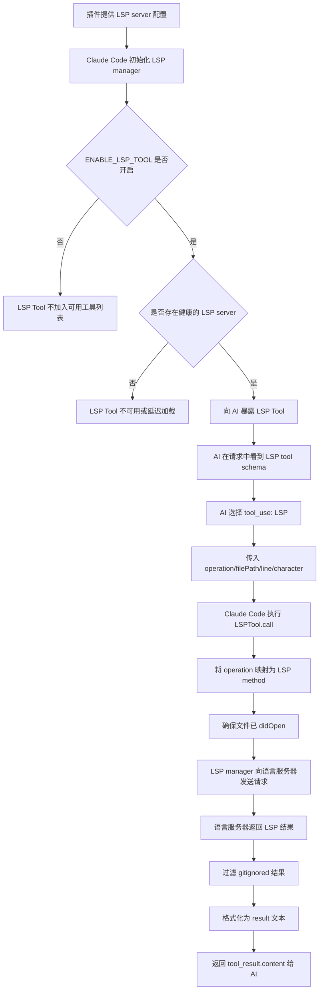

# Claude Code LSP 知识文档

## LSP 是什么

LSP 是 Language Server Protocol 的缩写，即语言服务器协议。它定义了编辑器、IDE、代码工具与语言服务器之间的通信方式。

语言服务器负责理解某种编程语言或项目结构，并对外提供代码智能能力，例如：

- 跳转到定义
- 查找引用
- 获取符号类型和文档
- 获取文件符号大纲
- 获取工作区符号
- 查找接口实现
- 分析函数调用层级

LSP 的价值在于把语言智能能力从编辑器中抽离出来。只要工具实现了 LSP 客户端能力，就可以复用不同语言服务器提供的代码理解能力。

## Claude Code 中的 LSP

Claude Code 中的 LSP 能力以内部 Tool 的形式暴露给 AI。

对 AI 来说，它看到的是一个名为 `LSP` 的工具。AI 调用这个工具时，通过 `operation` 字段选择具体能力，例如：

- `goToDefinition`
- `findReferences`
- `hover`
- `documentSymbol`
- `workspaceSymbol`
- `goToImplementation`
- `prepareCallHierarchy`
- `incomingCalls`
- `outgoingCalls`

AI 不直接连接语言服务器，也不直接发送 LSP 协议请求。Claude Code 在本地接收 AI 的 tool 调用，然后把 `operation/filePath/line/character` 转换成真实的 LSP method 和 params，再通过内部 LSP manager 与语言服务器通信。

## 整体原理

Claude Code 的 LSP 能力由四层组成：

| 层级 | 作用 |
|---|---|
| AI Tool 层 | 向 AI 暴露 `LSP` 工具和 operation schema |
| Tool 执行层 | 校验输入、打开文件、转换 operation、格式化结果 |
| LSP manager 层 | 管理语言服务器生命周期、文件打开状态、请求转发 |
| Language Server 层 | 真正理解代码并返回定义、引用、符号、调用层级等结果 |

AI 调用的是 Tool 层抽象，真实代码智能能力来自底层语言服务器。

## 执行流程



## LSP Tool 的暴露方式

`LSPTool` 是标准内部 Tool，具备以下特征：

- 工具名：`LSP`
- 对 AI 暴露的能力入口：`operation`
- 输入参数：`filePath`、`line`、`character`
- 输出结果：格式化后的 `result` 文本
- 只读工具：不会直接修改文件
- 并发安全：可以并发执行
- 延迟加载：初始化未完成时可走 `defer_loading`

工具是否可用受运行时状态控制：

1. `ENABLE_LSP_TOOL` 环境变量需要开启。
2. LSP manager 需要初始化成功。
3. 至少有一个语言服务器连接成功且状态健康。
4. 当前文件类型需要有插件提供对应的 LSP server。

## 启用方式

LSP 能力需要 Claude Code `2.0.74+`。当前源码相关 changelog 显示 bundled CLI 已高于该版本，但精确运行时版本需要通过 `claude --version` 或构建产物确认。

启动时需要设置环境变量：

```bash
ENABLE_LSP_TOOL=1 claude
```

开发或本地运行源码时，在对应启动命令前加同样的环境变量。

此外，还需要满足：

1. 插件提供对应文件类型的 LSP server 配置。
2. 插件处于启用状态。
3. 工作区通过 trust 检查。
4. LSP manager 初始化成功。
5. 至少一个语言服务器连接成功且状态健康。

## LSP server 配置来源

Claude Code 当前通过插件提供 LSP server 配置。插件加载后，Claude Code 会读取插件中的 LSP server 配置，并交给 LSP manager 管理。

配置可以来自：

1. 插件根目录的 `.lsp.json`。
2. 插件 `.claude-plugin/plugin.json` 中的 `lspServers` 字段。
3. marketplace / catalog 对插件的 `lspServers` 声明。

使用官方已支持的 LSP 插件时，通常不需要自己写 `.lsp.json`；安装官方插件和对应 language server binary 即可。官方不支持的语言、需要特殊启动参数、需要调整 diagnostics 行为时，才需要自定义 LSP 插件配置。

自定义 `.lsp.json` 示例：

```json
{
  "go": {
    "command": "gopls",
    "args": ["serve"],
    "extensionToLanguage": {
      ".go": "go"
    },
    "diagnostics": false
  }
}
```

字段含义：

| 字段 | 说明 |
|---|---|
| `go` | LSP server 配置名称，在插件内唯一即可 |
| `command` | Claude Code runtime 要启动的 language server 命令，必须在 `PATH` 中 |
| `args` | 启动 language server 时传入的参数 |
| `extensionToLanguage` | 文件扩展名到 LSP language id 的映射 |
| `diagnostics` | 是否把 diagnostics 自动注入 Claude 上下文，默认 `true` |

## 官方 LSP 插件与语言服务器安装命令

官方插件仓库地址：<https://github.com/anthropics/claude-plugins-official/tree/main/plugins>

安装 Claude Code 插件的通用方式：

```text
/plugin install {plugin-name}@claude-plugins-official
```

也可以通过 Claude Code 内的 `/plugin > Discover` 浏览并安装。

下表列出官方 `plugins` 目录中已提供的 LSP 插件、支持的语言/文件扩展名，以及对应语言服务器的安装命令。

| Claude 插件 | 语言 / LSP 服务 | 支持扩展名 | 插件安装命令 | LSP 服务安装命令 |
|---|---|---|---|---|
| `clangd-lsp` | C / C++，clangd | `.c`, `.h`, `.cpp`, `.cc`, `.cxx`, `.hpp`, `.hxx`, `.C`, `.H` | `/plugin install clangd-lsp@claude-plugins-official` | macOS: `brew install llvm`；Ubuntu/Debian: `sudo apt install clangd`；Fedora: `sudo dnf install clang-tools-extra`；Arch: `sudo pacman -S clang`；Windows: `winget install LLVM.LLVM` |
| `csharp-lsp` | C#，csharp-ls | `.cs` | `/plugin install csharp-lsp@claude-plugins-official` | 推荐: `dotnet tool install --global csharp-ls`；macOS: `brew install csharp-ls` |
| `gopls-lsp` | Go，gopls | `.go` | `/plugin install gopls-lsp@claude-plugins-official` | `go install golang.org/x/tools/gopls@latest` |
| `jdtls-lsp` | Java，Eclipse JDT.LS | `.java` | `/plugin install jdtls-lsp@claude-plugins-official` | macOS: `brew install jdtls`；Arch AUR: `yay -S jdtls`；其他 Linux: 手动安装 Eclipse JDT.LS 并创建 `jdtls` wrapper |
| `kotlin-lsp` | Kotlin，Kotlin LSP | `.kt`, `.kts` | `/plugin install kotlin-lsp@claude-plugins-official` | `brew install JetBrains/utils/kotlin-lsp` |
| `lua-lsp` | Lua，Lua Language Server | `.lua` | `/plugin install lua-lsp@claude-plugins-official` | macOS: `brew install lua-language-server`；Ubuntu/Debian: `sudo snap install lua-language-server --classic`；Arch: `sudo pacman -S lua-language-server`；Fedora: `sudo dnf install lua-language-server` |
| `php-lsp` | PHP，Intelephense | `.php` | `/plugin install php-lsp@claude-plugins-official` | npm: `npm install -g intelephense`；yarn: `yarn global add intelephense` |
| `pyright-lsp` | Python，Pyright | `.py`, `.pyi` | `/plugin install pyright-lsp@claude-plugins-official` | npm: `npm install -g pyright`；pip: `pip install pyright`；pipx: `pipx install pyright` |
| `ruby-lsp` | Ruby，Ruby LSP | `.rb`, `.rake`, `.gemspec`, `.ru`, `.erb` | `/plugin install ruby-lsp@claude-plugins-official` | gem: `gem install ruby-lsp`；Bundler: 在 `Gemfile` 加 `gem 'ruby-lsp', group: :development` 后执行 `bundle install` |
| `rust-analyzer-lsp` | Rust，rust-analyzer | `.rs` | `/plugin install rust-analyzer-lsp@claude-plugins-official` | 推荐: `rustup component add rust-analyzer`；macOS: `brew install rust-analyzer`；Ubuntu/Debian: `sudo apt install rust-analyzer`；Arch: `sudo pacman -S rust-analyzer` |
| `swift-lsp` | Swift，SourceKit-LSP | `.swift` | `/plugin install swift-lsp@claude-plugins-official` | macOS: 安装 Xcode，或 `brew install swift`；Linux: 从 <https://www.swift.org/download/> 安装 Swift，确保 `sourcekit-lsp` 在 PATH 中 |
| `typescript-lsp` | TypeScript / JavaScript，typescript-language-server | `.ts`, `.tsx`, `.js`, `.jsx`, `.mts`, `.cts`, `.mjs`, `.cjs` | `/plugin install typescript-lsp@claude-plugins-official` | npm: `npm install -g typescript-language-server typescript`；yarn: `yarn global add typescript-language-server typescript` |

### Java JDT.LS 安装细节

`jdtls-lsp` 使用的是 Eclipse JDT.LS。JDT.LS 要求本机安装 **Java 17 或更高版本的 JDK**，不是只安装 JRE。

#### Java 版本要求

先确认当前 Java 版本：

```bash
java -version
```

常见版本对应关系：

| 常见说法 | `java -version` 可能显示 | 是否满足 JDT.LS 要求 |
|---|---|---:|
| Java 8 | `1.8.0_xxx` | 否 |
| Java 11 | `11.x.x` | 否 |
| Java 17 | `17.x.x` | 是 |
| Java 21 | `21.x.x` | 是 |

`Java 8` 和 `Java 1.8` 是同一个版本。`JDK 17+` 表示 JDK 17、JDK 21 等，不包括 Java 8 / Java 1.8。

如果本机只有 Java 8 或 Java 11，通常无法启动当前官方 `jdtls-lsp` 依赖的 JDT.LS 服务。解决方案是额外安装一个 JDK 17+，专门用于运行 JDT.LS。

这不要求业务项目升级到 Java 17。Java 8 项目仍然可以保持 Java 8 编译目标，例如 Maven 中继续使用：

```xml
<source>1.8</source>
<target>1.8</target>
```

或 Gradle 中继续使用：

```gradle
sourceCompatibility = JavaVersion.VERSION_1_8
targetCompatibility = JavaVersion.VERSION_1_8
```

推荐做法是：

```text
JDK 8：用于老项目编译和运行
JDK 17+：用于启动 JDT.LS language server
```

#### 推荐的 JDK 17+ 发行版

JDK 17+ 不一定收费。为了减少授权不确定性，建议优先使用常见 OpenJDK 发行版，而不是默认选择 Oracle JDK。

| JDK 发行版 | 出品方 / 维护方 | 说明 | 适合场景 |
|---|---|---|---|
| Eclipse Temurin | Eclipse Adoptium / Eclipse Foundation | 社区常用 OpenJDK 发行版，前身是 AdoptOpenJDK | 本地开发、CI、企业环境 |
| Amazon Corretto | Amazon / AWS | AWS 维护的 OpenJDK 发行版，免费长期支持 | AWS、服务器、企业环境 |
| Microsoft Build of OpenJDK | Microsoft | Microsoft 维护的 OpenJDK 发行版 | Windows、Azure、微软生态 |
| Azul Zulu Community | Azul Systems | Azul 维护的 OpenJDK 发行版，有免费社区版和商业支持版 | 企业环境、本地开发 |
| Homebrew `openjdk@17` | Homebrew 分发的 OpenJDK 包 | macOS 上安装方便 | macOS 本地开发 |
| Oracle JDK | Oracle | Oracle 官方 JDK，授权政策需要单独确认 | 已确认 Oracle 授权的环境 |

推荐优先级：

1. Eclipse Temurin 17 / 21
2. Amazon Corretto 17 / 21
3. Microsoft OpenJDK 17 / 21
4. Homebrew `openjdk@17`

#### 安装 JDK 17+

macOS 推荐使用 Eclipse Temurin：

```bash
brew install --cask temurin@17
```

或者使用 Amazon Corretto：

```bash
brew install --cask corretto17
```

也可以使用 Homebrew OpenJDK：

```bash
brew install openjdk@17
```

安装后确认：

```bash
java -version
```

如果系统同时存在 JDK 8 和 JDK 17+，需要确保启动 `jdtls` 时使用的是 JDK 17+。可以通过 `JAVA_HOME` 指定：

```bash
export JAVA_HOME=$(/usr/libexec/java_home -v 17)
export PATH="$JAVA_HOME/bin:$PATH"
```

Linux 可以选择 Eclipse Temurin、Amazon Corretto 或系统包管理器中的 OpenJDK 17。例如 Ubuntu / Debian：

```bash
sudo apt update
sudo apt install openjdk-17-jdk
```

安装后确认：

```bash
java -version
```

#### 安装 JDT.LS

macOS 可以用 Homebrew 安装 JDT.LS：

```bash
brew install jdtls
```

安装后确认命令可用：

```bash
command -v jdtls
```

Arch Linux 可以通过 AUR 安装：

```bash
yay -S jdtls
```

其他 Linux 发行版通常需要手动安装 Eclipse JDT.LS：

1. 从 Eclipse JDT.LS snapshots 下载发行包：<https://download.eclipse.org/jdtls/snapshots/>
2. 解压到固定目录，例如：

```bash
mkdir -p ~/.local/share/jdtls
```

3. 将下载的 JDT.LS 内容解压到该目录。
4. 在 `PATH` 中创建名为 `jdtls` 的 wrapper 脚本。

wrapper 脚本示例：

```bash
#!/usr/bin/env bash
export JAVA_HOME="${JAVA_HOME:-/path/to/jdk-17}"
export PATH="$JAVA_HOME/bin:$PATH"
JDTLS_HOME="$HOME/.local/share/jdtls"
LAUNCHER_JAR=$(ls "$JDTLS_HOME"/plugins/org.eclipse.equinox.launcher_*.jar | head -n 1)
java \
  -Declipse.application=org.eclipse.jdt.ls.core.id1 \
  -Dosgi.bundles.defaultStartLevel=4 \
  -Declipse.product=org.eclipse.jdt.ls.core.product \
  -Dlog.protocol=true \
  -Dlog.level=ALL \
  -Xmx1G \
  --add-modules=ALL-SYSTEM \
  --add-opens java.base/java.util=ALL-UNNAMED \
  --add-opens java.base/java.lang=ALL-UNNAMED \
  -jar "$LAUNCHER_JAR" \
  -configuration "$JDTLS_HOME/config_linux" \
  -data "${1:-$PWD/.jdtls-workspace}"
```

保存为 `~/.local/bin/jdtls`，并赋予执行权限：

```bash
chmod +x ~/.local/bin/jdtls
```

确保 `~/.local/bin` 在 `PATH` 中：

```bash
export PATH="$HOME/.local/bin:$PATH"
```

最后确认：

```bash
command -v jdtls
```

#### 部署 Claude Java LSP 插件

JDK 17+ 和 `jdtls` 准备好后，安装 Claude 官方插件：

```text
/plugin install jdtls-lsp@claude-plugins-official
```

如果是在已运行的 Claude Code 会话中安装插件，执行：

```text
/reload-plugins
```

启动 Claude Code 时开启 LSP Tool：

```bash
ENABLE_LSP_TOOL=1 claude
```

使用 Agent SDK 时，如果显式限制了工具，需要允许 `LSP`：

```python
allowed_tools=["Read", "Grep", "Glob", "LSP"]
```

部署完成后，打开 Java 项目文件，Claude Code runtime 会根据 `jdtls-lsp` 插件配置启动本机 `jdtls` 进程。用户一般不需要手动运行 `jdtls`。

### 使用官方 LSP 插件的基本步骤

1. 安装对应语言服务器，并确保可执行命令在 `PATH` 中。
2. 在 Claude Code 中安装对应 LSP 插件。
3. 启动 Claude Code 时开启 LSP Tool：

```bash
ENABLE_LSP_TOOL=1 claude
```

4. 打开对应语言的项目文件，等待 LSP manager 初始化并连接语言服务器。

## Agent SDK 中使用 LSP

Claude Agent SDK 建立在 Claude Code runtime 之上。SDK 本身不提供独立的 LSP API，例如没有 `client.lsp.goToDefinition()` 这类直接调用接口。LSP 能力仍然通过 Claude Code 的内部 Tool 和插件系统生效。

在 Agent SDK 场景中，链路是：

```text
Python / TypeScript 应用
  ↓
Claude Agent SDK
  ↓
Claude Code runtime / bundled Claude Code binary
  ↓
加载 Claude Code 配置和 plugins
  ↓
读取 LSP server 配置
  ↓
启动 language server 进程
  ↓
向 AI 暴露 LSP Tool
```

### SDK 中的 Tool 名称

官方 Tools reference 中明确的工具名是 `LSP`。如果在 SDK 中显式设置 `allowed_tools` / `allowedTools`，需要把 `LSP` 加进去。

Python 示例：

```python
from claude_agent_sdk import ClaudeAgentOptions

options = ClaudeAgentOptions(
    cwd="/path/to/project",
    allowed_tools=["Read", "Grep", "Glob", "LSP"],
)
```

TypeScript 示例：

```ts
const options = {
  cwd: "/path/to/project",
  allowedTools: ["Read", "Grep", "Glob", "LSP"],
}
```

如果没有显式限制工具，SDK 会按 Claude Code runtime 的默认工具可用性和权限配置处理。如果显式限制了工具但漏掉 `LSP`，AI 就不能调用 LSP Tool。

### SDK 加载官方 LSP 插件

使用官方已支持的 LSP 插件时，通常不需要自己写 `.lsp.json`。需要做的是：

1. 安装对应 language server binary，并确保命令在 `PATH` 中。
2. 安装官方 LSP 插件，例如 `/plugin install gopls-lsp@claude-plugins-official`。
3. SDK 会话加载对应 Claude Code 配置或显式加载插件。
4. 如果设置了 `allowed_tools` / `allowedTools`，加入 `LSP`。

SDK 默认会加载用户、项目、本地等 Claude Code 配置来源；如果显式设置 `setting_sources=[]` / `settingSources: []`，则不会自动加载项目和用户配置中的插件、skills、hooks 等内容。

Python 示例：

```python
import asyncio
from claude_agent_sdk import query, ClaudeAgentOptions

async def main():
    async for message in query(
        prompt="Find where validateUser is defined and list its references.",
        options=ClaudeAgentOptions(
            cwd="/path/to/project",
            allowed_tools=["Read", "Grep", "Glob", "LSP"],
        ),
    ):
        print(message)

asyncio.run(main())
```

TypeScript 示例：

```ts
import { query } from "@anthropic-ai/claude-agent-sdk"

for await (const message of query({
  prompt: "Find the implementation of UserService and explain its call hierarchy.",
  options: {
    cwd: "/path/to/project",
    allowedTools: ["Read", "Grep", "Glob", "LSP"],
  },
})) {
  console.log(message)
}
```

### SDK 显式加载本地 LSP 插件

如果不是使用已安装的官方插件，也可以在 SDK options 中显式加载本地插件。

TypeScript 示例：

```ts
import { query } from "@anthropic-ai/claude-agent-sdk"

for await (const message of query({
  prompt: "Analyze this project with code intelligence.",
  options: {
    plugins: [
      { type: "local", path: "./my-lsp-plugin" },
    ],
    allowedTools: ["Read", "Grep", "Glob", "LSP"],
  },
})) {
  console.log(message)
}
```

Python 示例：

```python
import asyncio
from claude_agent_sdk import query, ClaudeAgentOptions

async def main():
    async for message in query(
        prompt="Analyze this project with code intelligence.",
        options=ClaudeAgentOptions(
            plugins=[
                {"type": "local", "path": "./my-lsp-plugin"},
            ],
            allowed_tools=["Read", "Grep", "Glob", "LSP"],
        ),
    ):
        print(message)

asyncio.run(main())
```

### SDK 与 LSP server 启动

SDK 不要求用户手动运行 language server，例如不需要手动执行：

```bash
gopls serve
```

正确做法是让插件声明启动方式，Claude Code runtime 根据插件配置启动对应进程。官方插件已经提供这类配置；自定义插件需要自己提供。

## 对 AI 暴露的 LSP 能力

`LSP` Tool 对 AI 暴露的是一个工具入口。AI 通过 `operation` 选择具体能力。

| AI 可调用能力 / operation | 对 AI 的能力说明 | 适合什么时候调用 | 底层 LSP method |
|---|---|---|---|
| `goToDefinition` | 查找当前位置符号的定义位置 | 需要理解某个变量、函数、类、类型、接口从哪里定义时 | `textDocument/definition` |
| `findReferences` | 查找当前位置符号的所有引用 | 需要分析某个函数、变量、类型在哪里被使用，或判断修改影响范围时 | `textDocument/references` |
| `hover` | 获取当前位置符号的类型、签名、文档等 hover 信息 | 需要快速理解符号类型、函数签名、参数、返回值或注释文档时 | `textDocument/hover` |
| `documentSymbol` | 获取当前文件内的符号大纲 | 需要快速了解一个文件里有哪些类、函数、方法、变量、接口时 | `textDocument/documentSymbol` |
| `workspaceSymbol` | 获取整个 workspace 的符号列表 | 需要在项目范围内查找符号、了解全局代码结构时 | `workspace/symbol` |
| `goToImplementation` | 查找接口、抽象方法或声明的具体实现 | 需要从接口/抽象定义跳到实际实现，或分析多态调用实现时 | `textDocument/implementation` |
| `prepareCallHierarchy` | 获取当前位置函数/方法的调用层级入口项 | 需要先确认当前位置是否能做调用层级分析时 | `textDocument/prepareCallHierarchy` |
| `incomingCalls` | 查找哪些函数/方法调用了当前位置函数/方法 | 需要分析上游调用方、入口路径、影响范围时 | `textDocument/prepareCallHierarchy` + `callHierarchy/incomingCalls` |
| `outgoingCalls` | 查找当前位置函数/方法内部调用了哪些函数/方法 | 需要分析下游依赖、执行链路、函数内部调用关系时 | `textDocument/prepareCallHierarchy` + `callHierarchy/outgoingCalls` |

## Tool 输入参数

所有 operation 使用同一套输入结构。

| 参数 | 类型 | 必填 | 说明 |
|---|---|---|---|
| `operation` | enum | 是 | 要执行的 LSP 能力 |
| `filePath` | string | 是 | 目标文件路径，支持绝对路径或相对路径 |
| `line` | number / int / positive | 是 | 行号，1-based，和编辑器显示一致 |
| `character` | number / int / positive | 是 | 字符偏移，1-based，和编辑器显示一致 |

示例：

```json
{
  "operation": "goToDefinition",
  "filePath": "src/services/api/claude.ts",
  "line": 1713,
  "character": 10
}
```

内部执行时，Claude Code 会把 `line` 和 `character` 转换为 LSP 协议使用的 0-based position。

## Tool 输出参数

结构化输出包含以下字段：

| 参数 | 类型 | 必填 | 说明 |
|---|---|---|---|
| `operation` | enum | 是 | 实际执行的 LSP 能力 |
| `result` | string | 是 | 格式化后的结果文本 |
| `filePath` | string | 是 | 操作目标文件 |
| `resultCount` | number / int / nonnegative | 否 | 结果数量 |
| `fileCount` | number / int / nonnegative | 否 | 包含结果的文件数量 |

示例：

```json
{
  "operation": "goToDefinition",
  "result": "Defined in src/services/api/claude.ts:1207:16",
  "filePath": "src/services/api/claude.ts",
  "resultCount": 1,
  "fileCount": 1
}
```

返回给 AI 的 `tool_result.content` 只包含 `result` 字符串。

## 各能力输入输出示例

### goToDefinition

输入：

```json
{
  "operation": "goToDefinition",
  "filePath": "src/services/api/claude.ts",
  "line": 1713,
  "character": 10
}
```

输出：

```json
{
  "operation": "goToDefinition",
  "result": "Defined in src/services/api/claude.ts:1207:16",
  "filePath": "src/services/api/claude.ts",
  "resultCount": 1,
  "fileCount": 1
}
```

多个定义时：

```json
{
  "operation": "goToDefinition",
  "result": "Found 2 definitions:\n  src/foo.ts:10:5\n  src/bar.ts:22:3",
  "filePath": "src/services/api/claude.ts",
  "resultCount": 2,
  "fileCount": 2
}
```

### findReferences

输入：

```json
{
  "operation": "findReferences",
  "filePath": "src/tools/LSPTool/LSPTool.ts",
  "line": 447,
  "character": 15
}
```

输出：

```json
{
  "operation": "findReferences",
  "result": "Found 4 references across 2 files:\n\nsrc/tools/LSPTool/LSPTool.ts:\n  Line 447:10\n  Line 494:10\n\nsrc/tools/LSPTool/schemas.ts:\n  Line 32:15\n  Line 146:15",
  "filePath": "src/tools/LSPTool/LSPTool.ts",
  "resultCount": 4,
  "fileCount": 2
}
```

### hover

输入：

```json
{
  "operation": "hover",
  "filePath": "src/tools/LSPTool/LSPTool.ts",
  "line": 427,
  "character": 10
}
```

输出：

```json
{
  "operation": "hover",
  "result": "Hover info at 427:10:\n\nfunction getMethodAndParams(input: Input, absolutePath: string): { method: string; params: unknown }",
  "filePath": "src/tools/LSPTool/LSPTool.ts",
  "resultCount": 1,
  "fileCount": 1
}
```

### documentSymbol

输入：

```json
{
  "operation": "documentSymbol",
  "filePath": "src/tools/LSPTool/LSPTool.ts",
  "line": 1,
  "character": 1
}
```

输出：

```json
{
  "operation": "documentSymbol",
  "result": "Document symbols:\nLSPTool (Constant) - Line 127\ngetMethodAndParams (Function) - Line 427",
  "filePath": "src/tools/LSPTool/LSPTool.ts",
  "resultCount": 2,
  "fileCount": 1
}
```

该能力实际只需要文件维度的信息。当前 Tool schema 仍统一要求 `line` 和 `character`。

### workspaceSymbol

输入：

```json
{
  "operation": "workspaceSymbol",
  "filePath": "src/tools/LSPTool/LSPTool.ts",
  "line": 1,
  "character": 1
}
```

输出：

```json
{
  "operation": "workspaceSymbol",
  "result": "Found 5 symbols in workspace:\n\nsrc/tools/LSPTool/LSPTool.ts:\n  LSPTool (Constant) - Line 127\n  getMethodAndParams (Function) - Line 427\n\nsrc/tools/LSPTool/formatters.ts:\n  formatHoverResult (Function) - Line 253\n  formatWorkspaceSymbolResult (Function) - Line 371\n  formatOutgoingCallsResult (Function) - Line 538",
  "filePath": "src/tools/LSPTool/LSPTool.ts",
  "resultCount": 5,
  "fileCount": 2
}
```

当前实现固定传 `query: ''`，没有开放自定义 query 参数。

### goToImplementation

输入：

```json
{
  "operation": "goToImplementation",
  "filePath": "src/Tool.ts",
  "line": 434,
  "character": 12
}
```

输出：

```json
{
  "operation": "goToImplementation",
  "result": "Defined in src/tools/LSPTool/LSPTool.ts:127:14",
  "filePath": "src/Tool.ts",
  "resultCount": 1,
  "fileCount": 1
}
```

### prepareCallHierarchy

输入：

```json
{
  "operation": "prepareCallHierarchy",
  "filePath": "src/tools/LSPTool/LSPTool.ts",
  "line": 427,
  "character": 10
}
```

输出：

```json
{
  "operation": "prepareCallHierarchy",
  "result": "Call hierarchy item: getMethodAndParams (Function) - src/tools/LSPTool/LSPTool.ts:427",
  "filePath": "src/tools/LSPTool/LSPTool.ts",
  "resultCount": 1,
  "fileCount": 1
}
```

### incomingCalls

输入：

```json
{
  "operation": "incomingCalls",
  "filePath": "src/tools/LSPTool/LSPTool.ts",
  "line": 427,
  "character": 10
}
```

输出：

```json
{
  "operation": "incomingCalls",
  "result": "Found 2 incoming calls:\n\nsrc/tools/LSPTool/LSPTool.ts:\n  call (Method) - Line 230 [calls at: 255:32]\n\nsrc/tests/LSPTool.test.ts:\n  testGoToDefinition (Function) - Line 88 [calls at: 91:15]",
  "filePath": "src/tools/LSPTool/LSPTool.ts",
  "resultCount": 2,
  "fileCount": 2
}
```

该能力会先请求 `textDocument/prepareCallHierarchy`，再请求 `callHierarchy/incomingCalls`。

### outgoingCalls

输入：

```json
{
  "operation": "outgoingCalls",
  "filePath": "src/tools/LSPTool/LSPTool.ts",
  "line": 230,
  "character": 10
}
```

输出：

```json
{
  "operation": "outgoingCalls",
  "result": "Found 3 outgoing calls:\n\nsrc/services/lsp/manager.ts:\n  getLspServerManager (Function) - Line 97 [called from: 236:21]\n  sendRequest (Method) - Line 120 [called from: 281:30]\n\nsrc/tools/LSPTool/formatters.ts:\n  formatResult (Function) - Line 600 [called from: 377:53]",
  "filePath": "src/tools/LSPTool/LSPTool.ts",
  "resultCount": 3,
  "fileCount": 2
}
```

该能力会先请求 `textDocument/prepareCallHierarchy`，再请求 `callHierarchy/outgoingCalls`。

## LSP 补全能力与扩展设计

LSP 协议本身支持代码补全，标准 method 是：

```text
textDocument/completion
```

当前 Claude Code 的 `LSP` Tool 没有把补全能力暴露给 AI。也就是说，很多官方 LSP 插件背后的语言服务器本身可能支持补全，但当前 Tool schema 中没有 `completion` operation，AI 不能直接通过现有 `LSP` Tool 调用代码补全。

### 补全请求参数

标准 `textDocument/completion` 请求通常包含：

```json
{
  "textDocument": {
    "uri": "file:///path/to/src/foo.ts"
  },
  "position": {
    "line": 9,
    "character": 14
  },
  "context": {
    "triggerKind": 1
  }
}
```

其中 `line` 和 `character` 是 LSP 协议的 0-based position。

`context.triggerKind` 常见值：

| 值 | 含义 |
|---:|---|
| `1` | 手动触发补全 |
| `2` | 由触发字符触发，例如 `.`, `:`, `/` |
| `3` | 重新触发未完成的补全 |

标准请求参数中没有 `limit`、`maxItems`、`onlyKinds` 这类字段。

### 补全返回结果

`textDocument/completion` 可能返回两种结构：

```ts
CompletionItem[]
```

或：

```ts
CompletionList
```

`CompletionList` 结构类似：

```json
{
  "isIncomplete": false,
  "items": [
    {
      "label": "map",
      "kind": 2,
      "detail": "method Array<T>.map(...)"
    }
  ]
}
```

`isIncomplete: true` 表示结果不完整，客户端通常会在用户继续输入后重新请求补全。

### 是否能指定返回数量

标准 LSP completion 请求不支持让服务端只返回指定数量，例如不能标准化地传：

```json
{
  "limit": 20
}
```

如果需要限制数量，应该由客户端在拿到结果后做截断：

```ts
items.slice(0, limit)
```

对于 Claude Code 场景，默认不应把全部补全项返回给 AI，建议本地限制返回数量，例如默认只展示前 20 个。

### 是否能指定返回类型

标准 LSP completion 请求也不支持让服务端只返回某几类补全项，例如不能标准化地传：

```json
{
  "onlyKinds": ["Method", "Function"]
}
```

但每个 `CompletionItem` 通常会带 `kind` 字段，客户端可以在本地过滤：

```ts
items.filter(item => item.kind === CompletionItemKind.Method)
```

常见 `CompletionItemKind` 包括：

| 类型 | 含义 |
|---|---|
| `Text` | 文本 |
| `Method` | 方法 |
| `Function` | 函数 |
| `Constructor` | 构造器 |
| `Field` | 字段 |
| `Variable` | 变量 |
| `Class` | 类 |
| `Interface` | 接口 |
| `Module` | 模块 |
| `Property` | 属性 |
| `Keyword` | 关键字 |
| `Snippet` | 代码片段 |
| `File` | 文件 |
| `Folder` | 目录 |

### 服务端和客户端的职责划分

LSP server 负责语义层面的候选生成。比如：

```ts
user.
```

语言服务器通常会根据 `user` 的类型返回该对象上的成员，例如：

- `name`：Property
- `age`：Property
- `getName`：Method
- `updateProfile`：Method

这类“当前位置语义上可以补什么”的判断主要由 LSP server 完成。

客户端负责展示层面的过滤和控制，例如：

- 根据已输入前缀过滤
- 根据 `CompletionItemKind` 过滤
- 限制展示数量
- 按 `sortText` / `filterText` / `label` 排序
- 控制是否展示 `detail`
- 控制是否展示 `documentation`
- 控制是否调用 `completionItem/resolve`

因此，服务端通常会返回“当前位置语义上合理的候选集合”，但不保证只返回变量、只返回函数或只返回方法。如果只想要某类结果，需要客户端再过滤。

### 对象成员补全示例

代码：

```ts
user.
```

服务端可能返回：

```text
name           Property
age            Property
getName        Method
updateProfile  Method
toString       Method
```

如果只需要方法，客户端再过滤 `Method`：

```text
getName        Method
updateProfile  Method
toString       Method
```

### 表达式位置补全示例

代码：

```ts
const result = ma
```

服务端可能返回：

```text
mapUser        Function
maxCount       Variable
Math           Module
Map            Class
match          Keyword / Snippet
```

在表达式位置，函数、变量、类、模块、关键字等都可能是合法候选，因此服务端不一定只返回变量。

### 性能和 token 控制

补全结果可能非常多，且每个补全项可能包含较长的 `detail`、`documentation`、`insertText`、`additionalTextEdits` 等字段。对于 Claude Code 这类把结果返回给 AI 的场景，全量返回会带来：

- LSP server 响应变慢
- 本地处理变慢
- tool result 过长
- token 成本升高
- 干扰模型关注重点

更合理的策略是轻量优先：

| 控制项 | 建议默认值 |
|---|---:|
| `limit` | `20` |
| `includeDetail` | `true` |
| `includeDocumentation` | `false` |
| `includeInsertText` | `false` |
| `includeAdditionalTextEdits` | `false` |
| `resolveItems` | `false` |

补全结果建议先返回轻量列表，例如：

```text
Found 128 completion items, showing top 20:

1. map [Method]
   detail: Array<T>.map(...)

2. length [Property]
   detail: number
```

### completionItem/resolve

LSP 还支持按需解析单个补全项：

```text
completionItem/resolve
```

很多 IDE 会先请求轻量补全列表，用户选中或停留在某一项时，再调用 `completionItem/resolve` 获取更完整的：

- documentation
- detail
- additionalTextEdits
- auto import edits
- 更完整的 textEdit

如果 Claude Code 后续扩展补全能力，也适合采用两阶段设计：

1. `completion`：返回轻量候选列表。
2. `resolveCompletionItem`：按需解析某一个候选项。

### 如果扩展 Claude Code 的 completion operation

最小实现不只是增加 `completion → textDocument/completion` 映射，还需要同步扩展：

1. operation enum：增加 `completion`。
2. Tool prompt：告诉 AI 可以调用 `completion`。
3. method 映射：增加 `completion → textDocument/completion`。
4. 结果格式化：支持 `CompletionItem[]` 和 `CompletionList`。
5. 输出控制：支持本地 `limit`、`kinds`、`includeDetail`、`includeDocumentation` 等参数。

推荐的 Tool 输入可以设计为：

```json
{
  "operation": "completion",
  "filePath": "src/foo.ts",
  "line": 10,
  "character": 15,
  "limit": 20,
  "kinds": ["Method", "Function", "Property"],
  "includeDetail": true,
  "includeDocumentation": false
}
```

## 运行时细节

### 文件打开

大多数语言服务器要求文件先通过 `textDocument/didOpen` 打开。Claude Code 在发送 LSP 请求前，会确保目标文件已在 LSP manager 中打开。

### 文件大小限制

超过 10MB 的文件不会进行 LSP 分析，工具会直接返回文件过大的提示。

### 文件变更同步

当文件被编辑或写入后，Claude Code 会向 LSP server 同步变更和保存事件，例如 `didChange`、`didSave`，让语言服务器保持最新的文件状态。

### gitignored 过滤

位置类结果会过滤 gitignored 文件，减少无关结果。涉及的能力包括：

- `goToDefinition`
- `findReferences`
- `goToImplementation`
- `workspaceSymbol`

### workspaceSymbol 查询

当前 `workspaceSymbol` 固定使用空 query：

```json
{
  "query": ""
}
```

这意味着它用于获取尽可能完整的 workspace symbols，而不是按用户传入的关键词搜索。

## 错误和特殊输出

### LSP manager 未初始化

```json
{
  "operation": "hover",
  "result": "LSP server manager not initialized. This may indicate a startup issue.",
  "filePath": "src/foo.ts"
}
```

### 没有可用 LSP server

```json
{
  "operation": "goToDefinition",
  "result": "No LSP server available for file type: .txt",
  "filePath": "README.txt"
}
```

### 文件过大

```json
{
  "operation": "documentSymbol",
  "result": "File too large for LSP analysis (13MB exceeds 10MB limit)",
  "filePath": "src/large-file.ts"
}
```

### 执行异常

```json
{
  "operation": "findReferences",
  "result": "Error performing findReferences: Request failed: server not initialized",
  "filePath": "src/foo.ts"
}
```

## 关键源码位置

| 内容 | 文件 |
|---|---|
| LSP 工具描述 | `src/tools/LSPTool/prompt.ts` |
| LSP Tool 定义 | `src/tools/LSPTool/LSPTool.ts` |
| LSP 输入 schema | `src/tools/LSPTool/schemas.ts` |
| LSP 结果格式化 | `src/tools/LSPTool/formatters.ts` |
| LSP manager | `src/services/lsp/manager.ts` |
| LSP server 配置 | `src/services/lsp/config.ts` |
| 工具注册入口 | `src/tools.ts` |
| Tool schema 转换 | `src/utils/api.ts` |
| API 请求组装 | `src/services/api/claude.ts` |
