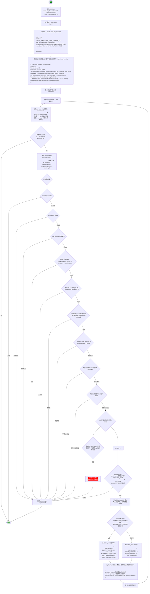

# ralph loop

```mermaid
flowchart TD

		0([<div style='background:green;color:white;'>开始</d]) --> A
		A["启动ralph loop<br/>/ralph-loop Build a todo API --completion-promise 'DONE' --max-iterations 20"] --> B[执行脚本：setup-ralph-loop.sh]
		B --> C["写入信息：.claude/ralph-loop.local.md
          <div style='text-align:left;white-space:nowrap;'>
          active: true
          iteration: 1
          session_id: ${CLAUDE_CODE_SESSION_ID:-}
          max_iterations: $MAX_ITERATIONS
          completion_promise: $COMPLETION_PROMISE_YAML
          started_at: $(date -u +%Y-%m-%dT%H:%M:%SZ)
          ---

          $PROMPT
          </div>"]
		
		C --> D["脚本输出相关信息，并提示大模型结束符号：Completion promise
					<div style='text-align:left;white-space:nowrap;'>
					🔄 Ralph loop activated in this session!
          Iteration: 1
          Max iterations: 20
          Completion promise: DONE
          The stop hook is now active. When you try to exit, the SAME PROMPT will be
          fed back to you. You'll see your previous work in files, creating a
          self-referential loop where you iteratively improve on the same task.
          To monitor: head -10 .claude/ralph-loop.local.md
          ⚠️  WARNING: This loop cannot be stopped manually! It will run infinitely
              unless you set --max-iterations or --completion-promise.
          🔄
          </div>"]
		D --> E["脚本输出用户提示词: $PROMPT"]
		
		E --> F[大模型开始回答问题，并结束回答]
		F --> G[触发stop hook：执行脚本: stop-hook.sh
					传递$HOOK_INPUT环境变了：是一个json数据，里面包含transcript_path会话日志路径
					]

		G --> H{检查文件是否存在：.claude/ralph-loop.local.md}
		H -- 否 --> 2
		H -- 是 --> I["解析.claude/ralph-loop.local.md文件
								获取相关参数：iteration、max_iterations、completion_promise、session_id"]
		
    I --> J{校验相关参数}
    
		J --> K{"session_id是否为空"}
		K -- 为空 --> 2
		K -- 不为空 --> L{"iteration是否为数字"}
		
		L -- 不是数字 --> 1
		L -- 是数字 --> M{"max_iterations不是数字"}
 
		M -- 不是数字 --> 1
		M -- 是数字 --> N{"是否符合退出条件：max_iterations <= 0 或者 iteration >= max_iterations"}
		
		N -- 符合 --> 1
		N -- 不符合 --> O{"检查$HOOK_INPUT，确认.transcript_path是否存在"}

		O -- 不存在 --> 1
		O -- 存在 --> P{"检查日志中是否存在AI的回答：角色role为assistant的文本内容"}
		
		P -- 不存在 --> 1
		P -- 存在 --> Q{"获取最后一条：角色role为assistant回答的文本内容"}
		
		Q -- 获取失败 --> 1
		Q -- 获取成功 --> R{"检查这个最后一条内容是否为json格式"}
		
		R -- 不是json格式 --> 1
		R -- 是json格式 --> S{"检查是否存在结束标记：<promise>DONE</promise>"}
		
		S -- 不存在结束标记 --> 1
		S -- 存在结束标记 --> T{"检查是否存在结束标记：<promise>DONE</promise>"}
		
		T --> T1{检查用户输入的结尾标记符 是否等于 大模型输出的结尾标记符}
		T1 -- 等于 --> T2[<div style='background:red;color:white;'>完成拉尔夫循环<br/>准备退出拉尔夫循环</div>]
		T2 --> 1
		
		T --> U["iteration + 1"]
		U --> V{"从.claude/ralph-loop.local.md获取提示词：$PROMPT_TEXT
					并检查提示词$PROMPT_TEXT是否存在"}
		
		V -- 不存在 --> 1
		V -- 存在 --> W["写入新的iteration值：通过写入临时文件，再移动覆盖源文件"]
		
		W --> X{"获取完成标记符：$COMPLETION_PROMISE<br/>判断$COMPLETION_PROMISE是否为空"}
		X -- 为空 --> Y["SYSTEM_MSG提示词：
									🔄 Ralph iteration $NEXT_ITERATION | To stop: output <promise>$COMPLETION_PROMISE</promise> (ONLY when statement is TRUE - do not lie to exit!)"]
		X -- 不为空 --> Z["SYSTEM_MSG提示词：
									🔄 Ralph iteration $NEXT_ITERATION | No completion promise set - loop runs infinitely"]

		Y --> Z0["stop-hook.sh输出json数据，用于知道大模型继续工作：
					<div style='text-align:left;white-space:nowrap;'>
					{
            'decision': 'block',	// 阻塞退出，继续执行
            'reason': $prompt,   	// 用于的原始提示词
            'systemMessage': $msg	// 系统提示词，内容如上面的输出
          }
					</div>"]
		Z --> Z0
		Z0 --> Z1[下一轮循环任务执行]
		Z1 --> F
		
		1["删除.claude/ralph-loop.local.md"] --> 2([<div style='background:green;color:white;'>结束</d])
		
```

