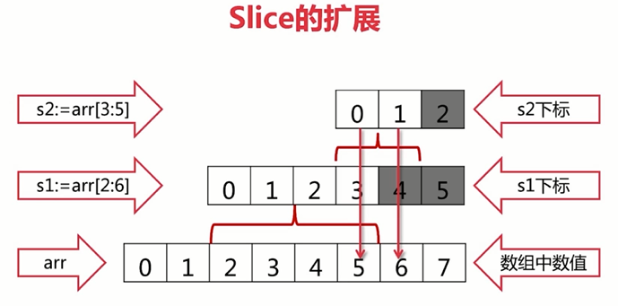

### 常量
1. 常量的名称不需要全部大写，就跟常规的命名一样，小写即可。
2. 常量如果需要导出对外访问，则可以首字母大写
3. const的数值可作为各种类型使用

    常量的类型定义时
    1. 如果定义了类型，则在使用常量的时候就包含类型
    2. 如果未定义类型，则在使用的地方就当字符代码直接替换掉，可以是各种类型，程序会去自动适配

### 条件判断、分支语句
1. if 判断
    1. 不需要使用括号
2. switch 判断
    1. 不需要使用break, 默认每一个都包含break
    2. 如果不想break, 则要是用fallthrough


### 指针
1. GO语言函数传参，只有值传递的一种方式，没有引用传递的说法

### 数组
1. 编译器自动识别数组个数

    arr := [...]int{1,2,3}
2. [10]int和[20]int是不同的类型
3. 数组是值类型的：函数内部的改变对函数外部不可见
    
    调用func f(arr [10]int)会拷贝数组

### 切片

* 向后扩展
```text
arr := [...]int{0,1,2,3,4,5,6,7}    //len=8, cap=8, arr=[0 1 2 3 4 5 6 7]
s1 := arr[2:6]                      //len=4, cap=6, s1=[2 3 4 5]
s2 := s1[3:5]                       //len=2, cap=3, s1=[5 6]
fmt.Println(s2[1])                  //6
fmt.Println(s2[2])                  //panic: runtime error: index out of range [2] with length 2
s1 := arr[2:10]                     //invalid slice index 10 (out of bounds for 8-element array)
```
**注意：**
1. s2[2] => s2长度为2，下标为0和1，超过s2的下标为2，则越界报错
2. arr[2:10] => s2的下标越过底层数组arr的cap，这里cap为8，报错

**原理：**
1. slice可以向后扩展，不能向前扩展
2. s[i] 不可以超越len(s), 向后扩展不可以超越底层数据cap(s)
```text
sli := make([]int, 2, 4)
sli[1] = 1
s1 := sli[1:4]
fmt.Println(s1)     //[1 0 0]
```



* 添加元素
```text
arr := [...]int{0,1,2,3,4,5,6,7}
s1 := arr[2:6]
s2 := s1[3:5]
s3 := append(s2, 10)
s4 := append(s3, 11)
s5 := append(s4, 12)
fmt.Println("s3, s4, s5 = ", s3, s4, s5)    //s3, s4, s5 =  [5 6 10] [5 6 10 11] [5 6 10 11 12]
fmt.Println("arr = ", arr)                  //arr = [0 1 2 3 4 5 6 10]
```
**注意：**
1. s3的最后一位10覆盖了arr的最后一位7

**原理：**
1. 添加元素时如果超越了cap, 系统会重新分配更大的底层数组，并且会将原来的数组拷贝过去
2. 原来的数组如果还有使用，则继续保留；如果没有使用，则系统回收
3. 由于是值传递，因此需要接受append的返回值


### map
1. map的key是无需的
2. 判断key、值是否存在

    if value, ok := arr["key"]; ok {}
3. map的key
    * map使用哈希表，必须可以比较相等
    * 除了slice,map,function的内建类型都可以作为key
    * struct类型不包含上述字段，也可以作为key

### 字符串处理

UTF-8采用可边长字符编码，英文占一个字节，中文占3个字节
1. 每个英文字符、英文标点符号 占1个字节
2. 每个中文字符、中文标点符号 占3个字节
3. len(x), 获取的是字节数
4. utf8.RuneCountInString(x), 获取字符数
5. []byte(x)，获取所有的字节

```text
s := "Yes!我爱编程！"
fmt.Println(len(s))                     //19
fmt.Println(utf8.RuneCountInString(s))  //9
	
//UTF-8编码，输出每一个字节
//59 65 73 21 E6 88 91 E7 88 B1 E7 BC 96 E7 A8 8B EF BC 81
for _, b := range []byte(s) {
    fmt.Printf("%X ", b)
}

//输出UNICODE编码、字节的序号
//序号数不连续的，英文序号加1，中文序号加3
//(0 59) (1 65) (2 73) (3 21) (4 6211) (7 7231) (10 7F16) (13 7A0B) (16 FF01) 
for i, ch := range s { // ch is a rune
    fmt.Printf("(%d %X) ", i, ch)
}

//输出UNICODE编码、rune的字符序号
//(0 59) (1 65) (2 73) (3 21) (4 6211) (5 7231) (6 7F16) (7 7A0B) (8 FF01) 
for i, ch := range []rune(s) { // ch is a rune
    fmt.Printf("(%d %X) ", i, ch)
}

//输出字符序号、rune的字符
//(0 Y) (1 e) (2 s) (3 !) (4 我) (5 爱) (6 编) (7 程) (8 ！) 
for i, ch := range []rune(s) { // ch is a rune
    fmt.Printf("(%d %c) ", i, ch)
}
```


### 协程
1. 轻量级线程
2. 非抢占式多任务处理，由协程主动交出控制权
3. 编译器、解释器、虚拟机层面的多任务，不是操作系统层的多任务
4. Go语言有一个调度器，来调度协程
5. 多个协程可能在一个或多个线程上运行，这个由调度器来决定

**goroutine可能的切换点**
* I/O(屏幕打印字符)切换会主动交出控制
* select
* channel
* 等待锁
* time.Sleep()
* 函数调用(有时)
* 手动交出控制权：runtime.Gosched()
* 只是参考，不能保证切换，不能保证在其他地方不切换

```text
func main() {
	var a [10]int
	for i := 0; i < 10; i++ {
		go func(i int) {
			for {
				a[i]++
			}
		}(i)
	}
	time.Sleep(time.Millisecond)
	fmt.Println(a)
}
```
**说明**
1. maim函数sleep时，交出了控制权
2. go协程时，由于a[i]++不会交出控制权，所以就一直执行，类似于卡死的现象
3. 如果CPU为4核心，则会有4个协程一直占用CPU，并且不会交出控制权，导致其他的协程无法使用CPU
4. 由于main函数，也是个协程，所以会等待交出控制权，虽然只是sleep 1毫秒，但是由于a[i]++一直没交出控制权，main函数也会一直等待

**调试**
1. 检测数据访问的冲突：协程间访问冲突
```text
go run -race main.go
```

### channel
1. 通道关闭，由发送方关闭，接收方判断通道是否关闭。
2. 如果通道由接收方关闭，则发送方需要判断通道是否关闭。<br/>
   否则向已关闭的通道发送数据，程序会崩溃。<br/>
   发送端不太容易判断通道已经关闭，需要通过其他标记操作来处理。
3. 不要通过共享内存来通信，通过通信来共享内存

**接收方，判断通道关闭的操作**
1. 判断channel已经close 关闭
    ```text
    c, ok := <-ch
    if !ok {
        //通道关闭
    }
    ```
2. 循环遍历通道，通道关闭，则循环退出
    ```text
    for c := range ch {
        //通道获取的数据
    }
    //通道已退出才执行
    ```

