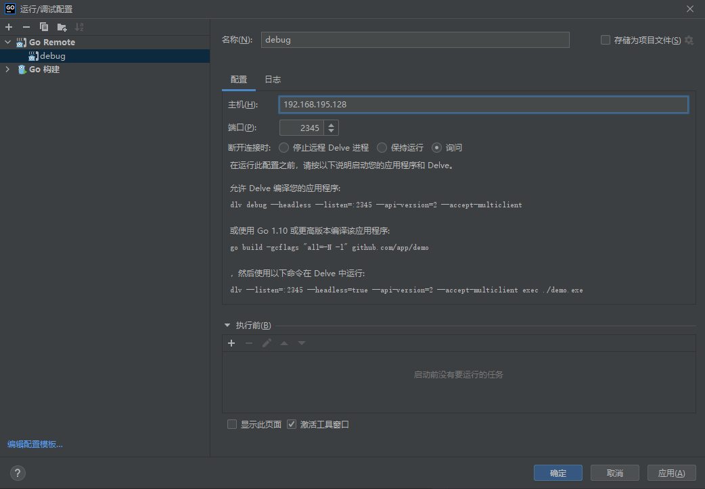
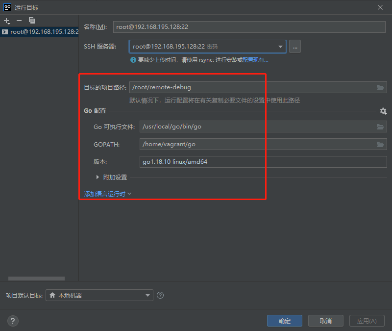
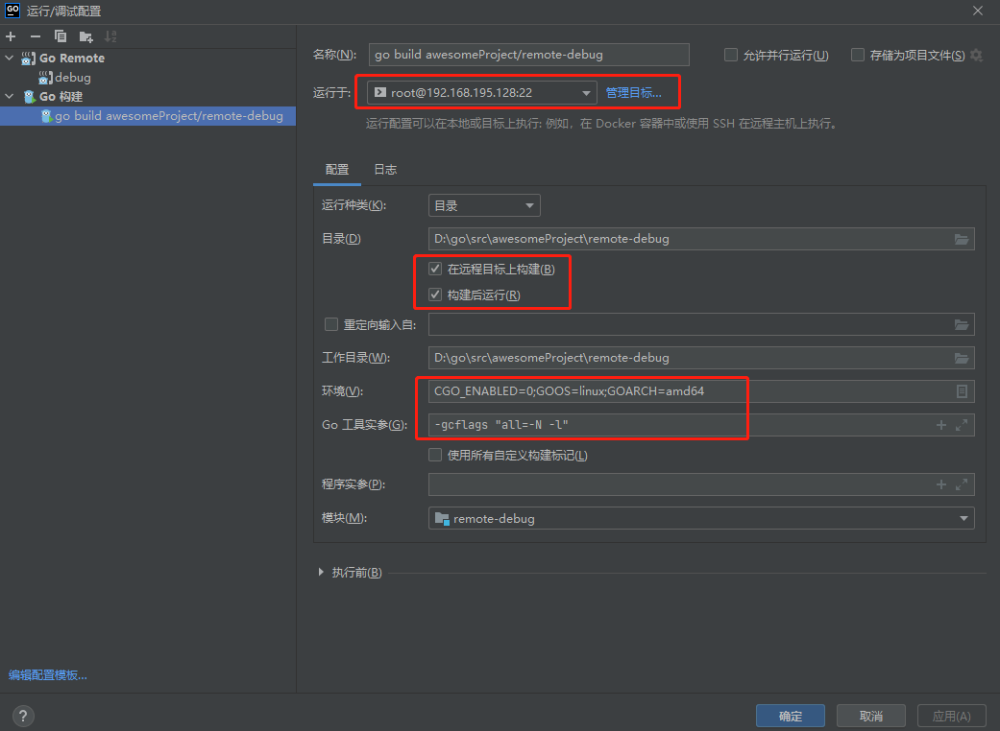
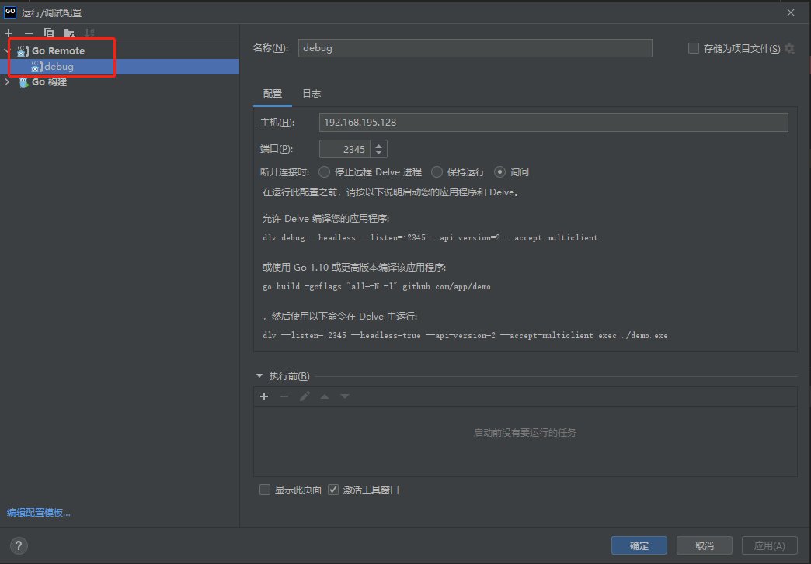

## 一、远程构建调试

### 1、流程说明

1. GoLand会将本地代码通过SFTP同步至远端，

2. 端编译二进制文件，推送至远端

   ```shell
   "C:\Program Files\Go\bin\go.exe" build -o D:\go\src\awesomeProject\remote-debug\go_build_awesomeProject_remote_debug_linux -gcflags "all=-N -l" .
   ```

3. 远端执行dlv调试命令

   ```shell
   /root/remote-debug/oIugBGHE7l/dlv --listen=0.0.0.0:50318 --headless=true --api-version=2 --check-go-version=false --only-same-user=false exec /root/remote-debug/sources-gJLcq8VlJR/go_build_awesomeProject_remote_debug_linux --
   ```


### 2、开启远程调试

1. Linux平台安装dlv，依赖go环境

   ```shell
   go install github.com/go-delve/delve/cmd/dlv@latest
   ```

2. 添remote debug

   设置服务器地址

   


### 3、编译可执行程序

#### 设置远程构建

1. 配置远程服务器

   

2. 配置远程构建

   - 选则远程服务器
   - **勾选再远程目标上构建、构建后运行**（否则编译的程序可以在Linux环境中运行，但是无法远程调试）
   - 设置交叉编译环境参数，这里设置的是编译Linux环境程序。可以设置windows/linux/macos
   - 设置编译参数，带调试信息的编译参数，否则无法调试

   

   编译后的路径

   ```shell
   # dlv程序目录
   /root/remote-debug/lsWkromOQa
   # 编译生成的可执行程序目录
   /root/remote-debug/executables-lHTfAQya7w
   # 上传的源码目录
   /root/remote-debug/sources-nU51bQN2re
   ```

   

#### 跨平台交叉编译程序

Windows的cmd

```shell
SET CGO_ENABLED=0 && SET GOOS=linux && SET GOARCH=amd64
go build -gcflags "all=-N -l" -o remote-debug ./main.go
```

Windows的PowerShell

```shell
go env -w CGO_ENABLED=0 GOOS=windows GOARCH=amd64
go build -gcflags "all=-N -l" -o remote-debug ./main.go
```


### 4、启动远程调试

#### 使用dlv启动程序调试

1. 将编译生成的程序上传至服务器

2. **在服务器使用dlv运行**

   ```shell
   dlv --listen=:2345 --headless=true --api-version=2 --accept-multiclient exec ./remote-debug
   ```

   带命令行参数,在可执行程序后面带上 `--`，再后面就是命令行参数：

   ```shell
   dlv --listen=:2345 --headless=true --api-version=2 --accept-multiclient exec ./remote-debug -- -s 123
   ```


#### 使用dlv attach程序来调试

> 该方法适用于程序编译时，不带有-gcflags "all=-N -l"的调试信息，并且已再后台一直运行，则可以通过该方式进行调试。

1. 启动程序执行，需要是可以后天执行的程序，否则程序执行完成就退出了

   ```shell
   # nohup ./remote-debug  &
   [2] 335
   # 进程号为335
   
   # 通过ps -ef 或者 ps -aux获取
   # ps -ef
   UID         PID   PPID  C STIME TTY          TIME CMD
   vagrant    3838   3455  0 2月04 ?       00:00:00 /root/remote-debug/remote-debug
   ```

2. attach进行调试

   ```shell
   # 注意 335 是 上述启动go进程的id
   # 2345 是服务监听的端口 这里写哪个端口 goland中就要配置哪个端口，其他参数可以通过 执行 dlv 查看帮助信息
   dlv attach 335 --headless --listen=:2345 --api-version=2 --accept-multiclient
   ```

   

### 5、在客户机电脑上调试

客户机可以是：Windows/Linux/MacOS

 使用**Go Remote进行调试**，而不是Go Build进行调试


## 参考

[Goland 远程开发配置详细步骤（远程构建+远程调试）](https://blog.csdn.net/MCKZX/article/details/127627424)

[手把手教你goland远程调试](https://blog.csdn.net/zhangxm_qz/article/details/122154006)

https://www.cnblogs.com/janbar/p/14856553.html

https://blog.csdn.net/u013536232/article/details/104123861

https://www.cnblogs.com/Jimmy00/p/12142093.html

https://blog.csdn.net/weixin_41571449/article/details/78957144

https://blog.csdn.net/turbock/article/details/102665187

 