# VSCode教程

 [全部settings参考](README.assets\settings.json) 

 [自定义主题颜色参考](README.assets\custom theme.json) 


## 插件安装

### 离线插件下载和安装

假设你想离线下载 **Python** 官方插件（由 Microsoft 发布）。

---

#### 1. 找到所需信息

我们需要确定三个关键部分：

*   **发布者 (Publisher)**: `ms-python`
    *   在 VS Code 市场页面的 URL 中可以找到。例如，Python 插件的市场页是：`https://marketplace.visualstudio.com/items?itemName=ms-python.python`
    *   `itemName` 后面的第一个部分 `ms-python` 就是发布者。

*   **插件名 (Extension Name)**: `python`
    *   同样在 `itemName` 后面，第二部分 `python` 就是插件名。

*   **版本号 (Version Number)**: `2025.10.0`
    *   这个需要在插件的市场页面上查找。通常在“版本历史”或“详细信息”区域可以看到当前最新版本。
    *   我们以 `2025.10.0` 为例。

---

#### 2. 拼接完整的下载链接

将上面的信息填入模板：
`https://marketplace.visualstudio.com/_apis/public/gallery/publishers/{发布者}/vsextensions/{插件名}/{版本号}/vspackage`

替换后得到：
`https://marketplace.visualstudio.com/_apis/public/gallery/publishers/ms-python/vsextensions/python/2025.10.0/vspackage`

---

#### 3. 下载和安装

1.  **下载**: 将拼接好的完整链接复制到浏览器中打开。
    *   浏览器会开始下载一个 `.vsix` 文件（文件名通常是 `ms-python.python-2025.10.0.vsix` 或类似的压缩包）。
    *   如果链接返回 `404` 错误，请检查版本号是否正确，或者尝试不填写版本号，让服务器返回最新版本。

2.  **安装**: 下载完成后，将 `.vsix` 文件拷贝到没有网络的电脑上。
    *   打开目标电脑上的 VS Code。
    *   进入扩展面板（快捷键 `Ctrl+Shift+X`）。
    *   点击右上角的“...”菜单。
    *   选择 **“从VSIX安装...”**。
    *   浏览并选择你下载的 `.vsix` 文件，然后点击安装即可。

---

#### 注意事项

*   **版本号**: 版本号必须精确匹配。如果输入了不存在的版本号，链接会失效。
*   **平台**: 大多数通用插件（如 Python、Prettier）不需要指定平台。但对于一些依赖本地二进制文件的插件（如某些 C++ 工具链），可能需要在链接末尾添加 `?targetPlatform=win32-x64` 或 `?targetPlatform=linux-x64` 等参数来获取对应操作系统的版本。
*   **替代方案**: 如果手动拼接链接失败，更简单的方法是在有网络的电脑上直接通过 VS Code 的“下载扩展VSIX”功能获取文件。


#### 示例

##### 插件下载

下载规则：https://marketplace.visualstudio.com/_apis/public/gallery/publishers/{发布者}/vsextensions/{插件名}/{版本号}/vspackage


例如：

##### GoLang插件

地址：https://marketplace.visualstudio.com/items?itemName=golang.Go

golang是发布者

go是插件名

查看Version History：得到最近的几个版本号，选择一个版本号0.51.1

https://marketplace.visualstudio.com/_apis/public/gallery/publishers/golang/vsextensions/go/0.51.1/vspackage


##### Python插件

地址：https://marketplace.visualstudio.com/items?itemName=ms-python.python

ms-python是发布者

python插件名

https://marketplace.visualstudio.com/_apis/public/gallery/publishers/ms-python/vsextensions/python/2025.19.2025111301/vspackage


##### Python Debugger

地址：https://marketplace.visualstudio.com/items?itemName=ms-python.debugpy

下载地址：https://marketplace.visualstudio.com/_apis/public/gallery/publishers/ms-python/vsextensions/debugpy/2025.16.0/vspackage


##### GitLens

地址：https://marketplace.visualstudio.com/items?itemName=eamodio.gitlens

下载地址：https://marketplace.visualstudio.com/_apis/public/gallery/publishers/eamodio/vsextensions/gitlens/2025.11.1304/vspackage


### 安装插件

#### 通义千问

**安装插件**

1. 点击左侧活动栏的 **扩展图标（Extensions）**（或按 `Cmd+Shift+X` / `Ctrl+Shift+X`）。

2. 搜索 `通义灵码` 或 `Tongyi Lingma`

   找到由 Alibaba Cloud 发布的插件，点击 Install

   - 插件 ID 通常为：`aliyun.tongyi-lingma`

**显示聊天对话框**

1. Cmd + Shift + P / Ctrl + Shift + P

2. Chat: Focus on Chat View

   聊天：焦点在 聊天 视图上

   右侧的聊天窗口会有LINGMA，点击中国区登录即可

3. 顶部搜索框右侧有一个聊天按钮，点击一下，即可开关聊天窗口。或者使用快捷键Cmd + Ctrl + I。

   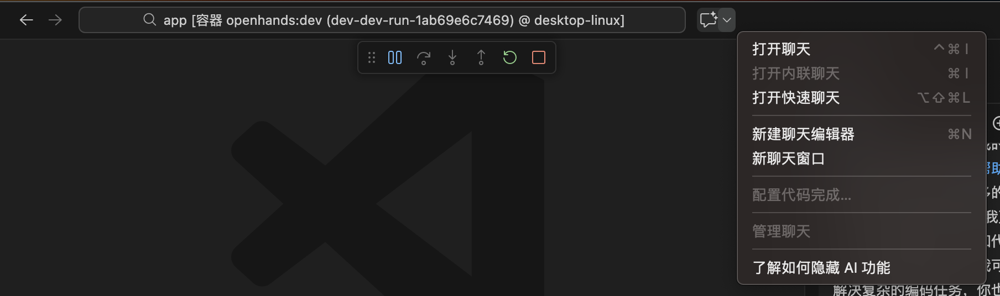

   **使用 Copilot Chat（GitHub Copilot Chat）**

   如果你安装了 **GitHub Copilot** 并启用了 Copilot Chat 功能，可以通过以下方式打开聊天窗口：

   - 快捷键：

     - Windows/Linux: `Ctrl + Shift + P` → 输入 `Copilot: Open Chat`
     - macOS: `Cmd + Shift + P` → 输入 `Copilot: Open Chat`

   - 或者点击侧边栏中的 **Copilot 图标**（机器人头像），即可打开聊天面板。

   - 打开 通义灵码

     > Lingma:Open/Close Lingma AI Chat

     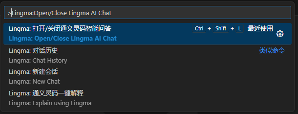

     > 注意：需要拥有 GitHub Copilot 订阅并启用 Copilot Chat（目前部分用户可能还在预览阶段）。

   登录：阿里云中国站账号登录，打开网页扫描登录。

   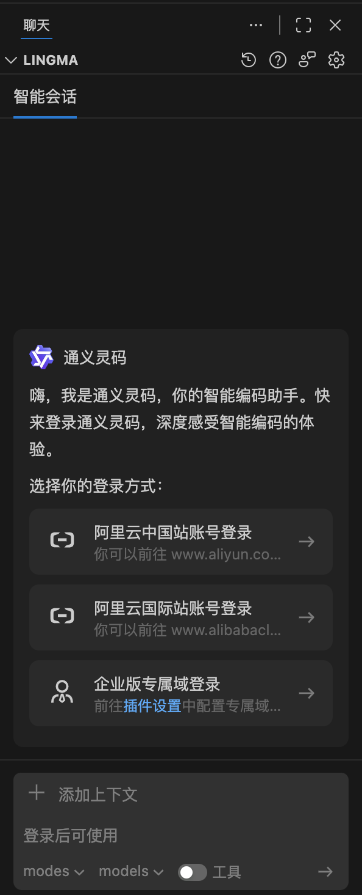


## GoLang环境

### 环境设置

1. 左下角 管理 --> 设置

2. 搜索 goroot/gopath
3. 点击 在settings.json中编辑

```json
{
    "go.gopath": "D:\\go",
    "go.goroot": "C:\\Program Files\\Go"
}
```

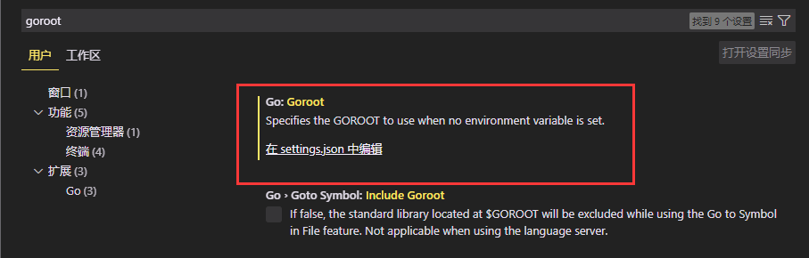

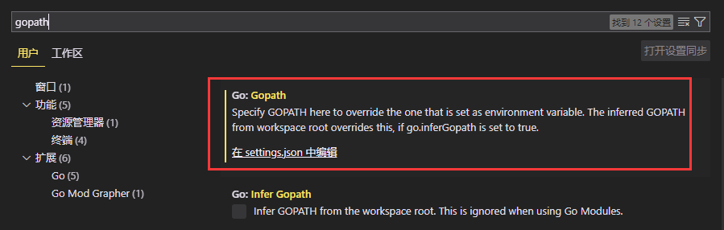


### 环境准备-插件安装

[在Visual Studio Code中配置GO开发环境的详细教程](http://www.viiis.cn/news/show_115464.html)


#### VSCode-Go插件

https://github.com/microsoft/vscode-go

https://marketplace.visualstudio.com/items?itemName=lukehoban.Go


#### 下载并编译go语言调试工具

| **程序名**             | 安装命令                                                     | 当前版本/CommitID | **程序用途**                                                 |
| ---------------------- | ------------------------------------------------------------ | ----------------- | ------------------------------------------------------------ |
| dlv.exe                | go install github.com/go-delve/delve/cmd/dlv@latest          | v1.9.1            | go 语言调试工具                                              |
| gocode.exe             | go install -v github.com/nsf/gocode@latest                   | 5bee97b           | go语言代码检查，自动补全<br/>不在维护，无法支持1.8版本以上自动补全 |
| gocode.exe             | go install -v github.com/mdempsky/gocode@latest              | 4acdcbd           | go语言代码检查，自动补全<br/>选择其他fork版本，比如：mdempsky/gocode。<br/>1.18版本以上使用 |
| godef.exe              | go install -v github.com/rogpeppe/godef@latest               | v1.1.2            | go语言代码定义和引用的跳转                                   |
| golint.exe             | go install -v golang.org/x/lint/golint@latest<br/>go get -u -v github.com/golang/lint/golint | 6edffad           | go语言代码规范检查                                           |
| go-outline.exe         | go install -v github.com/lukehoban/go-outline@latest         | e785568           | 用于在Go源文件中提取JSON形式声明的简单工具<br/>File outline 文件大纲 |
| gopkgs.exe             | go install -v github.com/tpng/gopkgs@latest                  | 81e90e2           | 快速列出可用包的工具<br/>Add Imports 添加引用                |
| gorename.exe           | go install -v golang.org/x/tools/cmd/gorename@latest<br/>github.com/golang/tools/cmd/gorename | d815cba           | 在Go源代码中执行标识符的精确类型安全重命名                   |
| goreturns.exe          | go install -v github.com/sqs/goreturns@latest                | 538ac60           | 类似fmt和import的工具，使用零值填充Go返回语句以匹配func返回类型 |
| go-symbols.exe         | go install -v github.com/newhook/go-symbols@latest           | b75dfef           | 从go源码树中提取JSON形式的包符号的工具<br/>Workspace symbol search 工作区符号搜索 |
| gotour.exe             | go install -v github.com/Go-zh/tour/gotour@latest（中文）<br/>go install -v golang.org/x/tour/gotour@latest（英文） | f4baf0d           | go语言指南网页版                                             |
| guru.exe               | go install -v golang.org/x/tools/cmd/guru@latest             | d815cba           | go语言源代码有关工具，如代码高亮等                           |
| go-find-references.exe | github.com/lukehoban/go-find-references@42505ef<br/>github.com/redefiance/go-find-references@0a36091 |                   | Find References 搜索参考引用                                 |
| fiximports.exe         | go install -v golang.org/x/tools/cmd/fiximports@latest<br/>github.com/golang/tools/cmd/fiximports | d815cba           |                                                              |
| goimports.exe          | go install -v golang.org/x/tools/cmd/goimports@latest<br/>github.com/golang/tools/cmd/goimports | d815cba           |                                                              |
| godex.exe              | go install -v golang.org/x/tools/cmd/godex@latest            | d815cba           |                                                              |
| gopls.exe              | go install -v golang.org/x/tools/gopls@latest<br/>github.com/golang/tools/gopls | v0.9.4            |                                                              |


#### gopls

[Go Module 教程第 2 部分：项目、依赖和 gopls](https://zhuanlan.zhihu.com/p/426677425)


### GoLang调试

[用vscode开发和调试golang超简单教程](https://blog.csdn.net/v6543210/article/details/84504460)

[How To Debug Go Code with Visual Studio Code](https://www.digitalocean.com/community/tutorials/debugging-go-code-with-visual-studio-code)


打开main.go，按F5开始调试，如果没有编译错误可以看到，变量显示，调用堆栈的显示还是非常清晰的，可以F10单步，F11进入函数，跟一般Visual Studio 一样了。

按F5调试 可能会弹出

 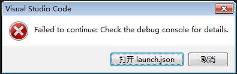

最大的原因可能是因为，VS code当前打开的文档不是main.go ,就那个包含main函数的go文件。


#### 方式一

**解决方法就是点击打开 main.go ,再按F5进行调试。**


#### 方式二

**另一种解决方法**是修改launch.json。路径：项目目录/.vscode/launch.json。

把program那个变量的值改一下，改成 "program": "${workspaceFolder}", 意思是调试的时候，以当前打开的文件夹根目录作为工程目录进行调试。

```json
{
    // 使用 IntelliSense 了解相关属性。 
    // 悬停以查看现有属性的描述。
    // 欲了解更多信息，请访问: https://go.microsoft.com/fwlink/?linkid=830387
    "version": "0.2.0",
    "configurations": [
        {
            "name": "Launch",
            "type": "go",
            "request": "launch",
            "mode": "auto",
            "program": "${workspaceFolder}",
            "env": {},
            "args": []
        }
    ]

```


##### 添加build flag/args

> go build的编译参数和执行参数args

```json
{
    "version": "0.2.0",
    "configurations": [
        {
            "name": "Launch Package",
            "type": "go",
            "request": "launch",
            "mode": "auto",
            // 主程序目录，main文件，程序入口目录
            "program": "${workspaceRoot}",
            // 执行参数
            "args": ["-config", " server.json"],
            // 编译参数
            "buildFlags": "-tags 'server'",
            // 环境变量
            "env": {},
            // 工作目录
            "cwd": "${workspaceRoot}"
        }
    ]
}
```


#### 触发建议

提示settings.json/launch.json怎么修改

1. 将鼠标放在需要提示的地方
2. Ctrl+Shift+P
3. 搜索 Trigger Suggest
4. 回车，则自动填充
5. 根据用户的需要去修改实际的值


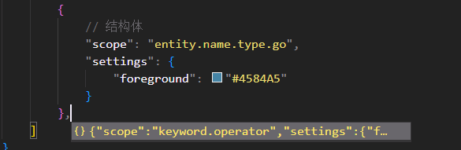

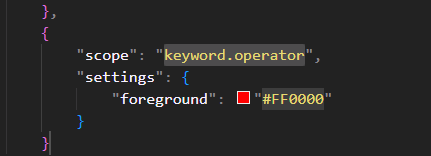


## 自定义主题

1. 左下角 管理 --> 设置

2. 搜索 主题/color
3. 找到Editor: Token Color Customizations
4. 点击 在settings.json中编辑
5. 修改一下属性

```json
{
    "editor.tokenColorCustomizations": {
        // 该项的配置即为自定义主题设置
    }
}
```

 [自定义主题参考](README.assets\custom theme.json) 

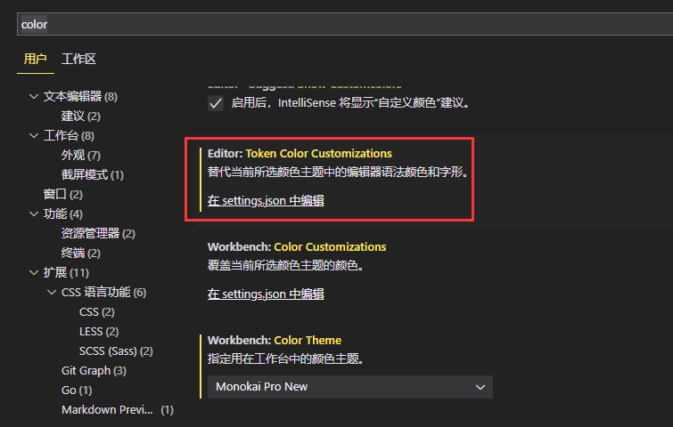


1. 光标选中需要查看的字段

   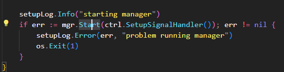

2. Ctrl+Shift+P

3. 搜索inspect，选中如图所示


4. 显示信息

   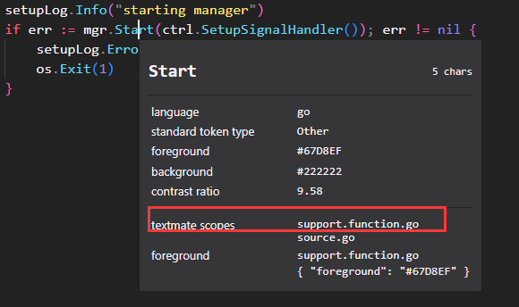

5. 复制textmate scopes

6. 再settings.json中的主题editor.tokenColorCustomizations的textMateRules去修改

   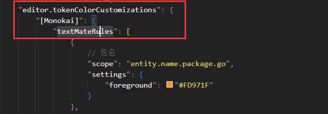

7. Ctrl+Shift+P，搜索Trigger Suggest，会自动生成辅助代码

   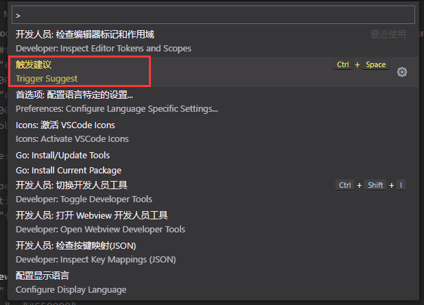

8. 修改辅助代码的scope和颜色，或者手动新增并修改scope和颜色

   

9. 查看生效效果

   

   


## 资源管理器树形结构

[vscode资源管理器中文件夹目录修改为树形结构](https://blog.csdn.net/wx1035589113/article/details/114265560)


**vocode资源管理器中显示的项目目录只有一个子目录是这样的**

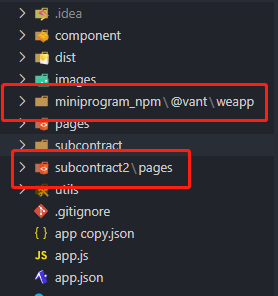

**这样不方便查看项目目录, 要修改为树形结构:**

1. 打开设置
   
   
   
2. 找到用户->功能->资源管理器:

   

3. 将 `Compace Folders`取消勾线:

   

然后显示目录就是树形结构了:

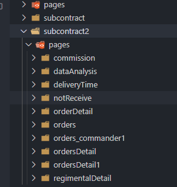


## 资源管理器vscode文件树缩进

[vscode文件树缩进](https://www.cnblogs.com/laoq112/p/12455502.html)

[VS code 设置左边文件栏缩进以及对齐的竖线](https://blog.csdn.net/u012770580/article/details/103126850)

[如何在资源管理器文件树结构中添加更多缩进](https://qastack.cn/programming/55310734/how-to-add-more-indentation-in-the-explorer-file-tree-structure)


打开菜单“文件”-->“首选项”-->“设置”，搜索“tree/workbench”

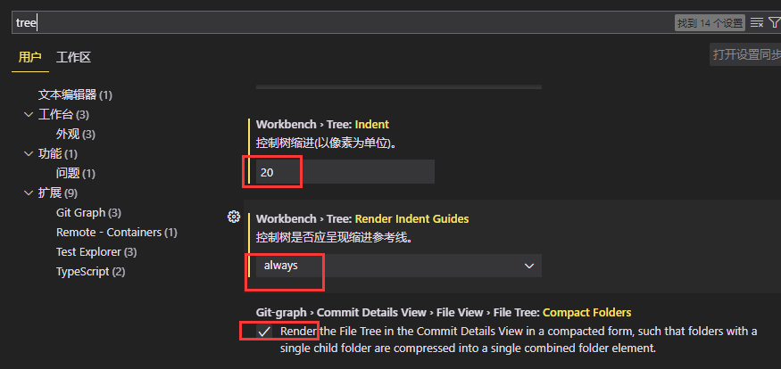


找到workbench.tree.indent，这个值就是缩进的像素数量，值越大，缩进越明显。


也可以把workbench.tree.renderIndentGuides选成always，这样会一直显示对齐的竖线。


 最终配置值都会显示在settings.json文件中，也可以到该文件输入代码：

```json
{
    // 资源管理器的树形目录层级距离、控制树缩进(以像素为单位)。
    "workbench.tree.indent": 20,
    // 资源管理器 控制树是否应呈现缩进参考线。
    "workbench.tree.renderIndentGuides": "always",
    // 缩进参考线的颜色
    "workbench.colorCustomizations": {
        "tree.indentGuidesStroke": "#008070"
    },
}
```


## VScode代码提示缓慢问题的解决办法

[VScode代码提示缓慢问题的解决办法](https://blog.csdn.net/qq_36689634/article/details/115187287)


上边那个是代码情况的提示，太短容易干扰阅读代码。

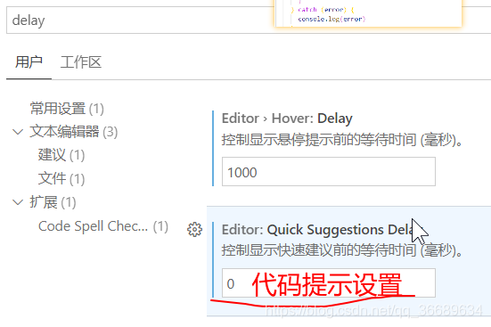

底下那个才是代码提示的设置，为0就行快了。


## vscode go 提示很慢

[vscode go 提示很慢](https://www.cnblogs.com/chongyao/p/13968356.html)

打开设置选项搜索  **go.useLanguageServe**

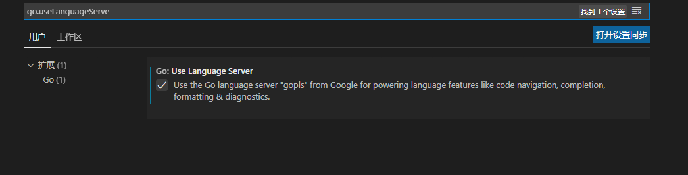

关于go vscode的一些设置的问题。 

代码能build 成功但是一直有错误提示（在设置中如下设置之后 然后在gopath 打开项目）


## 保存自动格式化

[Vscode如何设置代码保存后自动格式化](https://blog.csdn.net/asacmxjc/article/details/125474692)

[Vscode实现保存后自动格式化代码](https://blog.csdn.net/weixin_51735258/article/details/124071593)


### 方法一

1. 打开vscode，点击`设置`

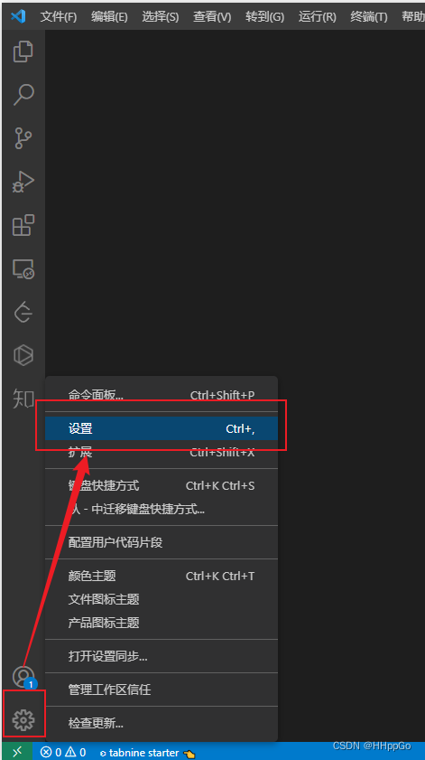


2. `搜索框`输入`格式化`，如图勾选这三个选项


### 方法二

1. 打开设置，搜索框不要输入东西，点击如图标识


2. 点击后，会打开setting设置，输入如下的代码即可

```cpp
"editor.formatOnType": true,
"editor.formatOnSave": true,
"editor.formatOnPaste": true
```

```json
{
    // 失去焦点自动保存
    "files.autoSave": "onFocusChange",
    // 输入一行代码后自动格式化该行
    "editor.formatOnType": true,
    // 粘贴时，是否格式化粘贴的内容
    "editor.formatOnPaste": false,
    // 保存的时候格式化
    "editor.formatOnSave": true,
    "[go]": {
        "editor.insertSpaces": true,
        "editor.snippetSuggestions": "none",
        "editor.codeActionsOnSave": {
            "source.organizeImports": true
        }
    }
}
```

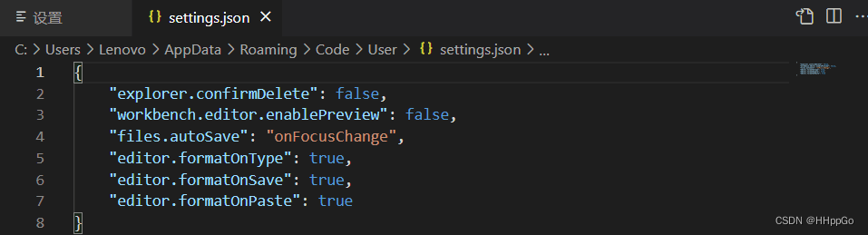

## 快捷键

| 键位             | 命令              | 说明                     |
| ---------------- | ----------------- | ------------------------ |
| Ctrl + `         | 打开终端/切换终端 | Esc下面的键              |
| Ctrl + Shift + ` | 打开新的终端      |                          |
| Ctrl + Shift + C | 打开外部终端      | Cmd终端                  |
| Ctrl + \         | 拆分编辑器        | 编辑器右侧新建一个编辑器 |
|                  |                   |                          |
| Ctrl + P         | go to  file       |                          |
| Ctrl +Shfit + P  | Show All Commands | 显示所有命令             |
|                  |                   |                          |
|                  |                   |                          |
|                  |                   |                          |
|                  |                   |                          |


**MacOS快捷键**

| 键位             | 命令 | 说明                  |
| ---------------- | ---- | --------------------- |
| Ctrl + -         |      | 跳转上一位置          |
| Ctrl + Shift + - |      | 跳转下一位置          |
| Cmd + 鼠标左键   |      | 跳转定义处/跳转调用处 |


## 命令

| 前置操作                                        | 命令                                 | 说明                                                         |
| ----------------------------------------------- | ------------------------------------ | ------------------------------------------------------------ |
| Ctrl + Shift + P                                | Go: Install/Update Tools             | 安装/更新go tools工具<br/>（老版本：一共17个工具，新版本：7个工具） |
| 选中要测试的代码<br/> 右键                      | Go: Generate Unit Tests For Function | 自动生成测试代码<br/>可以在go插件的扩展配置中设置右键快捷操作 |
| 选中要测试的代码<br/> Ctrl + Shift + P<br/>搜索 | Go: Fill struct                      |                                                              |
|                                                 |                                      | 自动实现接口                                                 |
| 选中要测试的代码<br/> 右键                      | Go: Add Tags To Struct Fields        | 自动增加Tag                                                  |
| 选中要测试的代码<br/>Ctrl + Shift + P           | Go: Remove Tags From Struct Fields   | 自动删除Tag                                                  |

