# kafka-go Writer 模式发送消息流程图

> 适配 Typora 的 Mermaid 语法版本（使用 `graph` 关键字而非 `flowchart`）

---

## 目录

- [一、整体流程图（Graph）](#一整体流程图graph)
- [二、首次发送消息时序图（Sequence）](#二首次发送消息时序图sequence)
- [三、后续复用发送时序图（Sequence）](#三后续复用发送时序图sequence)
- [四、SASL 认证子时序图（Sequence）](#四sasl-认证子时序图sequence)
- [五、Metadata 缓存查询子流程图（Graph）](#五metadata-缓存查询子流程图graph)
- [六、partition 选择子流程图（Graph）](#六partition-选择子流程图graph)
- [七、状态图：connPool 生命周期](#七状态图connpool-生命周期)
- [八、状态图：单条 conn 生命周期](#八状态图单条-conn-生命周期)
- [九、状态图：writeBatch 生命周期](#九状态图writebatch-生命周期)
- [十、状态图：metadata 缓存生命周期](#十状态图metadata-缓存生命周期)
- [十一、状态图：partitionWriter 生命周期](#十一状态图partitionwriter-生命周期)
- [十二、缓存机制总览图（Graph）](#十二缓存机制总览图graph)
- [十三、关闭流程时序图（Sequence）](#十三关闭流程时序图sequence)
- [十四、与服务端交互的所有 RPC](#十四与服务端交互的所有-rpc)

---

## 一、整体流程图（Graph）

> **颜色说明**：
> - 🟥 红色：与 Kafka 服务端网络交互
> - 🟩 绿色：读取/写入内存缓存（无网络）
> - 🟪 紫色：纯本地计算（无网络，无缓存操作）

```mermaid
graph TD
    Start([用户调用 WriteMessages]) --> Closed{Writer 已关闭?}
    Closed -->|是| ErrClosed[返回 ErrClosedPipe<br/>【意图】防止向已关闭的 Writer 写入]
    Closed -->|否| ValidateSize[校验消息大小<br/>【意图】提前发现过大消息，避免发送失败]
    ValidateSize --> LoopMsg[遍历每条消息<br/>【意图】逐一处理，确定路由]
    LoopMsg --> ChooseTopic[确定 Topic<br/>【意图】从消息或 Writer 配置获取]
    ChooseTopic --> QueryParts[查询分区数 N<br/>【意图】确定目标 topic 有多少 partition]
    QueryParts --> CacheCheck{本地缓存有 metadata?}
    CacheCheck -->|有| GetN[从内存缓存读取 N<br/>【意图】快速返回，避免网络请求]
    CacheCheck -->|无| RealReq[★ 请求 Kafka 获取 metadata<br/>【意图】首次访问或强制刷新时必须从服务端获取]
    RealReq --> Server1[(Kafka Broker 控制连接)]
    Server1 --> UpdateCache[更新内存缓存<br/>【意图】后续请求直接用缓存，减少网络开销]
    UpdateCache --> GetN
    GetN --> LoadIdx[生成分区索引列表 0..N-1<br/>【意图】Balancer 需要知道可选的 partition 列表]
    LoadIdx --> CacheHit{全局索引缓存已存在?}
    CacheHit -->|是| ReuseSlice[复用缓存的索引数组<br/>【意图】避免重复创建数组，减少内存分配]
    CacheHit -->|否| NewSlice[创建新的索引数组并缓存<br/>【意图】缓存起来供后续请求复用]
    NewSlice --> ReuseSlice
    ReuseSlice --> Balance[Balancer 选择目标 partition<br/>【意图】根据算法决定消息发往哪个分区<br/>默认轮询，也可按 key 哈希]
    Balance --> Group[加入 assignments map<br/>【意图】按 topic+partition 分组消息<br/>便于批量投递到对应 partitionWriter]
    Group --> MoreMsg{还有消息?}
    MoreMsg -->|是| LoopMsg
    MoreMsg -->|否| BatchPhase[路由到 partitionWriter<br/>【意图】把消息交给负责该分区的协程处理]
    BatchPhase --> PWExist{partitionWriter 已存在?}
    PWExist -->|否| NewPW[创建新的 partitionWriter<br/>【意图】每个 topic+partition 一个专属协程处理]
    PWExist -->|是| AddBatch[加入当前 batch<br/>【意图】攒批发送，减少网络请求次数]
    NewPW --> AddBatch
    AddBatch --> BatchFull{batch 满或超时?}
    BatchFull -->|否| Wait[继续攒批<br/>【意图】等待更多消息，凑成更大批次]
    BatchFull -->|是| Enqueue[batch 入队等待发送<br/>【意图】异步处理，不阻塞主线程]
    Enqueue --> AsyncCheck{Async 模式?}
    AsyncCheck -->|是| ReturnNil[立即返回<br/>【意图】异步模式不等待发送完成]
    AsyncCheck -->|否| WaitDone[等待 batch 发送完成<br/>【意图】同步模式等待结果]

    %% 发送阶段 - 独立协程处理（与主线程并行）
    Enqueue --> Pick[writeBatches 协程取出 batch]
    Pick --> Produce[构造 ProduceRequest<br/>【意图】准备发送到 Kafka 的请求结构]
    Produce --> RouteBroker[找到 partition leader<br/>【意图】消息必须发送到分区的 leader broker]
    RouteBroker --> NeedConn{有空闲连接?}
    NeedConn -->|是| GetConn[尝试获取连接]
    NeedConn -->|否| Connect[★ 建立新连接<br/>TCP+TLS+认证<br/>【意图】需要连接才能与 broker 通信]
    GetConn --> ConnOK{连接可用?}
    ConnOK -->|是| Reuse[复用空闲连接<br/>【意图】避免重复建连的开销]
    ConnOK -->|否| Connect[连接断开了<br/>自动重连]
    Reuse --> Server2[(Kafka Broker 数据连接)]
    Connect --> Server2
    Server2 --> SendProduce[发送 Produce 请求]
    SendProduce --> Result{发送成功?}
    Result -->|失败| CanRetry{是否可重试?<br/>临时错误或网络错误}
    CanRetry -->|是| HasMoreAttempts{还有重试次数?<br/>默认最多10次}
    HasMoreAttempts -->|是| Backoff[指数退避<br/>【意图】避免重试风暴，减少压力]
    Backoff --> Produce
    CanRetry -->|否| FillBack[回填消息 offset<br/>【意图】让调用方知道消息的位置]
    HasMoreAttempts -->|否| FillBack
    Result -->|成功| FillBack
    FillBack --> Completion[调用 Completion 回调<br/>【意图】通知调用方发送结果]
    Completion --> CloseDone[标记 batch 完成<br/>【意图】唤醒等待的主线程]
    CloseDone --> WaitDone
    WaitDone --> RetSuccess[返回结果<br/>【意图】告知用户发送结果]

    style Server1 fill:#ffcccc,stroke:#cc0000
    style Server2 fill:#ffcccc,stroke:#cc0000
    style RealReq fill:#ffe4b5
    style Connect fill:#ffe4b5
    style SendProduce fill:#ffe4b5
    style UpdateCache fill:#ccffcc
    style GetN fill:#ccffcc
    style Closed fill:#e0e0ff
    style ValidateSize fill:#e0e0ff
    style LoopMsg fill:#e0e0ff
    style ChooseTopic fill:#e0e0ff
    style QueryParts fill:#e0e0ff
    style CacheCheck fill:#e0e0ff
    style LoadIdx fill:#e0e0ff
    style CacheHit fill:#e0e0ff
    style ReuseSlice fill:#e0e0ff
    style NewSlice fill:#e0e0ff
    style Balance fill:#e0e0ff
    style Group fill:#e0e0ff
    style MoreMsg fill:#e0e0ff
    style BatchPhase fill:#e0e0ff
    style PWExist fill:#e0e0ff
    style NewPW fill:#e0e0ff
    style AddBatch fill:#e0e0ff
    style BatchFull fill:#e0e0ff
    style Wait fill:#e0e0ff
    style Enqueue fill:#e0e0ff
    style AsyncCheck fill:#e0e0ff
    style Pick fill:#e0e0ff
    style Produce fill:#e0e0ff
    style RouteBroker fill:#e0e0ff
    style NeedConn fill:#e0e0ff
    style Reuse fill:#e0e0ff
    style GetConn fill:#e0e0ff
    style ConnOK fill:#e0e0ff
    style Result fill:#e0e0ff
    style CanRetry fill:#e0e0ff
    style HasMoreAttempts fill:#e0e0ff
    style Backoff fill:#e0e0ff
    style FillBack fill:#e0e0ff
    style Completion fill:#e0e0ff
    style CloseDone fill:#e0e0ff
```

---

## 二、首次发送消息时序图（Sequence）

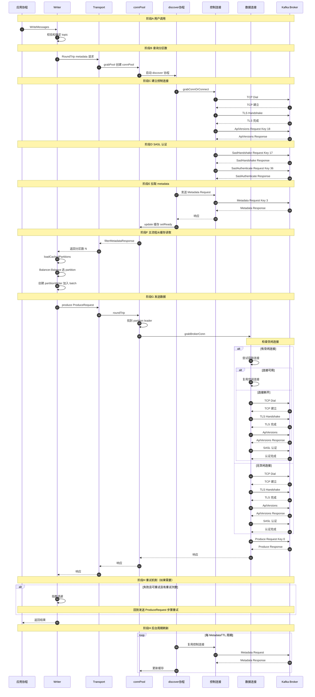

---

## 三、后续复用发送时序图（Sequence）

> 第二次及以后调用 WriteMessages，连接和 metadata 都已就绪，与服务端的交互大幅减少

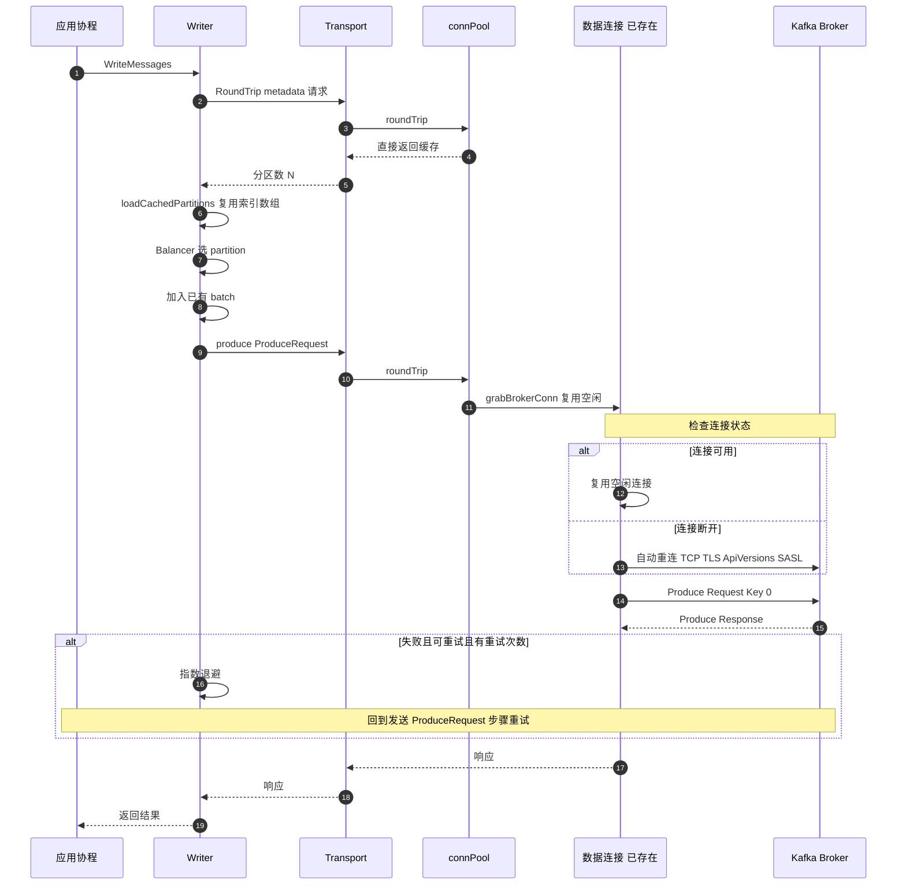

---

## 四、SASL 认证子时序图（Sequence）

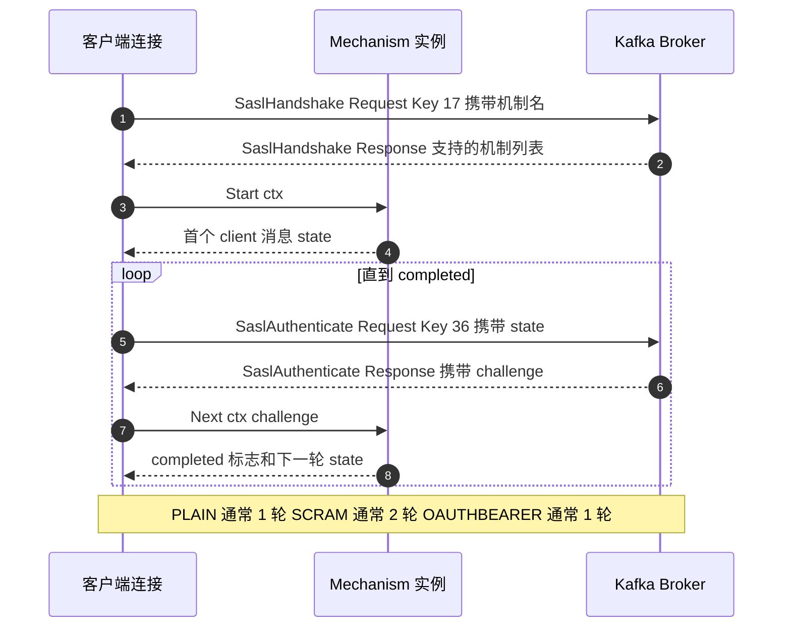

---

## 五、Metadata 缓存查询子流程图（Graph）

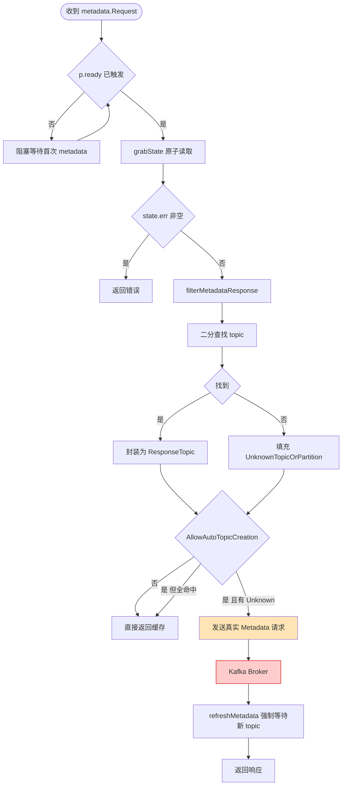

---

## 六、partition 选择子流程图（Graph）

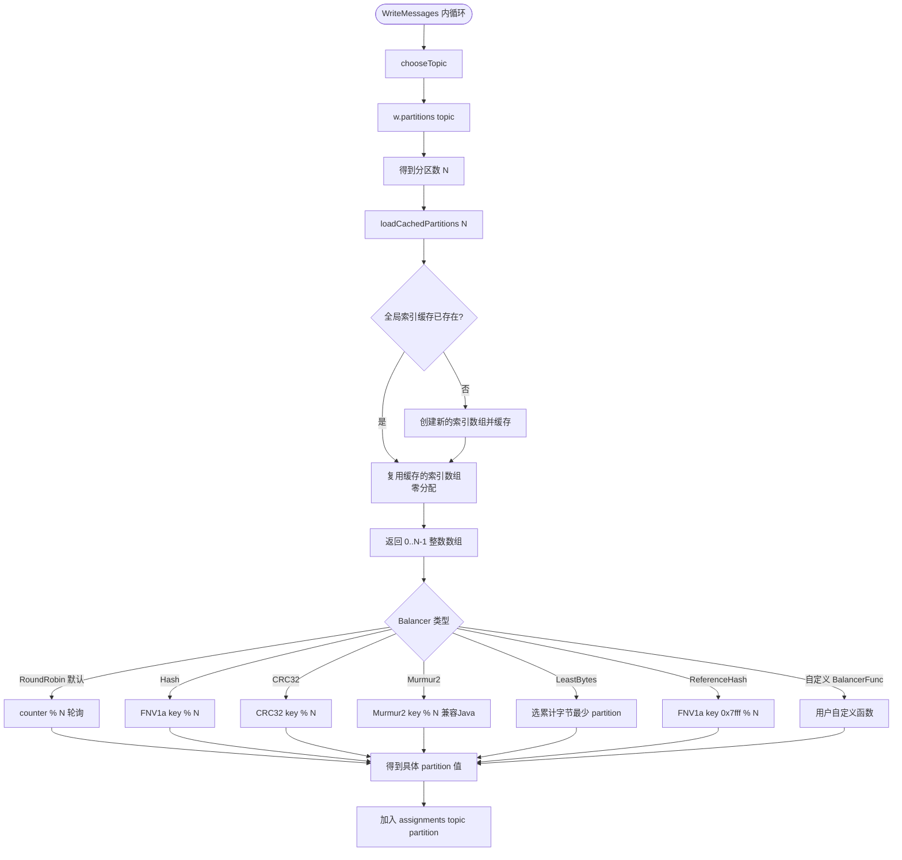

---

## 七、状态图：connPool 生命周期

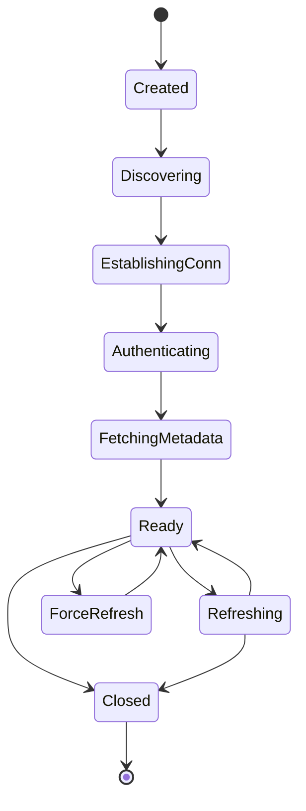

**状态说明**：

| 状态 | 触发条件 | 与服务端交互 |
|------|---------|-------------|
| Created | Transport.grabPool 首次访问 | 无 |
| Discovering | go discover 协程启动 | 无 |
| EstablishingConn | grabClusterConn | TCP + TLS + ApiVersions |
| Authenticating | 启用 SASL | SaslHandshake + SaslAuthenticate |
| FetchingMetadata | 发送 metadata 请求 | Metadata Request |
| Ready | setState + setReady | 无（缓存可用） |
| Refreshing | timer 到期 周期刷新 | Metadata Request |
| ForceRefresh | wake channel 收到信号 | Metadata Request |
| Closed | refc 归零 CloseIdleConnections | 关闭所有连接 |

---

## 八、状态图：单条 conn 生命周期

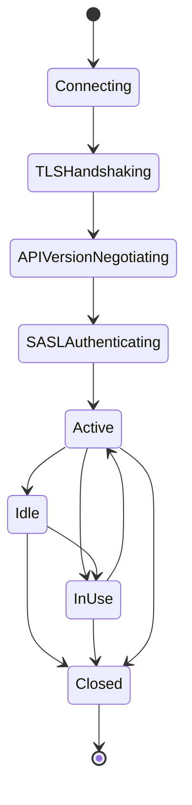

**状态转移说明**：

| 转移 | 触发条件 |
|------|---------|
| Connecting → TLSHandshaking | TCP 建立成功（无 TLS 则跳过） |
| TLSHandshaking → APIVersionNegotiating | TLS 完成 |
| APIVersionNegotiating → SASLAuthenticating | ApiVersions 响应（无 SASL 则跳过） |
| SASLAuthenticating → Active | SASL 完成 启动 conn.run |
| Active → InUse | reqs channel 收到请求 |
| InUse → Active | roundTrip 完成 |
| Active → Idle | releaseConn 归还 |
| Idle → InUse | grabConn 取出复用 |
| Idle → Closed | IdleTimeout 默认 30s |
| InUse → Closed | 非 ErrNoRecord 错误（如连接断开） |
| Active → Closed | connGroup.closeIdleConns |

**连接断开的处理**：
- 如果连接在使用中（InUse）断开：自动进入Closed状态
- 如果从空闲池（Idle）取出的连接不可用：自动建立新连接（不是重连）
- 新连接会走完整的 TCP → TLS → ApiVersions → SASL 流程

---

## 九、状态图：writeBatch 生命周期

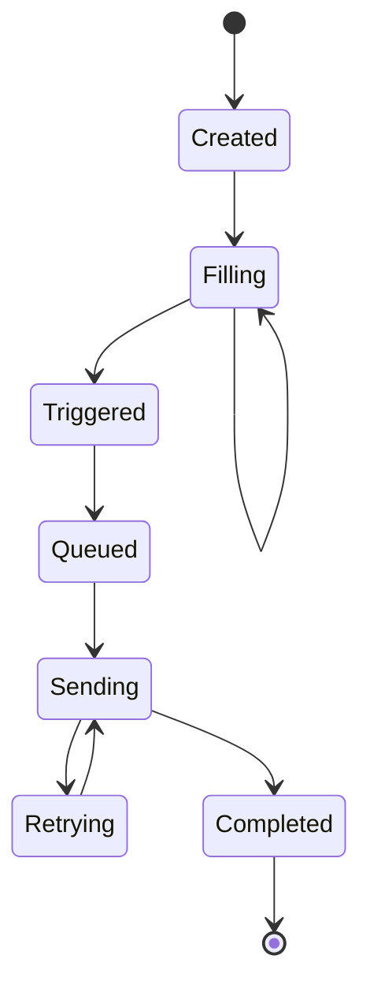

**状态说明**：

| 状态 | 含义 | 触发条件 |
|------|------|---------|
| Created | newWriteBatch 初始化 | 用户首次添加消息 |
| Filling | 攒批中 | batch.add 成功 |
| Triggered | batch.ready 已 close | 满 BatchSize/BatchBytes 或 BatchTimeout |
| Queued | 入 batchQueue | queue.Put |
| Sending | writeBatches 协程取出 produce | 从 queue.Get 取出 |
| Retrying | 退避后重试 | 失败且可重试且还有重试次数 |
| Completed | close batch.done | 成功或重试上限 |

**重试逻辑**：
1. 发送失败后判断：
   - 是否临时错误或网络错误？
   - 还有重试次数吗？（默认最多10次）
2. 如果是：指数退避（默认100ms→1s递增），然后回到Sending状态重试
3. 如果否：直接进入Completed状态

---

## 十、状态图：metadata 缓存生命周期

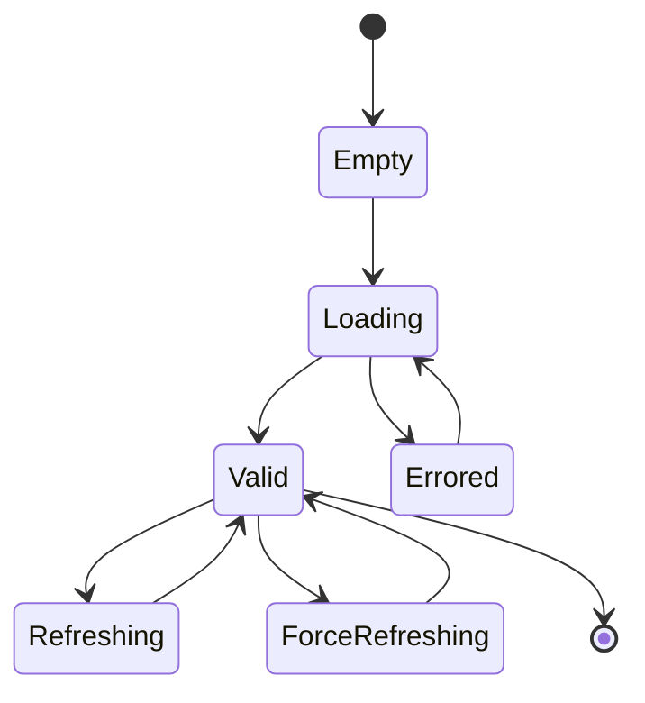

**状态说明**：

| 状态 | 含义 |
|------|------|
| Empty | connPool 创建后初始状态 |
| Loading | discover 首次拉取中 |
| Valid | 缓存可用 主流程命中 |
| Errored | 失败但保留旧缓存 下轮重试 |
| Refreshing | timer 到期周期刷新 |
| ForceRefreshing | wake 强制刷新 |

---

## 十一、状态图：partitionWriter 生命周期

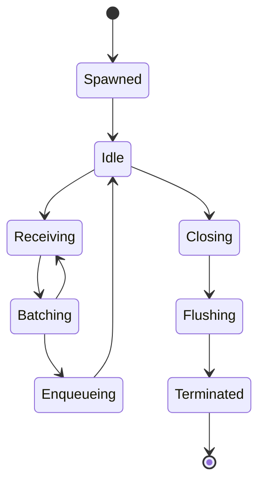

**状态说明**：

| 状态 | 含义 |
|------|------|
| Spawned | newPartitionWriter 创建 启动 writeBatches |
| Idle | writeBatches 阻塞在 queue.Get |
| Receiving | writeMessages 调用 |
| Batching | batch.add 攒批 |
| Enqueueing | batch 满或超时 入队 |
| Closing | Writer.Close 触发 |
| Flushing | 处理剩余 batch |
| Terminated | queue 关闭且空 协程退出 |

---

## 十二、缓存机制总览图（Graph）

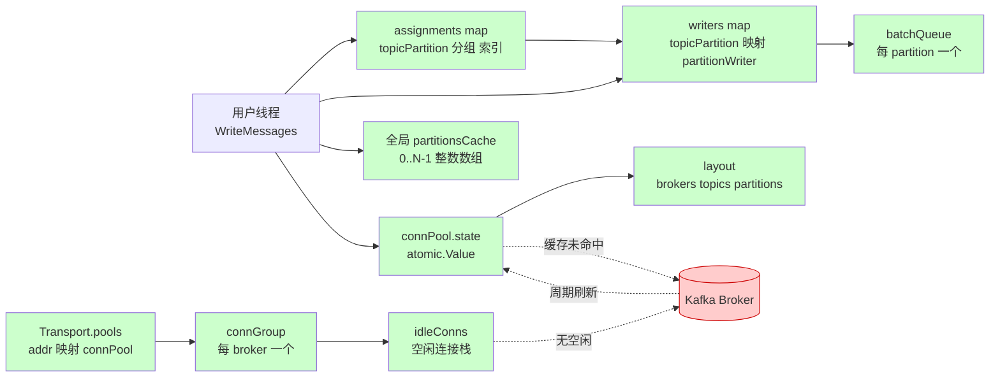

**说明：
- **assignments map**：临时结构，用于按 topic+partition 分组消息索引，减少内存分配
- **全局 partitionsCache**：维护 0..N-1 整数数组，全局共享，按 128 对齐分配，只增不减
- **connPool.state**：原子缓存，存储 brokers/topics/partitions 布局，周期性从 Kafka 刷新

---

## 十三、关闭流程时序图（Sequence）

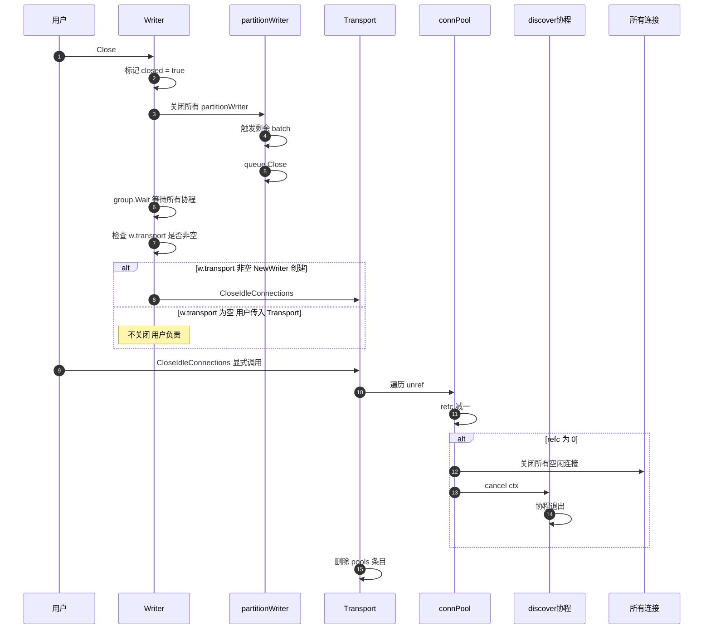

---

## 十四、与服务端交互的所有 RPC

| 交互类型 | 发起方 | API Key | 何时触发 | 频率特点 |
|---------|-------|---------|---------|---------|
| TCP Dial | connGroup.connect | - | 每条新连接 | 连接复用后较低 |
| TLS Handshake | connGroup.connect | - | 每条新 TLS 连接 | 连接复用后较低 |
| ApiVersions | protocol.Conn.RoundTrip | 18 | 每条新连接首次 | 连接复用后较低 |
| SaslHandshake | authenticateSASL | 17 | 每条新连接（启用 SASL） | 连接复用后较低 |
| SaslAuthenticate | authenticateSASL | 36 | 每条新连接（可能多轮） | 连接复用后较低 |
| **Metadata（后台）** | **discover 协程** | **3** | **每 rand[0, MetadataTTL]** | **高 默认平均 3s 一次** |
| Metadata（强制） | refreshMetadata | 3 | CreateTopics / AllowAutoTopicCreation | 偶发 |
| Produce | writeBatch | 0 | 每个 batch 满或超时 | 业务流量驱动 |
| FindCoordinator | sendRequest | 10 | GroupMessage / TransactionalMessage | 偶发 |
| CreateTopics | Client.CreateTopics | 19 | 显式调用 | 偶发 |

---

## 配置参数与默认值速查

| 参数 | 位置 | 默认值 | 影响 |
|------|------|--------|------|
| MetadataTTL | Transport | 6s | discover 周期上限 实际 rand[0, MetadataTTL] |
| MetadataTopics | Transport | nil | nil 表示拉全集群 metadata |
| IdleTimeout | Transport | 30s | 空闲连接被回收 |
| DialTimeout | Transport | 5s | 含 TLS 和 SASL 全部握手时间 |
| BatchSize | Writer | 100 | 单 batch 最大消息数 |
| BatchBytes | Writer | 1MB | 单 batch 最大字节 |
| BatchTimeout | Writer | 1s | batch 攒批最长时间 |
| WriteTimeout | Writer | 10s | Produce 单次请求超时 |
| MaxAttempts | Writer | 10 | 失败重试上限 |
| WriteBackoffMin | Writer | 100ms | 重试初始退避 |
| WriteBackoffMax | Writer | 1s | 重试最大退避 |
| RequiredAcks | Writer | 0 None | 0/1/-1 |

---

## 关键问题速查

### Q1: 频繁创建 Writer/Transport 为什么 metadata 请求暴涨

每个新 Transport 启动一个 discover 协程 默认每平均 3s 发一次 Metadata 请求 默认拉全集群所有 topic
Writer.Close 不关闭用户传入的 Transport 导致 Transport 泄漏 协程永不退出 metadata 请求量随时间线性增长

### Q2: 如何降低 metadata 请求量

1. 全局共享 Transport
2. 显式设置 MetadataTopics 只列出实际使用的 topic
3. 调大 MetadataTTL 比如 30s 或 60s
4. 应用退出时调用 Transport.CloseIdleConnections

### Q3: partition 是怎么来的

分两步：

**第一步：获取分区数量 N**
- `w.partitions(topic)` 从 Transport 的 `connPool.state` 内存缓存读取分区数
- 如果缓存未命中或强制刷新，向 Kafka Broker 发送 `Metadata Request` 获取
- 获取成功后更新到 `connPool.state` 原子缓存

**第二步：生成 0..N-1 索引列表**
- `loadCachedPartitions(N)` 是**纯本地内存操作，完全不涉及服务端**
- 它维护一个全局 `partitionsCache`，按需生成从 0 开始连续的整数数组
- 目的是避免每次发送消息都重复分配内存（Go 语言中变长参数会触发分配）

**第三步：选择具体 partition**
- `Balancer.Balance(msg, 0..N-1)` 根据算法选出具体值（默认 RoundRobin）

### Q4: loadCachedPartitions 和 Kafka 服务端有关吗

**完全无关**，纯本地内存操作。

**实际逻辑是 load-or-store 模式（虽然函数名只叫 load）**：

```go
var partitionsCache atomic.Value  // 全局变量

func loadCachedPartitions(numPartitions int) []int {
    partitions, ok := partitionsCache.Load().([]int)
    if ok && len(partitions) >= numPartitions {
        return partitions[:numPartitions]    // ← Load 路径：直接复用
    }

    const alignment = 128
    n := ((numPartitions / alignment) + 1) * alignment

    partitions = make([]int, n)
    for i := range partitions {
        partitions[i] = i                    // 填充 0,1,2,...,n-1
    }

    partitionsCache.Store(partitions)        // ← Store 路径：原子写入
    return partitions[:numPartitions]
}
```

**两条执行路径**：

| 路径 | 触发条件 | 操作 |
|------|---------|------|
| Load 命中 | 缓存存在且容量 ≥ N | 直接切片返回，零分配 |
| Store 路径 | 缓存不存在或容量 < N | 按 128 对齐分配新数组并原子写入 |

**按 128 对齐的拆分逻辑**：

- 假设 numPartitions = 6 → n = (6/128 + 1) * 128 = 128，分配 `[0..127]`
- 假设 numPartitions = 200 → n = (200/128 + 1) * 128 = 256，分配 `[0..255]`
- 假设 numPartitions = 130 → n = (130/128 + 1) * 128 = 256，分配 `[0..255]`

**为什么按 128 对齐**：
- 减少触发 Store 的次数：分区数小幅增长时（如 6→7→8）不需要重分配
- 多个 topic 共用：100 个分区的 topic 和 50 个分区的 topic 共享同一个底层数组
- 只增不减：随着分区数变大，缓存数组单调递增，最终稳定不再分配

**总结一句话**：函数名是 load，但内部是典型的 load-or-store——先尝试加载，不够再分配并存储。

### Q5: assignments map 是干什么用的

**assignments 是一个中间分组结构**，把消息按 (topic, partition) 归类，然后批量投递到对应的 partitionWriter。

数据结构：
```
map[topicPartition][]int32
```

举例：发送 5 条消息到 topic="orders"（6 个分区），使用 Hash Balancer：

```
assignments = {
    {topic:"orders", partition:2}: [0,2],    ← 第0条和第2条消息
    {topic:"orders", partition:5}: [1,4],    ← 第1条和第4条消息
    {topic:"orders", partition:0}: [3],       ← 第3条消息
}
```

为什么用 int32 索引而不是直接存 Message：
- int32 只占 4 字节，Message 占 100+ 字节且含指针
- 减少 GC 压力，避免大对象复制

后续流程：
1. `batchMessages` 遍历 assignments 的每个 key
2. 根据 key 找到或创建对应的 partitionWriter
3. 把索引对应的消息投递到 partitionWriter 的 batch 中
4. 同一个 partitionWriter 的消息会被攒到同一个 batch 一起发送

---

### Q6: 发送重试机制是怎么实现的？底层支持吗？

**底层完全支持，用户无需实现。**

参考 [partitionWriter.writeBatch](file:///Users/mac/go/src/github_src/kafka-go-0.4.51/writer.go#L1101-L1165)：

```go
for attempt, maxAttempts := 0, ptw.w.maxAttempts(); attempt < maxAttempts; attempt++ {
    if attempt != 0 {
        delay := backoff(attempt, ptw.w.writeBackoffMin(), ptw.w.writeBackoffMax())
        time.Sleep(delay)
    }
    res, err = ptw.w.produce(key, batch)
    
    if err == nil {
        break
    }
    
    if !isTemporary(err) && !isTransientNetworkError(err) {
        break
    }
}
```

**默认配置**：
- **默认重试次数**：最多 10 次（可通过 `Writer.MaxAttempts` 配置）
- **退避策略**：指数退避，默认最小 100ms，最大 1s（可通过 `Writer.WriteBackoffMin` 和 `Writer.WriteBackoffMax` 配置）
- **重试条件**：只有临时错误或瞬时网络错误会重试

**用户不需要实现重试逻辑**，只需要配置参数即可。

---

### Q7: 连接断开需要手动重连吗？

**不需要，底层自动管理连接池。**

参考 [connGroup.grabConnOrConnect](file:///Users/mac/go/src/github_src/kafka-go-0.4.51/transport.go#L982-L1049)：

```go
c = g.grabConn() // 先尝试从空闲连接池拿

if c == nil { // 没有空闲连接
    go func() {
        c, err := g.connect(ctx, addr) // 建立新连接
    }()
}
```

**自动连接管理**：
1. 先尝试从空闲连接池获取可用连接
2. 无空闲连接时，自动创建新连接（TCP+TLS+认证）
3. 请求完成后，连接归还到空闲池
4. 默认 30s 空闲超时后自动关闭连接
5. 连接异常断开时，下次发送会自动重连

**用户完全无需关心重连**，库会自动处理。
